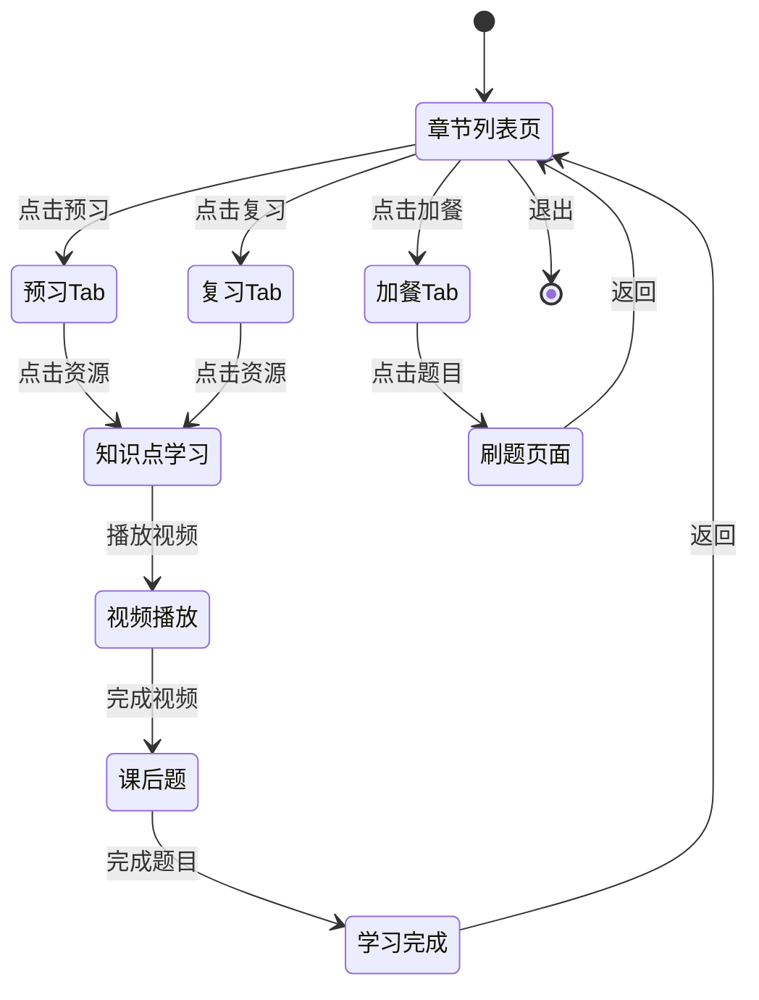

# 需求质询确认文档

> **项目名称**：章节列表页迭代
> **创建时间**：2025-12-29
> **产品经理**：已经填写
> **分析模式**：深度模式（完整6阶段分析）
> **当前状态**：🔄 阶段1 分析中

---

## 需求概述

**原始描述**：
> 迭代洋葱学园APP中的章节列表页（"教材同步"和"同步刷题"入口进入后的内容列表页）。主要问题：
> 1. 现有页面未贴合用户实际学习路径，直接按"同步课学习"和"同步刷题"分流
> 2. 未能有效传递产品和当前课程的价值

**复杂度评估**：

| 维度 | 评估 | 得分 |
|------|------|------|
| 范围 | 多页面改造（两个入口的章节列表页） | 3/3 |
| 用户 | 多学段（小初高）、多学科、多场景 | 3/3 |
| 创新 | 信息架构重构（资源分类→场景聚类） | 2/3 |
| 影响 | 核心学习流程入口 | 3/3 |
| **总分** | **复杂** | **11/12** |

---

## 阶段 1: 目标与用户价值

### 1.1 需求触发因素

> ⚠️ 以下为 AI 推测，请确认或修正

| 触发来源 | 说明 | PM确认 |
|----------|------|--------|
| **用户反馈/数据** | 主要是家长用户，通过目前的应用功能设计，无法一眼就感知到洋葱的课程其实是有“学练结合”的设计的，更谈不上“对不同的需求有针对性设计”。当用户有特定学习需求“想要预习/复习/拔高”等等时，往往还会需要咨询客服老师“具体该学什么”。目前实际是靠教研老师给客服人员产出了一些具体的学习指导文档，客服再转发给用户来为这些问题兜底。| ⬜ 已修正 |
| **产品洞察** | 现有页面按"资源类型"分流（视频 vs 题目），与公司和团队的教研专家经过专业评估后，认为最理想的不同场景不同类型用户所需要的学习路径脱节 | ⬜ 已修正 |
| **教研共识** | 识别到"学练闭环"未显性化、课程价值未透传等问题 | ⬜ 确认|

---

### 1.2 目标用户

> ⚠️ 以下为 AI 推测，请确认或修正

| 用户类型 | 优先级 | 典型特征 | 核心诉求 | PM确认 |
|----------|--------|----------|----------|--------|
| **初中生** | 主要 | 学业压力增大，需要"及时解惑"+"提分承诺"，对学校进度高度敏感 | 快速找到"今天该学什么"，学练结合不割裂 | ⬜ 确认  |
| **小学生（4-6年级）** | 主要 | 需要趣味引导，家长参与度高，习惯养成期 | 好玩易懂，知道"下一步做什么" | ⬜ 确认 |
| **高中生** | 主要 | 时间极度紧张，功利性强，需要高效的学习路径 | 直接告诉我"预习/复习/加餐"分别该做什么 | ⬜ 确认 |

**学科差异**（推测）：

| 学科 | 资源特点 | 用户场景差异 | PM确认 |
|------|----------|--------------|--------|
| 数学 | 视频课 + 大量习题 | 需要对不同的资源进行比较好的聚类和标记，让用户有较强的认知，某个资源能干啥，有较大刷题的需求 | ⬜ 确认 |
| 语文 | 视频课 + 古诗词/快背 | 背诵需求强，阅读理解需单独处理 | ⬜ 确认 |
| 英语 | 视频课 + 词汇训练/快背 | 碎片化记忆需求，听说读写多元 | ⬜ 确认  |
| 理科（物化生） | 视频课 + 实验/刷题 | 概念理解 + 公式应用，与数学类似 | ⬜ 确认  |
| 文科（政史地） | 视频课 + 快背 | 记忆为主，时间线/逻辑梳理 | ⬜ 确认 |


---

### 1.3 核心场景

> ⚠️ 以下为 AI 推测，请确认或修正

#### 场景 1：日常课后复习
| 项目 | 内容 |
|------|------|
| **用户画像** | 刚放学回家的初中生 |
| **触发情境** | "今天学校讲了二次函数，回家想看洋葱复习一下，做几道题巩固。" |
| **期望体验** | 进入章节列表 → 快速找到"复习"分类 → 视频+课后题一站式完成 |
| **PM确认** | ⬜ 确认  |

#### 场景 2：考前临时抱佛脚
| 项目 | 内容 |
|------|------|
| **用户画像** | 明天有单元测试的学生 |
| **触发情境** | "明天单元测试，这章哪些是重点？高频考点有哪些？" |
| **期望体验** | 进入章节列表 → 看到"单元必考题"或类似标记 → 快速刷题查漏补缺 |
| **PM确认** | ⬜ 确认  |

#### 场景 3：课前预习
| 项目 | 内容 |
|------|------|
| **用户画像** | 习惯预习的学生 / 被老师布置预习作业的学生 |
| **触发情境** | "晚上预习明天要讲的内容，看个视频提前了解。" |
| **期望体验** | 进入章节列表 → 找到"预习"入口 → 看预习视频+适当做课后习题（其实现在每一个视频知识点背后都有5道随堂练习题，只不过目前的产品设计没有体现这一点） |
| **PM确认** | ⬜ 确认 |

#### 场景 4：定向加餐（学有余力）
| 项目 | 内容 |
|------|------|
| **用户画像** | 完成校内作业后想多做点题的学生 |
| **触发情境** | "作业写完了，这章学得不错，想再多做点题巩固。" |
| **期望体验** | 进入章节列表 → 找到"加餐"入口 → 同步刷题/更多资源 |
| **PM确认** | ⬜ 确认 |


---

### 1.4 用户价值

> ⚠️ 以下为 AI 推测，请确认或修正

#### 对用户的价值

| 价值点 | 说明 | PM确认 |
|--------|------|--------|
| **降低选择成本** | 不用纠结"我该看视频还是刷题"，按场景引导 | ⬜ 确认 |
| **学练闭环显性化** | 视频+课后题作为整体呈现，形成"学会了"的闭环感 | ⬜ 确认 |
| **知道课程价值** | 看到"这门课能帮我什么"，提升使用意愿 | ⬜ 确认 |
| **贴合学习节奏** | 预习/复习/加餐清晰分区，与学校进度同步 | ⬜ 确认 |

#### 对业务的价值

| 价值点 | 说明 | PM确认 |
|--------|------|--------|
| **提升资源利用率** | 让同步刷题、快背系列等被埋没的资源重见天日 | ⬜ 确认 |
| **优化学习链路数据** | 可追踪"预习→复习→加餐"的完整学习行为 | ⬜ 确认  |
| **为后续智能推荐打基础** | 场景化标签为 AI 推荐提供抓手 | ⬜ 确认  |
| **强化洋葱产品对用户的价值透传** | 对洋葱用户，尤其是关注孩子学习产品的家长用户，强化产品和功能价值点的透传，让用户更认可洋葱产品 | ⬜ 确认  |

---

### 1.5 战略关联

> ⚠️ 以下为 AI 推测，请确认或修正

| 公司目标 | 本需求如何响应 | PM确认 |
|----------|----------------|--------|
| 提升用户学习效果 | 按学习路径组织资源，提升学练闭环完成率 | ⬜ 确认  |
| 提升同步课权益价值感 | 让用户看到"我买的会员原来有这么多资源" | ⬜ 确认 |
| 优化用户体验 | 解决"不知道该学什么"的选择困难 | ⬜ 确认 |


---

## ⚠️ 关键盲点问题（需 PM 明确回答）

### 问题 1：场景优先级

预习/复习/加餐 三个场景，哪个是最核心的？是否存在其他更重要的场景划分方式？

**PM 回答**：
```
我认为对于不同的用户，甚至相同用户不同的时间和阶段，这三个场景的重要性都是会动态变化的。最理想的情况肯定是在我们足够了解用户（采集了大量关于这个用户的数据和记录，有充分的分析后）的情况下，对每个用户都有其特定的展示策略。但是在没有这些深入的洞察的情况下，也可以通过一些通用的，普遍的策略进行设计。
另外，从目前较为普遍的用户调研角度来说，假如单纯考虑用户的动力和习惯，肯定是有复习需求和习惯的用户多于预习的用户，而加餐大概会是少数学有余力的学生的选择。但这只是最为降阶的方式。
```

---

### 问题 2：学段差异处理

小初高是共用同一套 Tab 结构，还是需要差异化设计？

**PM 回答**：
```
共用一套。
```

---

### 问题 3：与现有功能的关系

- "同步刷题"入口进入后，是否仍需保留"同步刷题"这个独立概念？
- "教材同步"入口进入后，现有的章节导航结构会如何变化？

**PM 回答**：
```
Q："同步刷题"入口进入后，是否仍需保留"同步刷题"这个独立概念？
A：关于这个问题，我有自己的想法：
1. 首先，我不排斥对两个功能的入口进行合并，但我认为合并功能入口并不是这次最重要的问题。最重要的问题应该是，用户无论从哪个入口（A或B，或未来合并成C）进入，都应该看到的是一个整合后的场景。因为我们实际要解决的其中一个重要的问题是“贴合用户学习路径”的问题。
2. 未来我们通过各种方式，验证我们的改造有效以后，可以再将外层的入口正式合并。在过渡阶段，可以保留不同的入口，也可以有一个入口合并的实验组。
3. 重点回到章节列表页内部，我也支持在章节列表页内部通过对用户诉求进行聚类来整合tab，例如将我们在当前学段学科、教材版版本、册别、、、等等一串目录下能够提供给用户的各种不同类型的学习资源按照“适合复习“、”适合预习“、”适合加餐“的逻辑进行整合

Q："教材同步"入口进入后，现有的章节导航结构会如何变化？
A：总体来说没有变化，只不过，原本这个章节导航目录只是“视频课程”的导航目录，现在这个导航目录应该是兼容了“所有符合目录结构的资源”。目录（包括整个应用的全局筛选）的结构简单来说，是按照“学段--年级--教材版本--册别--章节--大节--小节--知识点”的结构梳理的，大部分洋葱产品中的资源，都能够在“小节”这一层级上对齐。个别资源可能只能在“章节”或“大节”的层级对齐，当出现这种情况，就需要对当前的导航目录做改造了。（比如在大节 或 章节上增加平行的资源入口。）

```

---

### 问题 4：课程价值透传的具体形式

您希望如何在列表页传递课程价值？
- [确认] A. 页面顶部放一个"使用指南"区域，但是这个区域希望可以折叠和展开
- [我想象不出来是什么样子] B. 在每个 Tab 内放说明文案
- [确认] C. 用视觉设计（图标、标签）暗示价值
- [我也没想好，你可以给些建议吗？] D. 其他形式（请说明）

---

## 阶段 1 确认状态

- [x] **1.1 需求触发因素** - 已确认
- [x] **1.2 目标用户** - 已确认
- [x] **1.3 核心场景** - 已确认
- [x] **1.4 用户价值** - 已确认
- [x] **1.5 战略关联** - 已确认
- [x] **关键盲点问题** - 已回答

**阶段1确认时间**：2025-12-29

**PM 备注**：
> 页面要承载的信息量非常大，需要在阶段2重点讨论如何避免给用户带来压力。

---

## 阶段 2: 功能框架与信息层级

> ⚠️ 以下为 AI 推测，请确认或修正

### 2.1 核心设计挑战：信息量控制

基于阶段1的确认，本次改版需要在章节列表页整合大量资源类型，这带来一个核心矛盾：

| 矛盾点 | 说明 |
|--------|------|
| **完整性诉求** | 用户需要看到"这里有什么资源可用"，体现产品价值 |
| **简洁性诉求** | 用户不希望被信息淹没，需要快速找到"我现在该学什么" |

**AI 建议的平衡策略**：

| 策略 | 说明 | 优点 | 缺点 | PM确认 |
|------|------|------|------|--------|
| **渐进式披露** | 默认展示核心内容，更多内容折叠/收起，只在初次使用时为了让用意识到资源/功能存在，可以多展示一些内容 | 首屏简洁，深度用户可探索 | 可能埋没有价值的资源 | ⬜ 确认  |
| **场景化聚焦** | 用户选择切换场景（预习/复习/加餐）后，只展示该场景相关资源 | 信息高度相关，减少干扰 | 用户需要先做选择 | ⬜ 确认  |
| **智能默认** | 系统根据时间/用户历史推荐默认场景，但是要让用户能感知到可以切换 | 降低选择成本 | 推荐不准确时适得其反 | ⬜ 确认  |
| **卡片化整合** | 将"视频+课后题"打包成一个学习卡片，而非分开展示 | 减少视觉元素数量 | 可能隐藏细节 | ⬜ 确认  |

---

### 2.2 页面结构设计

**入口策略**（阶段1已确认）：
- 过渡期保留"教材同步"和"同步刷题"两个入口
- 两个入口进入后，展示相同的整合后章节列表页
- 本次需求专注于章节列表页本身的设计，可以先不做外层入口的设计

**页面层级结构（推测）**：

```
章节列表页（整个页面遵循响应式设计规范）
├── [顶部区域] 版本选择 + 使用指南（可折叠）
│   ├── 学段/年级/版本/册别 筛选
│   └── "这门课能帮你什么" 使用指南卡片（可折叠）
│
├── [场景Tab] 预习 | 复习 | 加餐
│   └── 每个Tab内有简短说明文案
│
└── [内容区域] 章节目录 + 资源列表
    ├── 章节导航（左侧/顶部）（当资源不能以“小节”对齐时，可能在章节目录中插入入口）
    └── 资源列表（按场景筛选后的结果）
        ├── 知识点卡片（视频+课后题整合）
        ├── 扩展资源（学案、快背、同步刷题等）
        └── 资源标签（适合预习/考前必看/等）
```

**PM确认**：⬜ 确认 

---

### 2.3 场景Tab设计

| Tab | 包含资源 | 默认展开 | 目标用户场景 | PM确认 |
|-----|----------|----------|--------------|--------|
| **预习** | 预习类视频+课后题（是一个共同的卡片）、背单词/古诗词、学案 | 全部资源列表 | 预习将要学习的内容 | ⬜ 确认  |
| **复习** | 复习类视频+课后题、学霸笔记、错题本入口、同步刷题 | 全部资源列表 | 复习当天内容 | ⬜ 确认  |
| **加餐** | 同步刷题（单元必考题）、拓展阅读、试卷库 | 全部资源列表 | 学有余力想多做题 | ⬜ 确认  |

**Tab内资源组织方式（推测）**：

```
[复习] Tab 示例
├── 📖 知识点学习（核心区域）
│   ├── 1.1 二次函数的概念 [视频8分钟 + 5题]  ← 卡片化整合
│   ├── 1.2 二次函数的图像 [视频10分钟 + 5题]
│   └── ...
│
├── 📝 配套资源（折叠区域）
│   ├── 学案下载
│   ├── 笔记卡/学霸笔记
│   └── 错题本入口
│
└── 🎯 推荐练习（底部推荐）
    └── "本章必考题" 入口 → 跳转到加餐Tab或独立页面
```

**PM确认**：⬜ 确认 

---

### 2.4 资源在目录层级的对齐问题

根据阶段1的回答，目录结构为：
> 学段 → 年级 → 教材版本 → 册别 → 章节 → 大节 → 小节 → 知识点

**资源对齐情况**（推测）：

| 资源类型 | 对齐层级 | 展示策略 | PM确认 |
|----------|----------|----------|--------|
| 同步视频课 | 小节/知识点 | 在对应小节目录下展示 | ⬜ 确认  |
| 课后题 | 小节/知识点 | 与视频打包展示 | ⬜ 确认  |
| 学案 | 章节/大节 | 在章节层级增加入口 | ⬜ 确认 |
| 同步刷题 | 小节 | 在对应小节目录下展示 | ⬜ 确认  |
| 快背系列 | 小节/知识点 | 在对应小节下展示 | ⬜ 确认  |
| 错题本 | 全局 | 作为浮动入口或固定Tab | ⬜ 确认  |

---

### 2.5 课程价值透传设计

结合阶段1的确认（A+C方案），具体设计如下：

**A. 顶部使用指南区域**（可折叠）：

```
┌─────────────────────────────────────────────────────────────┐
│ 📚 学习方法                                           [收起 ▲]│
├─────────────────────────────────────────────────────────────┤
│      “根据当前 Tab 动态展示学习建议 ”                                        
└─────────────────────────────────────────────────────────────┘
```

**C. 视觉设计暗示价值**：

| 元素 | 设计方式 | 传递的价值 |
|------|----------|-----------|
| 知识点卡片 | 显示"视频+5题"标签 | 学练结合 |
| 进度指示 | 显示"已学3/12"进度条 | 完成感、成就感 |
| 场景标签 | "适合预习"/"考前必看" | 场景化引导 |
| 难度标识 | 基础/中等/拔高 | 分层学习 |

**PM确认**：⬜ 确认

---

## ⚠️ 阶段2关键问题

### 问题 5：Tab默认选中策略

用户进入章节列表页时，默认选中哪个Tab？

**选项**：
- [ ] A. 固定默认"复习"（最高频场景）
- [ ] B. 根据时间智能推荐（上午预习、下午/晚上复习）
- [ ] C. 记住用户上次选择
- [ ] D. 不预选，让用户主动选择
- [ ] E. 其他（请说明）

**PM 回答**：
```
A

```

---

### 问题 6：章节目录展开策略

用户进入后，章节目录默认展开到哪一级？

**选项**：
- [ ] A. 只展示章节（大目录），用户点击后展开小节
- [ ] B. 自动展开用户"当前学习进度"所在的章节
- [ ] C. 全部展开
- [ ] D. 其他（请说明）

**PM 回答**：
```
B

```

---

### 问题 7：不同入口的差异化处理

从"教材同步"和"同步刷题"两个入口进入时，是否需要差异化处理？

**选项**：
- [ ] A. 完全相同，无差异
- [ ] B. 默认Tab不同（教材同步→复习，同步刷题→加餐）
- [ ] C. 顶部提示不同（告知用户"这里整合了所有资源"）
- [ ] D. 其他（请说明）

**PM 回答**：
```
B
```

---

### 问题 8：信息量控制的优先策略

针对"信息量大可能给用户压力"的问题，您更倾向于哪种策略？

**选项**：
- [ ] A. 渐进式披露（默认简洁，需要时展开）
- [ ] B. 场景化聚焦（选场景后只看相关内容）
- [ ] C. 卡片化整合（视频+题打包，减少元素数量）
- [ ] D. 以上组合使用
- [ ] E. 其他（请说明）

**PM 回答**：
```
D

```

---

## 阶段 2 确认状态

- [x] **2.1 信息量控制策略** - 已确认（组合使用）
- [x] **2.2 页面结构设计** - 已确认
- [x] **2.3 场景Tab设计** - 已确认
- [x] **2.4 资源目录对齐** - 已确认
- [x] **2.5 价值透传设计** - 已确认
- [x] **关键问题5-8** - 已回答

**阶段2确认时间**：2025-12-29

---

## 阶段 3: 用户角色与权限

> ⚠️ 以下为 AI 推测，请确认或修正

### 3.1 涉及的用户角色

根据阶段1和阶段2的确认，本次改版涉及以下用户角色：

| 角色 | 说明 | 权益状态 | 页面差异 | PM确认 |
|------|------|----------|----------|--------|
| **同步课VIP用户** | 已购买同步课权益的付费用户 | 完整权限 | 所有资源可用，无锁定标识（也可以是已解锁的标识） | ⬜ 确认  |
| **非VIP用户（游客/试用）** | 未购买或试用期用户 | 受限权限 | 部分资源锁定，展示付费引导 | ⬜ 确认  |
| **培优课VIP用户** | 仅购买培优课权益（无同步课权益） | 受限权限 | 同步课资源锁定 | ⬜ 确认 |

**注意**：根据阶段1确认的业务约束，本次改版仅涉及"同步课权益"体系，不展示培优课相关内容。

---

### 3.2 权限差异处理

**非VIP用户看到的页面差异（推测）**：

| 元素 | VIP用户 | 非VIP用户 | PM确认 |
|------|---------|-----------|--------|
| 视频课 | 直接播放 | 试看部分 + 锁定标识 + 购买引导 | ⬜ 确认 |
| 课后题 | 直接做题 | 和视频课共享入口，也共享标识 | ⬜ 确认  |
| 同步刷题 | 完整题库 | 完整题库 | ⬜ 确认  |
| 学案下载 | 直接下载 | 锁定 + 购买引导 | ⬜ 确认 |
| 快背系列 | 完整内容 | 完整内容 | ⬜ 确认  |
| 错题本 | 正常使用 | 正常使用 | ⬜ 确认  |
| 顶部使用指南 | 正常展示 | 正常展示 + 可能增加付费价值说明 | ⬜ 确认 |

---

### 3.3 学段/学科差异

根据阶段2确认，小初高**共用同一套Tab结构**，但资源内容可能有差异：

| 维度 | 小学 | 初中 | 高中 | PM确认 |
|------|------|------|------|--------|
| **Tab结构** | 预习/复习/加餐 | 预习/复习/加餐 | 预习/复习/加餐 | ⬜ 确认 |
| **快背系列** | 古诗词为主 | 语文/英语/生物/地理 | 较少 | ⬜ 确认  |
| **学案** | 部分课程有 | 部分课程有 | 较多（尤其复习课） | ⬜ 确认  |
| **同步刷题** | 有 | 有 | 有 | ⬜ 确认 |
| **学霸笔记** | 较少 | 有 | 有 | ⬜ 确认  |

---

### 3.4 角色转换场景

| 转换场景 | 触发条件 | 页面变化 | PM确认 |
|----------|----------|----------|--------|
| 非VIP → VIP | 用户购买同步课权益 | 锁定标识消失（或变更为已解锁标识），所有资源可用 | ⬜ 确认  |
| VIP → 非VIP | 权益到期 | 锁定标识出现，提示续费 | ⬜ 确认  |
| 切换学段 | 用户在设置中切换学段 | 页面资源和内容更新 | ⬜ 确认  |
| 切换学科 | 用户切换学科（如数学→语文） | 页面资源和内容更新，Tab内资源差异 | ⬜ 确认  |

---

## ⚠️ 阶段3关键问题

### 问题 9：非VIP用户的体验策略

对于非VIP用户，您希望采用什么策略？

**选项**：
- [ ] A. 完整展示页面结构，但锁定具体资源（让用户感知到"买了能获得什么"）
- [ ] B. 简化展示，只展示可用资源 + 明显的升级入口
- [ ] C. 与VIP用户完全相同的展示，点击时再提示付费
- [ ] D. 其他（请说明）

**PM 回答**：
```
A和C结合
与VIP用户完全相同的展示，但是具体资源展示为“需要付费”的标识，点击时引导付费

```

---

### 问题 10：学科切换时的Tab记忆

用户从数学切换到语文时，Tab选择是否保持？

**选项**：
- [ ] A. 保持用户上次选择的Tab（如用户在数学选了"加餐"，切到语文也是"加餐"）
- [ ] B. 每个学科独立记忆Tab选择
- [ ] C. 每次切换学科都重置为默认Tab（复习）
- [ ] D. 其他（请说明）

**PM 回答**：
```
A

```

---

### 问题 11：本次改版是否需要考虑非VIP用户的特殊设计？

本次改版的范围是否包含非VIP用户的差异化展示设计？还是先专注于VIP用户体验，非VIP用户的设计作为后续迭代？

**选项**：
- [ ] A. 本次需要完整考虑VIP和非VIP的差异化展示
- [ ] B. 本次先专注于VIP用户体验，非VIP用户沿用现有逻辑
- [ ] C. 其他（请说明）

**PM 回答**：
```
A

```

---

## 阶段 3 确认状态

- [x] **3.1 用户角色** - 已确认
- [x] **3.2 权限差异处理** - 已确认（同步刷题、快背系列非VIP也完整开放）
- [x] **3.3 学段/学科差异** - 已确认
- [x] **3.4 角色转换场景** - 已确认
- [x] **关键问题9-11** - 已回答

**阶段3确认时间**：2025-12-29

**关键决策总结**：
- 非VIP体验策略：与VIP完全相同展示，资源显示"需付费"标识，点击时引导付费
- 学科切换Tab记忆：保持用户上次选择
- 本次完整考虑VIP和非VIP的差异化展示

---

## 阶段 4: 核心流程

> ⚠️ 以下为 AI 推测，请确认或修正

### 4.1 用户主流程

基于前三阶段的确认，用户在章节列表页的主要流程如下：

```
用户从"教材同步"或"同步刷题"入口进入
    ↓
展示整合后的章节列表页（默认Tab根据入口不同：教材同步→复习，同步刷题→加餐）
    ↓
用户可选择：
    ├─ 切换场景Tab（预习/复习/加餐）
    ├─ 浏览/展开章节目录
    ├─ 查看顶部使用指南（可折叠）
    └─ 直接点击具体资源
    ↓
点击资源后：
    ├─ VIP用户：直接进入学习/做题
    └─ 非VIP用户：展示付费引导，可选择购买或返回
```

**PM确认**：⬜ 确认 

---

### 4.2 核心用户路径

#### 路径 1：日常复习路径

```
入口：教材同步 → 章节列表页（默认"复习"Tab）
    ↓
查看当前学习进度（章节自动展开到对应位置）
    ↓
点击知识点卡片（视频+5题）
    ↓
观看视频 → 完成课后题 → 标记为"学习进度（对应的学习进度）"
    ↓
返回列表页，继续下一个知识点
```

| 步骤 | 用户动作 | 系统反馈 | PM确认 |
|------|----------|----------|--------|
| 1 | 点击"教材同步"入口 | 进入章节列表页，默认"复习"Tab | ⬜ 确认 |
| 2 | 浏览章节目录 | 自动展开到当前学习进度 | ⬜ 确认 |
| 3 | 点击知识点卡片 | 跳转到学习页 | ⬜ 确认 |
| 4 | 观看视频+做题 | 记录学习进度，完成后进入学习完成页面| ⬜ 确认 |
| 5 | 返回列表页 | 更新进度状态，引导下一个知识点 | ⬜ 确认 |

---

#### 路径 2：考前刷题路径

```
入口：同步刷题 → 章节列表页（默认"加餐"Tab）
    ↓
切换到目标章节
    ↓
查看"单元必考题"或直接进入刷题
    ↓
刷题 → 查看解析 → 记录错题
    ↓
返回列表页，继续刷其他题
```

| 步骤 | 用户动作 | 系统反馈 | PM确认 |
|------|----------|----------|--------|
| 1 | 点击"同步刷题"入口 | 进入章节列表页，默认"加餐"Tab | ⬜ 确认 |
| 2 | 选择目标章节 | 展开该章节的题目资源 | ⬜ 确认 |
| 3 | 点击题目/单元必考题 | 进入刷题界面 | ⬜ 确认 |
| 4 | 刷题+查看解析 | 记录对错，错题自动加入错题本 | ⬜ 确认 |
| 5 | 返回列表页 | 更新刷题进度 | ⬜ 确认 |

---

#### 路径 3：预习路径

```
入口：教材同步 → 章节列表页 → 切换到"预习"Tab
    ↓
选择要学的章节
    ↓
点击预习视频 → 观看 → 做课后题
    ↓
可选：背单词/古诗词等辅助资源
```

| 步骤 | 用户动作 | 系统反馈 | PM确认 |
|------|----------|----------|--------|
| 1 | 切换到"预习"Tab | 展示预习相关资源 | ⬜ 确认 |
| 2 | 选择目标章节 | 展开该章节的预习资源 | ⬜ 确认 |
| 3 | 点击预习视频卡片 | 进入视频+课后题学习流程 | ⬜ 确认 |
| 4 | 完成后查看辅助资源 | 展示背单词/古诗词等入口 | ⬜ 确认 |

---

### 4.3 关键决策点

| 决策点 | 用户选择 | 后续流程 | PM确认 |
|--------|----------|----------|--------|
| 进入页面后选择Tab | 预习/复习/加餐 | 展示对应场景的资源 | ⬜ 确认 |
| 点击锁定资源（非VIP） | 购买/返回 | 购买→跳转支付；返回→回到列表页 | ⬜ 确认 |
| 完成一个知识点后 | 继续/切换/退出 | 继续→下一个；切换→其他章节；退出→返回首页 | ⬜ 确认 |
| 查看使用指南 | 折叠/展开 | 记住用户偏好 | ⬜ 确认 |

---

### 4.4 异常/中断处理

| 异常情况 | 处理方式 | 恢复方式 | PM确认 |
|----------|----------|----------|--------|
| 网络中断 | 提示网络异常，保存本地进度 | 网络恢复后自动同步 | ⬜ 确认  |
| 资源加载失败 | 提示加载失败，提供重试按钮 | 用户点击重试 | ⬜ 确认 |
| 用户中途退出 | 保存当前进度和位置 | 下次进入时恢复到上次位置 | ⬜ 确认 |
| 权益变更（VIP→非VIP） | 刷新页面，更新锁定状态 | 提示续费入口 | ⬜ 确认 |
| 切换学科 | 保持Tab选择，更新内容 | - | ⬜ 确认 |

---

### 4.5 页面状态流转



**PM确认**：基本确认，但是用户在每个页面点击的资源都可能不同

---

## ⚠️ 阶段4关键问题

### 问题 12：知识点卡片的交互方式

点击知识点卡片（视频+课后题）后，用户的交互方式是？

**选项**：
- [ ] A. 直接跳转到视频播放页（视频+题在同一页面）
- [ ] B. 在列表页内展开卡片详情，展示视频和题目入口
- [ ] C. 弹出半屏面板，展示该知识点的所有资源
- [ ] D. 其他（请说明）

**PM 回答**：
```
A
```

---

### 问题 13：学习进度的展示粒度

学习进度应该展示到什么粒度？

**选项**：
- [ ] A. 章节级别（第1章已学3/10）
- [ ] B. 小节级别（1.1已完成、1.2进行中）
- [ ] C. 知识点级别（每个视频+课后题的完成状态）
- [ ] D. 以上都要，分层展示

**PM 回答**：
```
C
```

---

### 问题 14：跨Tab资源是否需要去重或标记？

同一个资源（如某个视频课）可能同时出现在"预习"和"复习"Tab中，如何处理？

**选项**：
- [ ] A. 允许重复出现，无需特殊处理
- [ ] B. 在资源上标记"也适合预习/复习"
- [ ] C. 避免重复，每个资源只出现在一个Tab中
- [ ] D. 其他（请说明）

**PM 回答**：
```
A，不过如果一个资源如果在其他tab学习过，应该让用户知道学习过

```

---

## 阶段 4 确认状态

- [x] **4.1 用户主流程** - 已确认
- [x] **4.2 核心用户路径** - 已确认（点击卡片直接跳转学习页）
- [x] **4.3 关键决策点** - 已确认
- [x] **4.4 异常/中断处理** - 已确认
- [x] **4.5 页面状态流转** - 已确认（备注：用户在每个页面点击的资源可能不同）
- [x] **关键问题12-14** - 已回答

**阶段4确认时间**：2025-12-29

**关键决策总结**：
- 知识点卡片交互：直接跳转到视频播放页（视频+题在同一页面）
- 学习进度展示粒度：知识点级别（每个视频+课后题的完成状态）
- 跨Tab资源：允许重复出现，但如果在其他Tab学习过，需让用户知道

---

## 阶段 5: 成功指标与验收标准

> ⚠️ 以下为 AI 推测，请确认或修正

### 5.1 核心成功指标

| 指标类型 | 指标名称 | 计算方式 | 目标值（推测） | PM确认 |
|----------|----------|----------|----------------|--------|
| **使用深度** | 学练闭环完成率 | 完成视频+课后题的用户 / 观看视频的用户 | 提升 10%+ | ⬜ 确认 |
| **资源曝光** | 同步刷题曝光率 | 看到同步刷题入口的用户 / 进入章节列表页的用户 | 提升 20%+ | ⬜ 确认  |
| **资源曝光** | 快背/学案资源使用率 | 使用快背/学案的用户 / 进入章节列表页的用户 | 提升 15%+ | ⬜ 确认 |
| **场景分布** | Tab切换率 | 切换过Tab的用户 / 进入章节列表页的用户 | 30%+ | ⬜ 确认  |
| **价值感知** | 使用指南展开率 | 展开过使用指南的用户 / 进入章节列表页的用户 | 20%+ | ⬜ 确认  |
| **转化** | 非VIP→VIP转化率 | 从章节列表页引导购买的用户 / 非VIP用户 | 维持或提升 | ⬜ 确认  |

---

### 5.2 业务价值指标

| 指标 | 说明 | 目标 | PM确认 |
|------|------|------|--------|
| **人均学习时长** | 用户在章节列表页及后续学习页的总时长 | 提升 | ⬜ 确认  |
| **人均学习资源数** | 用户单次会话中使用的资源类型数量 | 提升（从1.x到2+） | ⬜ 确认  |
| **次日留存率** | 用户次日继续学习的比例 | 维持或提升 | ⬜ 确认  |
| **用户满意度** | NPS或用户反馈 | 正向反馈 | ⬜ 确认  |

---

### 5.3 验收标准

#### 功能验收

| 验收项 | 验收标准 | 优先级 | PM确认 |
|--------|----------|--------|--------|
| Tab切换 | 预习/复习/加餐三个Tab可正常切换，内容正确加载 | P0 | ⬜ 确认 |
| 资源整合 | 各Tab下正确展示对应场景的资源（视频、题目、学案、快背等） | P0 | ⬜ 确认 |
| 入口差异化 | 教材同步入口默认复习Tab，同步刷题入口默认加餐Tab | P0 | ⬜ 确认 |
| 章节目录 | 自动展开到用户当前学习进度所在章节 | P0 | ⬜ 确认 |
| 知识点卡片 | 点击后跳转到视频+课后题学习页 | P0 | ⬜ 确认 |
| 使用指南 | 顶部使用指南可折叠/展开，内容根据Tab动态变化 | P1 | ⬜ 确认 |
| 学习进度 | 知识点级别的学习进度正确展示和同步 | P0 | ⬜ 确认 |
| 跨Tab进度同步 | 在其他Tab学习过的资源，在当前Tab显示已学习标识 | P1 | ⬜ 确认 |
| 非VIP展示 | 非VIP用户看到完整页面，付费资源显示"需付费"标识 | P0 | ⬜ 确认 |
| 响应式 | 页面遵循响应式设计规范 | P1 | ⬜ 确认 |

#### 体验验收

| 验收项 | 验收标准 | PM确认 |
|--------|----------|--------|
| 页面加载 | 首屏加载时间 < 2s | ⬜ 确认 |
| 信息密度 | 首屏不让用户感到信息过载 | ⬜ 确认 |
| 场景引导 | 用户能快速理解Tab含义，找到自己需要的内容 | ⬜ 确认 |
| 价值透传 | 用户能感知到"洋葱提供了丰富的学习资源" | ⬜ 确认 |

---

### 5.4 发布策略（推测）

| 阶段 | 策略 | 目标 | PM确认 |
|------|------|------|--------|
| **灰度测试** | 10%用户灰度，观察核心指标 | 验证无重大问题 | ⬜ 确认  |
| **A/B测试** | 新旧版本对比，验证指标提升 | 确认方案有效 | ⬜ 确认 |
| **全量发布** | 确认指标正向后全量 | - | ⬜ 确认 |
| **入口合并实验** | 可选：测试合并"教材同步"和"同步刷题"入口 | 后续迭代 | ⬜ 确认  |

---

## ⚠️ 阶段5关键问题

### 问题 15：最核心的成功指标

如果只能关注1-2个核心指标，您认为最重要的是？

**选项**：
- [ ] A. 学练闭环完成率（衡量学习效果）
- [ ] B. 资源使用多样性（衡量资源曝光）
- [ ] C. 用户满意度/NPS（衡量体验）
- [ ] D. 转化率（衡量商业价值）
- [ ] E. 其他（请说明）

**PM 回答**：
```
用户满意度和次周留存率
```

---

### 问题 16：灰度发布的用户范围

灰度测试时，优先选择哪些用户群体？

**选项**：
- [ ] A. 新用户（减少对老用户习惯的影响）
- [ ] B. 活跃老用户（能提供更多反馈）
- [ ] C. 按学段/学科分批（如先初中数学）
- [ ] D. 随机抽样
- [ ] E. 其他（请说明）

**PM 回答**：
```
全量活跃用户
```

---

### 问题 17：验收标准的优先级

以上验收标准的优先级（P0/P1）是否合理？有需要调整的吗？

**PM 回答**：
```
合理，无
```

---

## 阶段 5 确认状态

- [x] **5.1 核心成功指标** - 已确认
- [x] **5.2 业务价值指标** - 已确认
- [x] **5.3 验收标准** - 已确认
- [x] **5.4 发布策略** - 已确认
- [x] **关键问题15-17** - 已回答

**阶段5确认时间**：2025-12-29

**关键决策总结**：
- 最核心成功指标：用户满意度和次周留存率
- 灰度发布用户范围：全量活跃用户
- 验收标准优先级：合理，无需调整

---

## 阶段 6: 风险与边界

> ⚠️ 以下为 AI 推测，请确认或修正

### 6.1 技术风险

| 风险 | 影响 | 缓解措施 | 优先级 | PM确认 |
|------|------|----------|--------|--------|
| **资源分类数据不完整** | 部分资源无法正确归类到Tab中 | 提前梳理资源元数据，补充缺失的场景标签 | 高 | ⬜ 确认  |
| **目录层级对齐复杂** | 非小节对齐的资源展示逻辑复杂 | 分阶段实现，先处理主流情况 | 中 | ⬜ 确认  |
| **响应式适配工作量** | 多端适配增加开发工作量 | 参考现有响应式规范，复用组件 | 中 | ⬜ 确认 |

---

### 6.2 业务风险

| 风险 | 影响 | 缓解措施 | 优先级 | PM确认 |
|------|------|----------|--------|--------|
| **用户习惯改变** | 老用户不适应新的Tab结构 | 灰度期收集反馈，提供切换引导 | 高 | ⬜ 确认  |
| **场景分类不准确** | 资源归类到错误的Tab，影响用户体验 | 与教研团队充分沟通，建立分类标准 | 高 | ⬜ 确认  |
| **信息过载** | 页面元素过多，用户感到压力 | 渐进式披露 + 用户测试验证 | 中 | ⬜ 确认  |
| **学习指南内容维护** | 不同学科/学段的指南内容需要持续更新 | 建立内容模板，由教研团队维护 | 低 | ⬜ 确认  |

---

### 6.3 项目风险

| 风险 | 影响 | 缓解措施 | 优先级 | PM确认 |
|------|------|----------|--------|--------|
| **跨团队协作复杂** | 涉及产品、前端、后端、教研多团队 | 明确接口和职责，定期同步 | 中 | ⬜ 确认  |
| **测试覆盖不全** | 学段/学科/资源类型组合多 | 制定完整的测试矩阵 | 中 | ⬜ 确认  |

---

### 6.4 边界与约束

#### 本次改版范围（IN SCOPE）

| 范围 | 说明 | PM确认 |
|------|------|--------|
| 章节列表页重构 | 预习/复习/加餐Tab结构 | ⬜ 确认 |
| 资源整合展示 | 视频、课后题、学案、快背等在新结构下展示 | ⬜ 确认 |
| 使用指南区域 | 顶部可折叠的学习方法说明 | ⬜ 确认 |
| 入口差异化 | 教材同步默认复习Tab，同步刷题默认加餐Tab | ⬜ 确认 |
| 学习进度展示 | 知识点级别的学习进度 | ⬜ 确认 |
| 非VIP用户展示 | 完整展示+付费标识 | ⬜ 确认 |
| 响应式设计 | 遵循现有响应式规范 | ⬜ 确认 |

#### 本次改版不包含（OUT OF SCOPE）

| 排除项 | 说明 | 后续计划 | PM确认 |
|--------|------|----------|--------|
| 外层入口合并 | 暂不合并"教材同步"和"同步刷题"入口 | 后续实验验证 | ⬜ 确认  |
| 培优课相关内容 | 不涉及培优课权益体系 | 独立项目 | ⬜ 确认 |
| 智能推荐算法 | 暂不实现基于用户数据的智能场景推荐 | 后续迭代 | ⬜ 确认  |
| 视频播放页改造 | 点击后跳转的学习页不在本次范围内 | 视情况决定 | ⬜ 确认  |
| 错题本功能改造 | 错题本本身的功能不变 | 独立项目 | ⬜ 确认 |

---

### 6.5 依赖项

| 依赖 | 依赖方 | 交付内容 | 风险等级 | PM确认 |
|------|--------|----------|----------|--------|
| 资源场景标签 | 教研团队 | 每个资源的场景分类（预习/复习/加餐） | 高 | ⬜ 确认 |
| 使用指南文案 | 教研/产品 | 各学科/学段的学习方法说明 | 中 | ⬜ 确认 |
| 目录层级数据 | 后端 | 资源与目录层级的对齐关系 | 中 | ⬜ 确认  |
| 设计稿 | 设计团队 | UI设计稿和交互规范 | 中 | ⬜ 确认  |

---

## ⚠️ 阶段6关键问题

### 问题 18：资源场景分类的责任方

资源的"预习/复习/加餐"场景分类由谁负责？

**选项**：
- [ ] A. 教研团队手动标注每个资源
- [ ] B. 产品定义规则，后端自动计算
- [ ] C. 两者结合（规则为主，人工校对）
- [ ] D. 其他（请说明）

**PM 回答**：
```
C
```

---

### 问题 19：工期预估

您对这个项目的工期预期是？

**选项**：
- [ ] A. 1个月内上线（MVP版本）
- [ ] B. 1-2个月（完整版本）
- [ ] C. 2-3个月（包含充分测试）
- [ ] D. 其他（请说明）

**PM 回答**：
```
基于SDD工作范式，1个月内上线完整版本
```

---

### 问题 20：最担心的风险

在以上列出的风险中，您最担心的是哪个？有没有遗漏的重要风险？

**PM 回答**：
```
无
```

---

## 阶段 6 确认状态

- [x] **6.1 技术风险** - 已确认
- [x] **6.2 业务风险** - 已确认
- [x] **6.3 项目风险** - 已确认
- [x] **6.4 边界与约束** - 已确认
- [x] **6.5 依赖项** - 已确认
- [x] **关键问题18-20** - 已回答

**阶段6确认时间**：2025-12-29

**关键决策总结**：
- 资源场景分类：规则为主 + 人工校对（C选项）
- 工期预估：基于SDD工作范式，1个月内上线完整版本
- 最担心的风险：无特别担忧

---

## ✅ V1.x 需求质询全部完成

**完成时间**：2025-12-29

**下一步**：生成 PRD V1.x 摘要文档 → `01-prd/章节列表页迭代_V1.2.md`

---

*此文档由 V1.x 助手通过"智能草拟 + 确认修正"模式生成*

