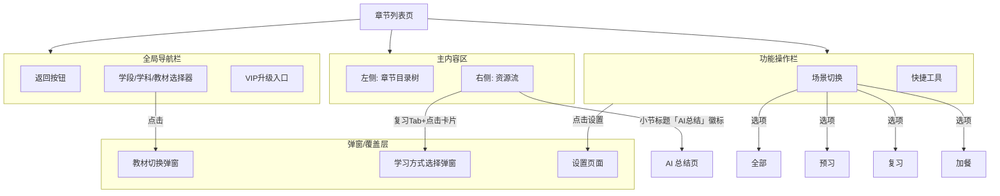
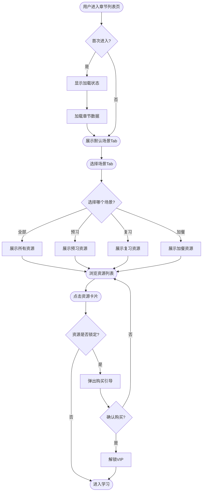
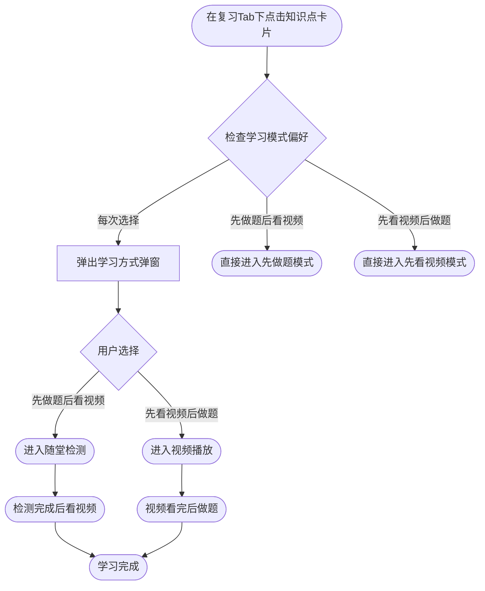
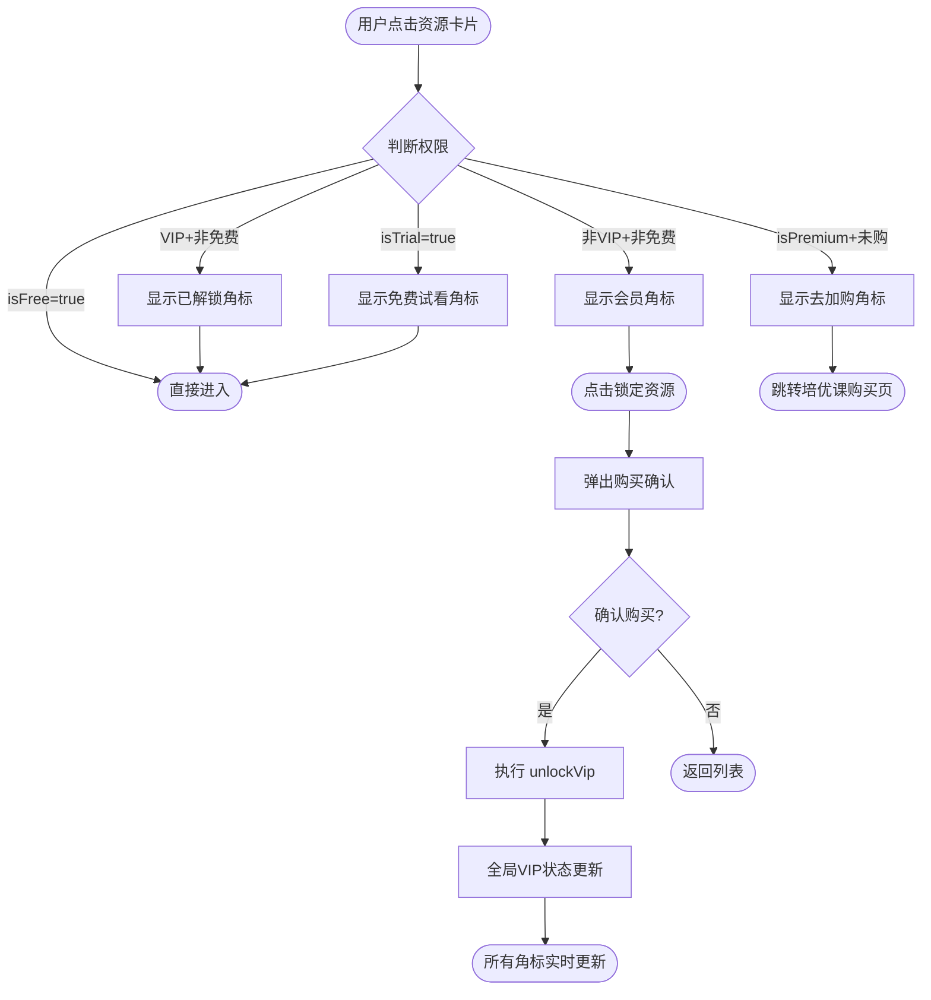
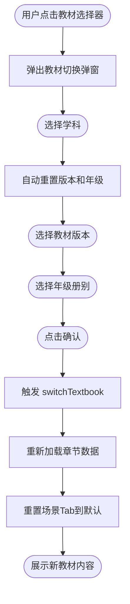

# PRD V1.x - 章节列表页迭代

> **版本**：V1.5
> **更新时间**：2026-03-10
> **状态**：V1.x 内审通过 + 线上系统对比补全
> **原型路径**：`../02-prototypes/vue-apps/chapter-list-redesign`
> **评审地图**：`../03-panorama/review-map.html`
> **埋点设计**：`../05-tracking/tracking-design.md`

### 变更记录

| 版本 | 日期 | 变更内容 |
|------|------|----------|
| V1.5 | 2026-03-10 | 线上系统对比补全：新增 §1.3.3 学习记录定位链、§3.5 重写为 4id 教材选择器、§3.8-§3.18 共 11 个功能章节（新手引导、学习内容选择弹窗、NEW 徽标、章节底部导航、课程订阅、下载、课堂笔记、低频引导、运营位、反馈入口、学年确认弹窗）；更新内审记录；数据模型对齐线上 4id 体系 |
| V1.4 | 2026-03-10 | V1.x 内审：补充目标用户分层与成功指标；新增 4 张业务流程图；基于原型反向补全 6 项遗漏功能（背单词入口、学科差异化 Tab、章节级统计、侧边栏切换按钮、全部资源模式、异常容错）；新增内审记录 |
| V1.3 | 2026-03-10 | AI 总结入口整合至小节标题徽标；移除小节标题 sticky 吸附；同步 Design Tokens；完善资源卡片及组件清单；补充完整埋点设计引用 |
| V1.2 | 2026-01-12 | 基于原型实现反向工程，形成完整 PRD |
| V1.0 | 2025-12-31 | 初始版本 |

---

## 1. 需求概述

### 1.1 背景

##### 关于响应式适配

1. 洋葱学园APP在2022年下半年进行了全局的“横屏化改造“项目，涉及所有的页面，不过当时的问题是：
   - 「遗留了一级页面没有进行横屏化改造」，举例：学习首页、发现tab首页等等。
   - 用户在首页进入次级页面，会需要切换设备横/竖置状态，整个的流程不统一
2. 在2025年，基于学习机/平板设备用量提升等背景，展开了“洋葱学园APP响应式改造”

### 1.2 核心目标
1.  **场景化整合**：打破资源类型壁垒，按预习/复习/加餐场景聚合资源。
2.  **结构化导航**：建立清晰的"全局筛选 -> 场景选择 -> 内容浏览"层级。
3.  **个性化体验**：支持复习模式偏好设置、刷题难度筛选等个性化配置。

### 1.3 目标用户与成功指标

#### 1.3.1 用户分层

| 用户类型 | 特征 | 核心诉求 | 页面差异 |
|----------|------|----------|----------|
| **免费用户** | 未付费，可访问 `isFree: true` 资源 | 体验核心功能，感知 VIP 价值 | 锁定资源显示「会员」角标 + 购买引导 |
| **VIP 用户** | 已付费，全资源解锁 | 高效学习，个性化体验 | 角标显示「已解锁」，无购买引导 |
| **试用期用户** | 限时免费体验部分付费资源 | 试用后决策购买 | 试用资源显示「免费试看」角标 |
| **培优课用户** | 购买了培优课程包 | 进阶学习，冲刺提分 | 解锁培优课钩子卡片跳转 |

> **待确认 (V5.x)**：游客/未登录用户是否允许浏览章节列表？若允许，需补充登录引导流程。

#### 1.3.2 成功指标 (KPI)

| 指标 | 定义 | 目标 | 埋点事件 |
|------|------|------|----------|
| **场景使用率** | 使用场景 Tab 的用户占比 | ≥60% | `clickSceneTab` |
| **资源点击率** | 点击资源卡片的用户占比 | 提升 15% (vs 旧版) | `clickResourceCard` |
| **复习模式渗透** | 使用复习 Tab 的 DAU 占比 | ≥30% | `clickSceneTab(review)` |
| **VIP 转化引导** | 非 VIP 点击锁定资源的转化率 | 跟踪基线 | `clickVipLock` |
| **设置活跃度** | 修改过偏好设置的用户占比 | ≥15% | `enterSettings` |

#### 1.3.3 学习记录定位优先级链

用户进入章节列表页时，需要自动定位到上次学习位置。定位逻辑按以下优先级链依次降级：

| 优先级 | 来源 | 说明 | 失败处理 |
|--------|------|------|----------|
| **1（最高）** | URL 参数 | `?chapterId=xxx&topicId=xxx` 直接定位到指定章节/小节 | 参数无效时降级 |
| **2** | 服务端 API | 从后端获取用户最近学习记录（包含 chapterId + topicId + scene） | 接口失败/无数据时降级 |
| **3** | localStorage | 本地缓存的上次浏览位置（key: `last_position_{textbookId}`） | 无缓存时降级 |
| **4（兜底）** | 默认首章 | 展开第一章，选中第一个小节 | — |

**实现约束**：
- URL 参数定位用于外部跳转场景（如推送通知、分享链接）
- 服务端 API 需在 V5.x 阶段对接，当前原型使用 localStorage 模拟
- 定位成功后需同步更新左侧目录树高亮和右侧资源列表滚动位置
- 定位失败时不弹出错误提示，静默降级到下一优先级

### 1.4 功能扩展性考量

| 扩展方向 | 预留方案 | 当前限制 |
|----------|----------|----------|
| **新增场景 Tab** | `SCENE_CONFIG` 按学科配置，新增场景只需扩展配置 | 需同步更新各卡片组件的 `scenes` 标记 |
| **新增卡片类型** | `componentMap` 注册机制，新增类型注册即可渲染 | 需创建对应 Vue 组件 |
| **新增学科** | 章节数据按学科分库，`chaptersBySubject` 扩展 | 学科配置（文理科判断、场景 Tab 差异）需同步 |
| **后端接入** | 当前为 Mock 数据 + localStorage，接口契约待定义 | API 设计需在 V5.x 阶段明确 |

---

## 2. 产品结构图



---

## 3. 功能详细说明

### 3.1 顶部导航体系

#### 3.1.1 Global Header (L1)
- **定位**：全局上下文控制，决定页面内容范围。
- **组成**：
  - **返回**：返回上一级页面。
  - **Context Selector**：显示当前"学段 · 学科 · 教材版本"，点击可切换教材。
  - **Upgrade Entry**：根据 VIP 状态显示"去升级"或"已升级"（金/银渐变色区分）。

#### 3.1.2 Function Bar (L2)
- **定位**：当前视图的操作与过滤。
- **Scene Tabs (左侧)**：
  - **全部** (固定)：展示该章节所有资源，首部显示通用课程特点。
  - **预习/复习/加餐**：场景化视图，首部显示特定场景的学习建议。
  - **交互**：点击切换视图，自动滚动到顶部。
  - **学科差异化**：不同学科可配置不同的可用 Tab（通过 `SCENE_CONFIG[subject]`）。例如语文可能无"加餐" Tab，英语可能新增"听力" Tab。
- **Quick Actions (右侧)**：
  - **思维导图**：跳转学科思维导图。**显示本章思维导图数量** badge（`chapterStats.mindMapCount`）。
  - **错题本**：跳转本章错题集。**显示本章错题数量** badge（`chapterStats.errorBookCount`）。
  - **收藏**：查看收藏资源。
  - **设置**：进入设置页面。
  - **响应式**：桌面端所有按钮水平展示，移动端（`< 480px`）收纳至"≡"汉堡菜单，菜单使用 dropdown 动画 + 背景遮罩。

### 3.2 内容浏览区

#### 3.2.1 双栏布局 (Layout)
- **Desktop**：左侧固定目录树 (260px)，右侧自适应资源流。
- **Mobile**：
  - 左侧目录树隐藏，变为**抽屉 (Drawer)**。
  - 通过左侧边缘"拉手"按钮唤起。拉手按钮定位于页面垂直方向 **61.8%**（黄金分割），橙色调背景（`rgba(255, 243, 229, 1)`），按下时宽度微扩。
  - 点击目录项后自动关闭抽屉。
  - 抽屉宽度 80%（最大 300px），使用 CSS `transform` 滑入动画，背景遮罩 `touch-action: none` 防穿透。
- **侧边栏内部结构**（自上而下）：
  1. **章节标题栏**：显示当前章节标题 + **「切换」按钮**（紫色 pill 样式），点击打开教材切换弹窗（作为 ContextSelector 的二级入口）。
  2. **章节目录树**：可滚动区域，递归渲染三级结构。
  3. **背单词入口（仅英语学科）**：固定在侧边栏底部，金色渐变卡片，显示 BookA 图标 + "背单词" + 词汇量数字（`chapterStats.vocabWordCount`），点击跳转背单词功能。

**初始定位逻辑**：页面加载时按 §1.3.3 定位优先级链执行。支持 URL 参数 `?chapterId=xxx&topicId=xxx` 从外部直接定位到指定小节，定位成功后自动展开目录树父级节点并滚动到对应资源区。

#### 3.2.2 双向滚动联动 (Scroll Sync)
- **目录 → 内容**：点击左侧小节，右侧平滑滚动到对应锚点（`#subsection-{id}`）。滚动期间通过 `isScrollingByClick` 锁机制（600ms）阻止 Observer 反向更新，避免循环冲突。
- **内容 → 目录**：`IntersectionObserver` 的 `rootMargin` 为 `-10% 0px -85% 0px`（感应区压缩在顶部 10%），检测到可见小节后更新 `selectedNodeId`，左侧目录 `scrollIntoView` 高亮项。
- **小节标题**：随内容自然滚动，不做 sticky 吸附。

#### 3.2.3 小节标题与 AI 总结入口

每个小节分组的顶部显示**小节标题栏**，包含：
- **定位图标**：标识当前小节。
- **小节标题**：显示小节名称（如"7.1.1 相交线"）。
- **「AI总结」徽标**：紫色渐变胶囊（pill 形状），作为该小节 AI 总结内容的唯一入口。
  - **样式**：`linear-gradient(135deg, #845EFF, #518AFF)`，白色文字，10px 字号。
  - **交互**：点击跳转至该小节的 AI 总结详情页。
  - **设计决策**：原独立的 SummaryNoteCard 卡片已合并至此徽标，避免重复入口占用卡片列表空间。

#### 3.2.4 资源卡片 (Cards)

资源列表按小节分组，每组内按配置顺序展示以下卡片类型：

| 资源类型 | 卡片组件 | 适用场景 | 说明 |
|----------|----------|----------|------|
| `video` | KnowledgeCard | preview, review | 知识点视频 + 随堂检测，含分段式进度条 |
| `practice` | PracticeCard | extra | 同步刷题，含难度标签 + 彩色进度段 |
| `guide` | GuideCard | review | 学案，含页数和下载入口 |
| `read_text` | ReadTextCard | preview (仅文科) | 读课文，含段落数和预计用时 |
| `premium_hook` | PremiumHookCard | extra | 培优课付费钩子，差异化金色样式 |

> **注**：`summary_note` 类型资源在数据层仍存在，但在 `filteredSubsections` 中被过滤，不再作为独立卡片渲染（入口已整合至 3.2.3 的「AI总结」徽标）。

**Knowledge Card 详情**：
- **进度条**：分段式（segmented），视频进度为橙色段，习题进度为绿色段，每条 10 个 segment。
- **标签体系**：课程分类（概念课/解题课）、价值标签（新中考/必看）、难度星级。
- **VIP 角标**：详见 3.4 VIP 权限控制。
- **复习模式**：在复习场景下点击，可触发学习顺序选择（见 3.3）。

### 3.3 复习模式与偏好设置

#### 3.3.1 学习顺序选择
- **触发**：在"复习" Tab 下点击知识点卡片。
- **逻辑**：
  - 若无偏好：弹出模态框（Modal）。
  - 若有偏好：直接进入对应流程（先测后学 / 先学后测）。
- **选项**：
  - **先做题后看视频** (推荐)：符合复习逻辑，检测薄弱点。
  - **先看视频后做题**：传统复习方式。

#### 3.3.2 设置页面
- **入口**：FunctionBar 右侧设置图标。
- **功能**：
  - **复习学习顺序**：修改上述偏好 (含"每次选择"选项)。
  - **默认场景**：进入页面时默认选中"全部"或"上次选择"。
  - **刷题难度**：设置同步刷题默认包含的难度 (基础/中等/困难)。
- **交互**：覆盖式页面（通过 `currentView` 组件切换，非路由），修改即自动保存至 localStorage。

### 3.4 VIP 权限控制

#### 3.4.1 权限判定规则
- **判定公式**：`isLocked = !resource.isFree && !store.isVip`
- **角标状态**（5 种）：

| 条件 | 角标样式 | 角标文案 |
|------|----------|----------|
| `isFree: true` | 无角标 | — |
| 非VIP + 非免费 | 珊瑚红渐变 | 「会员」 |
| VIP + 非免费 | 灰色 | 「已解锁」 |
| `isTrial: true` | 橙色渐变 | 「免费试看」 |
| `isPremium` + 未购 | 金色渐变 | 「去加购」 |

#### 3.4.2 购买引导
- **触发**：点击锁定资源卡片。
- **流程**：弹出 `confirm()` 购买确认 → 确认后 `store.unlockVip()` 全局切换 VIP 状态 → 所有角标实时更新。

### 3.5 教材切换弹窗 (ContextSelector) — 4id 教材定位体系

#### 3.5.1 4id 数据模型

教材通过 4 个维度唯一定位，与线上系统保持一致：

| 字段 | 类型 | 说明 | 线上对应 |
|------|------|------|----------|
| `stageId` | `number` | 学段 ID（如：2=初中, 3=高中） | `stageId` |
| `subjectId` | `number` | 学科 ID（如：2=数学, 3=英语） | `subjectId` |
| `publisherId` | `number` | 出版社/版本 ID（如：2=人教版） | `publisherId` |
| `semesterId` | `number` | 册别 ID（如：上册/下册） | `semesterId` |

> **约束**：4id 组合唯一确定一本教材，所有 API 请求以 4id 为参数，不再使用单一 `textbookId` 字符串。

#### 3.5.2 选择器交互

- **入口**：Global Header 中的 Context Selector + 侧边栏「切换」按钮（二级入口）。
- **选择流程**：四级级联选择器（学段 → 学科 → 版本 → 册别）。
  - 选择学段时重置学科/版本/册别列表
  - 选择学科时重置版本/册别列表
  - 选择版本时重置册别列表
- **学科列表**：数学/英语/语文/物理/化学/生物/历史/地理/政治（9 学科）。
- **确认行为**：触发 `store.switchTextbook()` → 传入 4id 参数 → 重新加载章节数据。
- **响应式**：移动端从底部弹出（`align-items: flex-end`），桌面端居中。小屏幕列变为纵向堆叠。
- **记忆策略**：上次选择的 4id 写入 localStorage（key: `last_textbook_4id`），下次进入时自动恢复。

### 3.6 业务流程图

#### 3.6.1 主学习流程



| 步骤 | 用户动作 | 系统反馈 | 备注 |
|------|----------|----------|------|
| 1 | 进入章节列表页 | 加载数据 + spinner | 首次有 500ms 延迟 |
| 2 | 选择场景 Tab | 过滤资源 + 滚动到顶部 | 默认依据设置 |
| 3 | 浏览资源列表 | 目录树联动高亮 | IntersectionObserver |
| 4 | 点击资源卡片 | 判断锁定状态 | 决策点 |
| 5a | 资源未锁定 | 进入学习 | — |
| 5b | 资源锁定 | 弹出购买确认 | confirm() |

#### 3.6.2 复习模式选择流程



| 步骤 | 用户动作 | 系统反馈 | 备注 |
|------|----------|----------|------|
| 1 | 点击复习场景知识点卡片 | 查询 `appSettings.reviewLearningMode` | — |
| 2a | 设置为"每次选择" | 弹出 LearningModeModal | 推荐"先做题" |
| 2b | 已有偏好 | 直接按偏好进入 | 跳过弹窗 |
| 3 | 选择学习方式 | 进入对应流程 | — |

#### 3.6.3 VIP 权限与购买引导流程



| 步骤 | 用户动作 | 系统反馈 | 备注 |
|------|----------|----------|------|
| 1 | 点击资源卡片 | 判断权限公式 | `!isFree && !isVip` |
| 2 | 看到角标提示 | 5 种角标状态 | 详见 §3.4 |
| 3 | 确认购买 | 全局 VIP 状态切换 | `store.unlockVip()` |
| 4 | — | 所有卡片角标实时更新 | 响应式计算 |

#### 3.6.4 教材切换流程



| 步骤 | 用户动作 | 系统反馈 | 备注 |
|------|----------|----------|------|
| 1 | 点击 Context Selector 或侧边栏"切换"按钮 | 弹出 ContextSelector | 两个入口 |
| 2 | 选择学科 | 重置版本 + 年级列表 | 级联联动 |
| 3 | 逐级选择 | 实时更新可选项 | — |
| 4 | 确认切换 | 重新加载 + 返回列表 | loading → 新内容 |

### 3.7 异常处理与容错

| 场景 | 当前处理 | 待补充 (V5.x) |
|------|----------|----------------|
| **数据加载中** | 全屏 Spinner + "正在加载..." | 骨架屏替代 Spinner |
| **空状态** | FileQuestion 图标 + "当前场景暂无资源" | 提供切换场景引导 |
| **网络异常** | 未处理 | 需增加重试按钮 + 离线提示 |
| **API 超时** | 未处理 | 需设置超时阈值 + 友好提示 |
| **数据异常** | 默认渲染 KnowledgeCard | 需增加兜底异常卡片样式 |
| **设置数据损坏** | `DEFAULT_SETTINGS` 兜底 | ✅ 已处理 |
| **localStorage 不可用** | `console.warn` 降级 | ✅ 已处理（设置仅当次有效） |
| **误操作保护** | VIP 购买有 confirm() 确认 | 其他破坏性操作需补充确认 |

> **完成页归属说明**：用户从资源卡片跳转到学习/练习后的「完成页」由各业务方（如 `problem-app` 刷题完成页、视频播放完成页）自行负责。章节列表页仅提供跳转关系，不包含完成页的详细设计。完成后应支持「返回章节列表」导航。

### 3.8 新手引导 (FirstTimeGuide)

#### 3.8.1 触发条件
- 用户首次进入章节列表页（判断 `localStorage.getItem('guide_completed')` 是否存在）
- 仅在页面数据加载完成后展示

#### 3.8.2 引导流程

| 步骤 | 聚焦区域 | 引导文案 | 遮罩行为 |
|------|----------|----------|----------|
| **Step 1** | 教材选择器 (ContextSelector) | "先选择你的教材版本" | 高亮 ContextSelector，其余区域半透明遮罩 |
| **Step 2** | 章节目录树 (ChapterTree) | "选择要学习的章节" | 高亮左侧目录区 |
| **Step 3** | 资源卡片区 (ResourceList) | "点击小节开始学习" | 高亮右侧资源区 |

#### 3.8.3 交互细节
- 每步引导显示「下一步」按钮 + 步骤指示器（1/3, 2/3, 3/3）
- **6 秒无操作**后在聚焦区域播放 **Lottie 手势动画**（点击手势），引导用户操作
- 点击「跳过」可直接结束引导
- 引导完成后写入 `localStorage.setItem('guide_completed', 'true')`，不再显示
- 遮罩层使用 `z-index: 1000`，被聚焦元素 `z-index: 1001`

### 3.9 学习内容选择弹窗 (ContentChoiceModal)

#### 3.9.1 触发场景
- 在**任意场景** Tab 下点击一个**已有观看记录**的知识点视频卡片
- 该视频包含多种衍生学习内容（课堂笔记、补充练习等）

> **注意区分**：本弹窗 (ContentChoiceModal) 是「学什么内容」的选择（视频/练习/笔记）；§3.3 的 LearningModeModal 是「怎么学」的选择（先做题/先看视频），两者触发条件不同。

#### 3.9.2 弹窗选项

| 选项 | 图标 | 说明 | 跳转目标 |
|------|------|------|----------|
| **继续看视频** | Play | 从上次断点继续播放 | 视频播放页（携带 `videoTimepoint`） |
| **做补充练习** | FileText | 做该知识点的课后习题 | 刷题页面（携带 `topicId`） |
| **看课堂笔记** | BookOpen | 查看该知识点的课堂笔记 | 笔记页面（携带 `topicId`） |

#### 3.9.3 交互细节
- 弹窗从底部滑入，带半透明遮罩
- 选项为大尺寸图标卡片，间距 16px，纵向排列
- 点击选项后立即跳转，弹窗关闭
- 「看课堂笔记」选项仅在 `resource.isContainNote === true` 时显示

### 3.10 NEW 徽标规则 (NewBadge)

#### 3.10.1 判定逻辑

```
isNew = resource.firstPublishAt 距今 ≤ 7 天 AND 用户未读该资源
```

#### 3.10.2 三级冒泡

| 层级 | 判定条件 | 显示位置 | 样式 |
|------|----------|----------|------|
| **资源级** | 该资源满足 isNew 条件 | 资源卡片右上角 | 红色 "NEW" pill 徽标 |
| **小节级** | 该小节下存在任一 isNew 资源 | 小节标题栏右侧 | 红色圆点 |
| **章节级** | 该章节下存在任一 isNew 小节 | 章节目录树节点右侧 (`isHaveNew`) | 红色圆点 |

#### 3.10.3 已读标记
- 用户点击进入资源详情后，标记该资源为「已读」
- 已读状态写入 localStorage（key: `read_resources`，值为已读资源 ID 数组）
- 标记已读后，三级冒泡自动重新计算（如小节下所有 NEW 资源均已读，则小节红点消失）

### 3.11 章节底部导航 (ChapterFooter)

#### 3.11.1 显示条件
- 资源列表滚动到底部时显示（使用 IntersectionObserver 检测列表末尾哨兵元素）
- 固定在资源列表底部（非 fixed 定位，随内容流）

#### 3.11.2 导航按钮

| 按钮 | 位置 | 显示条件 | 行为 |
|------|------|----------|------|
| **上一章** | 左侧 | 当前不是第一章 | 切换到上一章第一小节，更新目录树 |
| **下一章** | 右侧 | 当前不是最后一章 | 切换到下一章第一小节，更新目录树 |

#### 3.11.3 交互细节
- 按钮显示目标章节名称（如"上一章：第六章 实数"）
- 点击后触发 `store.selectNode()` 跳转 + 滚动到顶部
- 当前为首章时仅显示「下一章」，末章时仅显示「上一章」
- 按钮样式：圆角卡片 + 箭头图标 + 章节名称

### 3.12 课程更新订阅

> **优先级**：P1（V1.5 仅文档标注，原型不实现）

- **功能**：用户可订阅/取消订阅当前教材的课程更新通知
- **订阅维度**：按 4id 教材维度（stageId + subjectId + publisherId + semesterId）
- **入口**：FunctionBar 右侧区域新增「订阅」图标按钮
- **交互**：
  - 点击切换订阅状态（已订阅/未订阅）
  - 订阅成功：Toast 提示"已订阅，新课程上线时将通知你"
  - 取消订阅：Toast 提示"已取消订阅"
- **后端依赖**：需要 `subscribe(4id)` / `unsubscribe(4id)` API

### 3.13 下载功能

> **优先级**：P1（V1.5 仅文档标注，原型不实现）

- **功能**：支持视频资源离线下载
- **入口**：知识点视频卡片 (KnowledgeCard) 右上角下载图标
- **权限判断**：
  - 免费资源：所有用户可下载
  - 付费资源：仅 VIP 用户可下载
  - 非 VIP 点击下载 → 弹出 VIP 购买引导
- **技术依赖**：依赖原生端 `$download` 能力（WebView → Native Bridge）
- **状态展示**：下载中显示进度条，已下载显示「已缓存」标记

### 3.14 课堂笔记入口

> **优先级**：P1（V1.5 仅文档标注，原型不实现）

- **功能**：章节级荣耀笔记/课堂笔记入口
- **入口位置**：FunctionBar Quick Actions 区域，与思维导图、错题本并列
- **跳转目标**：`notereview` 页面（传 `topicId` 参数）
- **显示条件**：当前章节下存在任一包含笔记的知识点（`resource.isContainNote === true`）
- **badge 显示**：笔记数量（`chapterStats.noteCount`）

### 3.15 低频用户快速定位

> **优先级**：P2（V1.5 仅文档标注，原型不实现）

- **功能**：对低频用户（定义待 AB 测试确认）弹出快速定位弹窗
- **弹窗内容**："X% 同龄人在学这里"（基于大数据推荐章节）+ 确认/取消按钮
- **触发条件**：
  - 用户 7 天内未访问章节列表页
  - 当前教材有新增内容或同龄人学习热点
- **行为**：
  - 点击「确认」：自动跳转到推荐章节
  - 点击「我自己选」：关闭弹窗，正常浏览
- **数据依赖**：需后端提供同龄人学习进度统计 API

### 3.16 运营位/广告位

> **优先级**：P2（V1.5 仅文档标注，原型不实现）

- **功能**：预留运营 Banner 和广告插槽位置
- **预留位置**：

| 插槽 | 位置 | 尺寸 | 用途 |
|------|------|------|------|
| **顶部 Banner** | SceneTabs 下方 | 全宽 × 80px | 运营活动、课程推广 |
| **资源流中间** | 资源列表每 N 条资源后 | 全宽 × 120px | 学习广告、成长提示 |
| **侧边栏底部** | ChapterTree 下方 | 侧边栏宽度 × 60px | 精选推荐 |

- **控制逻辑**：通过后端配置是否展示、展示内容、展示频率
- **关闭能力**：用户可手动关闭单次广告（X 按钮），3 天内不再显示同一广告

### 3.17 用户反馈入口

> **优先级**：P2（V1.5 仅文档标注，原型不实现）

- **功能**：页面底部提供用户反馈入口
- **入口位置**：资源列表滚动到底部后、ChapterFooter（3.11）下方
- **交互**：
  - 显示"对本页有建议？告诉我们"文案 + 反馈图标
  - 点击弹出反馈弹窗（文字输入框 + 可选截图 + 提交按钮）
- **提交行为**：调用反馈 API 提交，成功后 Toast 提示"感谢反馈"

### 3.18 学年确认弹窗

> **优先级**：P2（V1.5 仅文档标注，原型不实现）

- **功能**：进入页面时检查用户学年配置是否需要更新
- **触发条件**：
  - 跨学年/跨学期（如 9 月开学、2 月下学期开始）
  - 后端标记需要用户确认学年
- **弹窗内容**：
  - 显示当前学年配置（如"七年级 上册"）
  - 提供「确认」（继续使用）和「编辑」（打开 ContextSelector）两个按钮
- **行为**：
  - 确认后写入标记，本学期不再弹出
  - 编辑则跳转到 ContextSelector 选择新教材

---

## 4. 交互与体验规范

### 4.1 响应式适配
- **Breakpoints**：
  - `mobile` (< 768px)：启用抽屉式侧边栏（宽度 80%，最大 300px），FunctionBar 快捷操作收纳至「≡」汉堡菜单。
  - `desktop` (>= 768px)：双栏并列（左侧 260px 固定），完整展示所有入口。
- **Touch**：移动端启用 `-webkit-overflow-scrolling: touch`；抽屉使用 CSS `transform` 动画；遮罩层 `touch-action: none` 防止穿透滚动。

### 4.2 状态反馈
- **Loading**：全屏 Spinner + 「正在加载...」文案。
- **Empty**：各场景下无资源时展示 `FileQuestion` 图标 + 「当前场景暂无资源」文案。
- **VIP Lock**：非 VIP 用户看到锁定角标，点击触发购买确认。

### 4.3 设计令牌 (Design Tokens)

原型已同步设计团队最新 Design Tokens（`onion-tokens.json`），核心变量：

| Token | 值 | 用途 |
|-------|-----|------|
| `$primary` | `#FEA345` | 主色 — 提示橙 |
| `$secondary` | `#845EFF` | 辅助色 — 品牌紫 |
| `$success` | `#92E066` | 成功/完成状态 |
| `$error` | `#FA5A65` | 错误/警告状态 |
| `$text-primary` | `#2E2E3A` | 主文字色 |
| 字体 | Alibaba PuHuiTi 2.0 | 全局字体 |

---

## 5. 数据埋点需求

> 完整埋点设计（23 个事件、18 个字段）详见：`../05-tracking/tracking-design.md`

### 5.1 核心事件概览

| 事件名 | 类型 | 页面 | 说明 |
|--------|------|------|------|
| `enterChapterList` | enter | 章节列表主页 | 进入页面，携带 chapterId/subjectId/textbookId |
| `clickSceneTab` | click | 章节列表主页 | 切换场景 Tab，参数 tabName/previousTab |
| `clickResourceCard` | click | 章节列表主页 | 点击资源卡片，参数 resourceType/resourceId/scene |
| `clickAiSummaryBadge` | click | 章节列表主页 | 点击小节标题的「AI总结」徽标 |
| `clickSidebarNode` | click | 章节列表主页 | 点击目录树小节 |
| `clickVipLock` | click | 章节列表主页 | 点击 VIP 锁定资源 |
| `popupTextbookModal` | popup | 教材切换弹窗 | 打开教材选择器 |
| `clickConfirmTextbook` | click | 教材切换弹窗 | 确认切换教材 |
| `enterSettings` | enter | 设置页 | 进入设置页 |
| `clickReviewModeSetting` | click | 设置页 | 修改复习学习顺序 |

### 5.2 事件命名规范

- 格式：`{verb}{Object}`（小驼峰）
- 动词前缀：`enter`（页面进入）/ `click`（用户点击）/ `popup`（弹窗弹出）/ `get`（异步数据获取）/ `dev`（开发自监控）
- click + get 配对模式：用户操作事件与异步结果事件成对出现

---

## 6. 组件清单

| 组件文件 | 功能 | 备注 |
|----------|------|------|
| `ChapterList.vue` | 主页面布局（双栏/抽屉） | 顶层容器 |
| `GlobalHeader.vue` | 全局顶部导航 | 返回 + VIP 入口 |
| `FunctionBar.vue` | 功能栏 | Tab + 快捷入口 + 移动端菜单 |
| `SceneTabs.vue` | 场景切换 Tab | 全部/预习/复习/加餐 |
| `ContextSelector.vue` | 教材切换弹窗 | 三列级联选择器 |
| `ChapterTree.vue` | 章节目录树 | 递归渲染，三级结构 |
| `ResourceList.vue` | 资源列表容器 | 小节分组 + 场景过滤 + AI 徽标 |
| `LearningGuide.vue` | 学习方法指南 | 根据 Tab 动态切换内容 |
| `KnowledgeCard.vue` | 知识点视频卡片 | 分段式进度条 + VIP 角标 |
| `PracticeCard.vue` | 同步刷题卡片 | 难度标签 + 彩色进度段 |
| `GuideCard.vue` | 学案卡片 | 页数 + 下载入口 |
| `ReadTextCard.vue` | 读课文卡片 | 仅文科显示 |
| `PremiumHookCard.vue` | 培优课钩子卡片 | 金色差异化样式 |
| `SummaryNoteCard.vue` | AI 总结卡片 | ⚠️ v1.3 起不再渲染（入口已整合至小节标题徽标） |
| `LearningModeModal.vue` | 学习方式选择弹窗 | 复习场景 + 每次选择时触发 |
| `SettingsPage.vue` | 设置页 | 三项偏好配置 |
| `FirstTimeGuide.vue` | 首次进入引导遮罩 | 3 步引导 + Lottie 手势动画占位（v1.5 新增） |
| `ContentChoiceModal.vue` | 学习内容选择弹窗 | 视频/练习/笔记三选一（v1.5 新增） |
| `ChapterFooter.vue` | 章节底部导航 | 上一章/下一章（v1.5 新增） |
| `NewBadge.vue` | NEW 徽标组件 | 7 天规则 + 三级冒泡（v1.5 新增） |

---

## 8. V1.x 内审记录

> 审查标准：`.agents/skills/v1-assistant/guides/v1-checklist.md`
> 审查日期：2026-03-10

### 8.1 V1.4 内审结果

| 维度 | 优先级 | 评级 | V1.4 处理 |
|------|--------|------|-----------|
| A. 顶层设计和基础 | P0 | ⚠️→✅ | 新增 §1.3 目标用户分层 + 成功指标 |
| B. 功能整体框架 | P0 | ✅ | 新增 §1.4 扩展性考量 |
| C. 用户角色和权限 | P0 | ⚠️→✅ | §1.3 用户分层表覆盖 4 类用户 |
| D. 账号相关 | P1 | ❌ | 标记为 V5.x 待补充 |
| E. 使用流程 | P0 | ⚠️→✅ | 新增 §3.6 业务流程图 + §3.7 异常处理 |
| F. 世界观融入 | P1 | ❌ | 标记为 V5.x 待补充（需设计团队配合） |
| G. 锦上添花 | P2 | — | 暂不处理 |

### 8.2 V1.5 线上系统对比审查

> 对比来源：线上 `courses/system`（同步课）+ `questionBank`（日常练习）反向推导 PRD
> 审查日期：2026-03-10

#### 发现清单（12 项纳入）

| 序号 | 功能 | 来源 | 优先级 | V1.5 处理 |
|------|------|------|--------|-----------|
| 1 | 首次进入引导（3 步 + 手势动画） | 线上 Guide 组件 | P0 | §3.8 新增 + 原型组件 |
| 2 | 学习记录定位优先级链 | 线上 useTextbook composable | P0 | §1.3.3 新增 + Store action |
| 3 | NEW 徽标（7 天规则 + 三级冒泡） | 线上 newTag 逻辑 | P0 | §3.10 新增 + 原型组件 |
| 4 | 学习内容选择弹窗 | 线上 ModalTopic | P0 | §3.9 新增 + 原型组件 |
| 5 | 章节底部导航（上一章/下一章） | 线上 SystemFooter | P0 | §3.11 新增 + 原型组件 |
| 6 | 课程更新订阅 | 线上 subscribe.ts | P1 | §3.12 仅文档 |
| 7 | 下载功能 | 线上 postVideoPlayAddr | P1 | §3.13 仅文档 |
| 8 | 课堂笔记入口 | 线上 Note.vue | P1 | §3.14 仅文档 |
| 9 | 低频用户快速定位 | 线上 lowFrequency.ts | P2 | §3.15 仅文档 |
| 10 | 运营位/广告位 | 线上 StudentAd/GrowAd | P2 | §3.16 仅文档 |
| 11 | 用户反馈入口 | 线上 Feedback 组件 | P2 | §3.17 仅文档 |
| 12 | 学年确认弹窗 | 线上 ModalSemesterCheck | P2 | §3.18 仅文档 |

#### 不纳入清单（已确认排除）

| 功能 | 排除原因 |
|------|----------|
| Tag 筛选（线上 FilterTags） | 用户决定不纳入本次迭代 |
| 日常激励（打卡/连续学习） | 用户决定不纳入 |
| NPS 调查 | 跨产品通用能力，非本页面职责 |
| 学习资料/云盘 | 独立模块 |
| 热搜词轮播 | 搜索模块功能 |
| 古诗词朗诵 | 学科特化功能 |
| 专项突破/高频错题挑战 | 独立练习模块 |
| 难度按小节预设 | 迭代项目有意简化为全局维度 |

#### 场景架构决策记录

> **决策**：章节列表页的 `preview/review/extra` 场景是全新设计，**不**与线上的 `system/sync/mistake/vocab/thematic/special` 场景做映射对齐。但在新设计的场景中，借用线上已存在的标签规则来做内容聚合。

#### 4id 数据模型对齐记录

> **决策**：V1.5 起在原型中对齐线上 4id 教材定位体系（stageId + subjectId + publisherId + semesterId），替代原来的单一 textbookId 字符串方案。详见 §3.5。

### 8.3 V5.x 遗留项

1. **账号与多设备**：多端设置同步策略（当前仅 localStorage）、离线访问、登录态变更影响
2. **世界观融入**：错误文案、空状态插画、加载动画需符合洋葱学园星球主题
3. **游客模式**：未登录用户的浏览权限与登录引导流程
4. **VIP 生命周期**：VIP 过期、降级、续费提醒的页面表现

### 8.4 原型反向补全清单

| 序号 | 原型功能 | 原文件 | V1.4 补充位置 |
|------|----------|--------|---------------|
| 1 | 背单词入口（仅英语学科） | `ChapterList.vue` L65-77 | §3.2.1 侧边栏结构 |
| 2 | 学科差异化 Scene Tab | `stores/chapter.ts` L89 | §3.1.2 学科差异化 |
| 3 | 章节级资源统计 badge | `FunctionBar.vue` L11-21 | §3.1.2 Quick Actions |
| 4 | 侧边栏"切换教材"按钮 | `ChapterList.vue` L51-54 | §3.2.1 侧边栏结构 |
| 5 | 拉手按钮黄金分割定位 | `ChapterList.vue` L224 | §3.2.1 Mobile |
| 6 | 异常容错兜底 | `stores/chapter.ts` | §3.7 异常处理 |

---

## 7. 附录

- **交互式评审地图**：`../03-panorama/review-map.html`（推荐浏览器打开）
- **完整埋点设计**：`../05-tracking/tracking-design.md`（23 事件、18 字段）
- **埋点 Excel**：`../05-tracking/tracking-design.xlsx`（管理平台上传用）
- **Design Tokens**：`../02-prototypes/vue-apps/chapter-list-redesign/src/styles/onion-tokens.json`
- **UI 截图**：`../03-panorama/screenshots/`（11 张，2026-03-10 截取）
- **线上系统参考 PRD**：`../../.agents/global-context/study-app-feat-26.3.10-分析代码推导需求文档/docs/apps/courses-system-prd.md` + `questionBank-prd.md`

*此文档基于可交互原型反向工程生成（v1.5 已同步线上系统对比补全 + 4id 数据模型对齐），用于支持在其他工程中复现原型*
