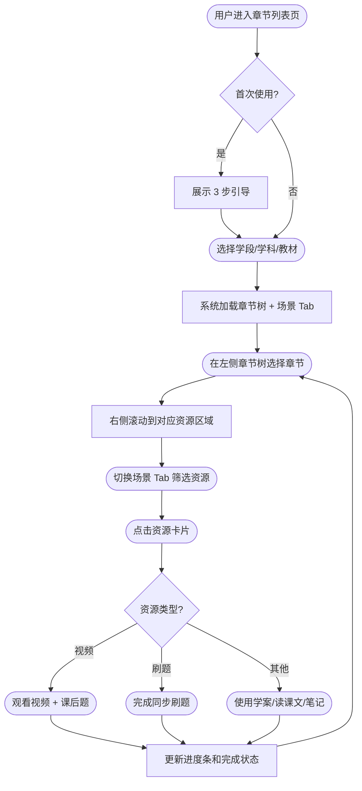
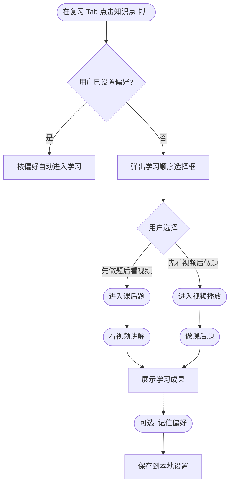

# 【章节列表页改版】PRD V1.6

> 基于 V1.x 助手质询结果生成 | 参考基线：原型代码 V1.2 + PRD V1.5

---

## 1. 需求版本及进度跟踪

| 版本 | 时间 | 变更内容 / PM |
|------|------|---------------|
| **V1.6** | 2026-03-11 | **Rice**：基于原型现状重新梳理，方式 B 逐项质询生成 |
| V1.5 | 2026-03-10 | Rice：线上系统对比补全 + 4id 数据模型对齐 |
| V1.4 | 2026-03-09 | Rice：内审通过（7 大维度） |
| V1.2 | 2025-12-31 | Rice：初始版本，基于原型反向工程 |

---

## 2. 需求涉及人员 & 排期

| PM | BI | UI | CB | 后端 | 前端 |
|:---|:---|:---|:---|:-----|:-----|
| **@Rice**<br>交互评审: 待定<br>需求评审: 待定 | **@待定** | **@待定** | | **@待定** | **@待定** |

---

## 3. 需求概述

### 3.1 目标分析 & 目标验证

*项目相关的所有光年重点关注，必填 & 必读*

| 关键信息 | 关键信息说明 | PM填写 |
|:---------|:-------------|:-------|
| **1. 为什么要做这个需求** | • 介绍一下需求/项目背景<br>• 需求产生的原因 (哪来的)?<br>• 响应了公司的什么目标/战略? | **背景**：洋葱学园同步课章节列表页是学生日常学习的核心入口。现有页面采用"按资源类型分流"的组织方式（视频归视频、刷题归刷题），与学生实际的学习节奏（预习→听课→复习→纠错→系统复习）脱节。同步刷题等模块定位模糊（"素材驱动而非场景驱动"），教研团队已明确指出这一结构性问题。<br><br>**直接原因**：<br>1. **资源聚合缺失**：同步课视频、课后题、学案、笔记等多种学习资源分散在不同入口，学生需要在多个页面间跳转，学习路径断裂<br>2. **价值透传不足**：现有列表页仅展示资源标题，无法传递"这门课能帮你什么"的课程价值，"买卖用"割裂——购买页讲卖点、使用页不体现<br>3. **响应式适配滞后**：APP 整体在推进响应式改造，章节列表页作为核心学习流程节点仍未完成适配<br><br>**战略关联**：<br>• 配合公司"响应式适配"技术战略，覆盖核心学习流程<br>• 通过"买卖用合一"提升付费转化效率，支撑商业化目标<br>• 通过场景化资源组织提升学习完成率和用户留存 |
| **关联OKR** | 该KR的描述内容 | （暂无关联 OKR） |
| **关联文档** | 有助于其他人了解本需求的关联文档 | • 需求质询文档：[v1-需求质询-v1.6.md](../00-context/v1-需求质询-v1.6.md)<br>• 设计决策记录：[design-decisions.md](../00-context/design-decisions.md)<br>• 学习流分析：[learning-flow-analysis.md](../00-context/learning-flow-analysis.md)<br>• 功能清单：[v5-feature-list.md](v5-feature-list.md)<br>• 埋点方案：[tracking-design.md](../05-tracking/tracking-design.md) |
| **2. 事情和目的** | • **描述方式**：通过做什么【事情】→ 能让谁【对象】→ 产生什么效果【目的】 | **核心公式**：通过**重构章节列表页，将多种学习资源按学科场景聚合呈现**（事情）→ 让**使用同步课的小初高全学段学生**（对象）→ **在一个页面内按学习场景快速找到并使用合适的学习资源，同时感知课程的完整价值**（目的）<br><br>**事情拆解**：<br>1. 按学科配置场景 Tab（理科解题型 3 Tab / 语言文科型 3 Tab / 理科基础型 2 Tab / 历史道法型 2 Tab）<br>2. 将视频、刷题、学案、读课文、总结笔记、培优钩子 6 种资源统一聚合到章节维度下<br>3. 左侧章节树 + 右侧资源列表双向联动导航<br>4. 资源卡片上展示价值标签（新中考/重难点/易错点/必看）、难度星级、进度条等信息<br>5. 响应式布局适配桌面端与移动端<br><br>**对象**：<br>• **主要用户**：使用同步课的小初高全学段学生（免费 + VIP）<br>• **间接受益者**：家长（感知课程价值 → 付费决策）、销售（有可展示的产品卖点页面）<br><br>**目的**：<br>• 学生：缩短资源查找路径，按场景引导学习，提升学习效率和完课率<br>• 商业：在使用场景中自然透传课程价值，促进"用→买"转化 |
| **3. 产品与卖点匹配** | • 带入一线销售/直播间达人的角色，会如何包装这个功能作为"卖点"讲述？ | **一句话卖点**："打开章节列表，预习复习刷题全都有——想学什么切个 Tab 就行，不用到处找。"<br><br>**销售话术拆解**：<br>• 给家长讲："我们把所有学习资源都整合到一个页面了，孩子不用来回跳转，预习有预习的内容，复习有复习的内容，按场景分好了"<br>• 给学生讲："点进去就知道先看什么后练什么，卡片上直接告诉你这是重难点还是易错点，做了多少一目了然"<br>• 给销售讲："打开 Demo 就是产品的最佳展示页——资源丰富度、学习路径、课程价值一目了然，'买卖用'同一个页面"<br><br>**产品中如何体现卖点**：<br>1. **价值标签系统**：每张资源卡片展示 valueTag（新中考/重难点/易错点/考点/必看），让用户感知内容质量<br>2. **课程分类标签**：视频卡片展示 category（概念课/解题课/实验课/总结课），传递课程体系的专业性<br>3. **难度可视化**：星级难度 + 难度分段彩色下划线，让用户感知题目精细度 |
| **4. 最重要的事** | • 为了达成目标，需要做的最重要的动作是什么？ | **核心动作（P0 底线）**：<br>1. **场景划分和资源聚合的重新设计**：按学科特性将学习资源分配到场景 Tab 下，这是需求的核心命题<br>2. **响应式适配**：配合 APP 整体适配规划，完成章节列表页的移动端/桌面端响应式改造<br>3. **价值信息透传**：在资源卡片上承载课程价值信息，实现"买卖用合一"<br><br>**如果不做，绝对无法接受的结果**：<br>• 缺少场景划分 → 页面退化为资源堆砌列表，和改版前无本质差异<br>• 缺少响应式 → 核心学习流程的适配规划断链<br>• 缺少价值透传 → 列表页依然只是资源索引，商业目标落空 |
| **5. 如何验证目标** | • **【数据指标】** 说明量化方法<br>• **【里程碑】** | **数据指标**：<br><br>• **章节列表页质量率**（P0）：进入章节列表页后完成关键学习动作（点击资源并产生有效学习时长）的用户数 / 进入章节列表页的活跃用户数 → 验证资源聚合+场景划分是否有效引导学习深度<br>• **场景 Tab 切换率**（P0）：主动切换场景 Tab 的用户数 / 进入章节列表页的用户数 → 验证场景划分是否被用户认可和使用<br>• **ARPU**（P0）：每用户平均收入（关注改版前后对比） → 验证"买卖用合一"的价值透传对商业化的影响<br><br>**里程碑**：<br>• 上线后 1 周：质量率不低于旧版，场景 Tab 切换率有正向数据<br>• 上线后 1 月：质量率稳定提升，ARPU 对比旧版有提升趋势 |
| **6. 前置思考项目可能遇到的陷阱或阻碍** | • **(陷阱)内因自检**<br>• **(阻碍)外因自检** | **内因（陷阱）**：<br>• **场景划分过度设计**：场景 Tab 数量过多或划分逻辑不符合学生直觉 → 先从教研团队验证的学科分类入手（原型已实现 4 种学科模板），上线后看 Tab 切换数据再迭代<br><br>**外因（阻碍）**：<br>• **各学科资源数据标准不统一**（中风险）：需要教研/内容团队配合统一资源的场景标签和学科归类<br>• **线上接口与原型数据模型差异**（中风险）：原型使用 4id 教材模型（stageId+subjectId+publisherId+semesterId），需提前与后端确认接口兼容性<br>• **改版上线后用户习惯迁移成本**（低风险）：原型已设计首次引导（FirstTimeGuide 3 步），可降低用户迷失风险 |
| **7. 用户故事** | • 哪些用户<br>• 在何种情况下<br>• 有何种体验 | **故事 1：初二学生小明（理科解题型 — 数学）**<br><br>小明是初二学生，数学中等偏上。周三晚上做完学校作业后，想预习明天要讲的"二次根式"。他打开洋葱学园，进入数学章节列表页，左侧章节树自动定位到当前进度。他点击"二次根式的概念"，右侧资源列表滚动到对应位置。场景 Tab 默认在"全部"，他切到"预习"Tab，看到两个预习类视频卡片——一个标着"概念课"，另一个标着"必看"。他点开概念课视频，看完后卡片上的进度条更新了。回到列表页，他注意到旁边还有一个"同步刷题"卡片标着"易错点"，就顺手做了几道。小明觉得这个页面挺方便——不用像以前一样从"教材同步"看完视频再跑去"同步刷题"找题做，现在切个 Tab 就行。<br><br>**故事 2：初一学生小美（语言文科型 — 英语）**<br><br>小美是初一学生，英语基础一般。周末她想复习这周学的 Unit 7。她打开章节列表，切到"复习"Tab，看到复习类视频和课后题并排展示。她先点了视频，弹出学习模式选择——"先做题后看视频"和"先看视频后做题"。她选了"先看视频"，看完后自动跳出课后测试。复习完视频部分后，她注意到下面还有一个"读课文"卡片，标着"3 段 · 约 5 分钟"。她点开跟读了一遍，感觉发音比课堂上自己读流利多了。整个复习过程都在一个页面内完成，不需要来回切换。 |

### 3.5 业务流程图

#### 流程 1：章节列表页核心使用流程



| 步骤 | 用户动作 | 系统反馈 | 备注 |
|------|----------|----------|------|
| 1 | 进入章节列表页 | 判断是否首次使用 | 入口：APP 首页教材同步/同步刷题 |
| 2 | （首次）查看引导 | 展示 3 步引导卡片 | FirstTimeGuide 组件 |
| 3 | 选择学段/学科/教材 | 加载对应章节树和场景 Tab | 场景 Tab 按学科模板配置 |
| 4 | 点击左侧章节树 | 右侧内容滚动到对应位置 | 双向联动 |
| 5 | 切换场景 Tab | 按场景过滤资源卡片 | 全部/预习/复习/解题/刷题/积累 |
| 6 | 点击资源卡片 | 进入对应学习内容 | 视频/刷题/学案/读课文/笔记 |
| 7 | 完成学习 | 更新进度条和完成状态 | 返回列表页可继续下一个 |

#### 流程 2：复习场景学习顺序选择



| 步骤 | 用户动作 | 系统反馈 | 备注 |
|------|----------|----------|------|
| 1 | 在复习 Tab 点击知识点 | 检查是否有偏好设置 | LearningModeModal |
| 2a | 已有偏好 | 直接按偏好安排顺序 | 跳过弹窗 |
| 2b | 无偏好 | 弹出学习顺序选择框 | 推荐"先做题后看视频" |
| 3 | 选择学习顺序 | 按选择安排学习内容 | 两条路径 |
| 4 | （可选）勾选"记住选择" | 保存到 localStorage | 可在设置页修改 |

### 3.6 页面布局预览

> 使用 ASCII 线框图预览主要页面布局

#### 桌面端布局（≥768px）

```
┌────────────────────────────────────────────────────────────┐
│  ← 返回    < 初中 · 数学 · 人教版 · 七上 >    [升级VIP]   │  ← L1 GlobalHeader
├────────────────────────────────────────────────────────────┤
│  [全部] [预习] [解题指导] [刷题]     🗺️ 📋 ⚙️             │  ← L2 FunctionBar
│                                    思维导图 错题本 设置     │     (场景Tab + 快捷工具)
├───────────────┬────────────────────────────────────────────┤
│               │                                            │
│  七年级数学   │  ── 第一章 有理数 ──────────────────────   │
│  ┌──────────┐ │                                            │
│  │ 第一章   │ │  ┌──────────────────────────────────────┐  │
│  │ ├ 1.1 ● │ │  │ 📺 有理数的概念     概念课 · 必看     │  │  ← 视频卡片
│  │ ├ 1.2   │ │  │    ★★☆  8min  ▓▓▓░░ 60%            │  │
│  │ └ 1.3   │ │  └──────────────────────────────────────┘  │
│  │ 第二章   │ │                                            │
│  │ ├ 2.1   │ │  ┌──────────────────────────────────────┐  │
│  │ ├ 2.2   │ │  │ 📺 有理数的分类     解题课 · 重难点   │  │  ← 视频卡片
│  │ └ 2.3   │ │  │    ★★★  12min  ░░░░░ 0%             │  │
│  │ 第三章   │ │  └──────────────────────────────────────┘  │
│  │ ...      │ │                                            │
│  └──────────┘ │  ┌──────────────────────────────────────┐  │
│               │  │ 📝 同步刷题          易错点            │  │  ← 刷题卡片
│  ──────────   │  │    基础▪中等▪困难   3/10 已完成        │  │
│  [英语专属]   │  └──────────────────────────────────────┘  │
│  ┌──────────┐ │                                            │
│  │📖 背单词 │ │  ┌──────────────────────────────────────┐  │
│  │   120 词  │ │  │ 📄 学案             12页 · 可下载     │  │  ← 学案卡片
│  └──────────┘ │  └──────────────────────────────────────┘  │
│               │                                            │
├───────────────┴────────────────────────────────────────────┤
│  侧边栏宽度: 220px          内容区域: 自适应填充           │
└────────────────────────────────────────────────────────────┘
```

#### 移动端布局（<768px）

```
┌──────────────────────────────┐
│ ← 返回  < 初中·数学·人教 > ⬆ │  ← L1 GlobalHeader (紧凑)
├──────────────────────────────┤
│ [全部][预习][解题指导][刷题]  │  ← L2 FunctionBar
│                         ⋮    │     (Tab 可横滑 + 更多菜单)
├──────────────────────────────┤
│▐                             │  ← 左侧拉手按钮
│▐ ── 第一章 有理数 ────────   │     (点击唤起侧边栏抽屉)
│▐                             │
│  ┌────────────────────────┐  │
│  │ 📺 有理数的概念        │  │
│  │ 概念课 · 必看           │  │  ← 视频卡片 (竖排)
│  │ ★★☆ 8min ▓▓▓░░ 60%   │  │
│  └────────────────────────┘  │
│                              │
│  ┌────────────────────────┐  │
│  │ 📺 有理数的分类        │  │
│  │ 解题课 · 重难点         │  │
│  │ ★★★ 12min ░░░░░ 0%   │  │
│  └────────────────────────┘  │
│                              │
│  ┌────────────────────────┐  │
│  │ 📝 同步刷题            │  │
│  │ 易错点 基础▪中等▪困难   │  │
│  │ 3/10 已完成             │  │
│  └────────────────────────┘  │
│                              │
└──────────────────────────────┘
```

#### 布局说明

| 区域 | 功能说明 | 交互要点 |
|------|----------|----------|
| L1 GlobalHeader | 全局上下文：返回按钮 + 学段/学科/教材选择器 + VIP 升级入口 | 教材选择器为级联下拉 |
| L2 FunctionBar | 场景 Tab（按学科模板配置）+ 快捷工具（思维导图/错题本/设置） | 移动端 Tab 可横滑，快捷工具收纳至更多菜单 |
| 侧边栏 | 章节目录树 + 教材切换 + 英语专属背单词入口 | 桌面端固定展示，移动端为抽屉式 |
| 内容区域 | 按场景过滤后的资源卡片列表 | 与侧边栏双向联动滚动 |
| 拉手按钮 | 移动端专属，位于左侧边缘黄金分割位（61.8%） | 点击唤起抽屉式侧边栏 |

#### 响应式断点

| 断点 | 布局方式 |
|------|----------|
| ≥768px | 双栏布局：左侧固定侧边栏 + 右侧资源流 |
| <768px | 单栏布局：侧边栏隐藏为抽屉，内容区全宽 |
| <480px | FunctionBar 快捷操作收纳至汉堡菜单 |

---

## 4. 风控核查

当需求涉及到以下事项，需同步到知识产权保护负责人处并进行评估：

- [ ] 免费VIP权益发放
- [ ] 站外注册或非常规注册流程生成用户账号
- [ ] 修改单账号同时登录设备数量上限
- [ ] 修改设备登录token过期时间
- [ ] 其他任何评估有可能影响用户账户安全或存在被灰产利用的可能性的功能

**本需求是否涉及上述事项：** 否。本需求为章节列表页 UI 重构，不涉及账号安全、VIP 权益发放或登录机制变更。

---

## 5. 法务 & 安全核查

| 类型 | 场景描述 | 建议找法务的时间点 |
|:-----|:---------|:-------------------|
| **A** | 模式基本固定，有模板且未改动 | 合同签订时 |
| **B** | 模式固定但无模板 / 模式微调无模板 | 商务方案确定时 |
| **C** | **新产品/新模式** | **及时提出 (构想阶段)** |

**本需求属于哪种类型：** A 类。本需求为现有同步课章节列表页的 UI 重构，不涉及新产品模式或商务模式变更。

---

## 附录

### A. 功能清单

详见 [v5-feature-list.md](v5-feature-list.md)，共 62 项功能点（P0: 30 / P1: 28 / P2: 4）。

### B. 场景 Tab 学科模板

| 学科模板 | 适用学科 | Tab 配置 |
|----------|----------|----------|
| 理科解题型 | 数学、物理、化学 | 预习 / 解题指导 / 刷题 |
| 语言文科型 | 语文、英语 | 预习 / 复习 / 日常积累 |
| 理科基础型 | 生物、地理 | 预习 / 复习 |
| 历史道法型 | 历史、政治 | 预习 / 复习 |

### C. 相关文档索引

| 文档 | 路径 | 说明 |
|------|------|------|
| 需求质询记录 | `00-context/v1-需求质询-v1.6.md` | V1.6 方式 B 逐项质询完整记录 |
| 设计决策 | `00-context/design-decisions.md` | 6 项核心设计决策（布局、导航、Tab、复习模式、设置、技术架构） |
| 学习流分析 | `00-context/learning-flow-analysis.md` | 教研团队整理的学习环节与资源映射 |
| 功能清单 | `01-prd/v5-feature-list.md` | 62 项功能点清单（含组件映射） |
| 埋点方案 | `05-tracking/tracking-design.md` | 23 个埋点事件设计 |
| 原型代码 | `02-prototypes/vue-apps/chapter-list-redesign/` | Vue3 + TypeScript 可交互原型 |

---

*此 PRD 由 V1.x 助手基于质询结果自动生成*
*生成时间：2026-03-11*
*质询文档：[v1-需求质询-v1.6.md](../00-context/v1-需求质询-v1.6.md)*
