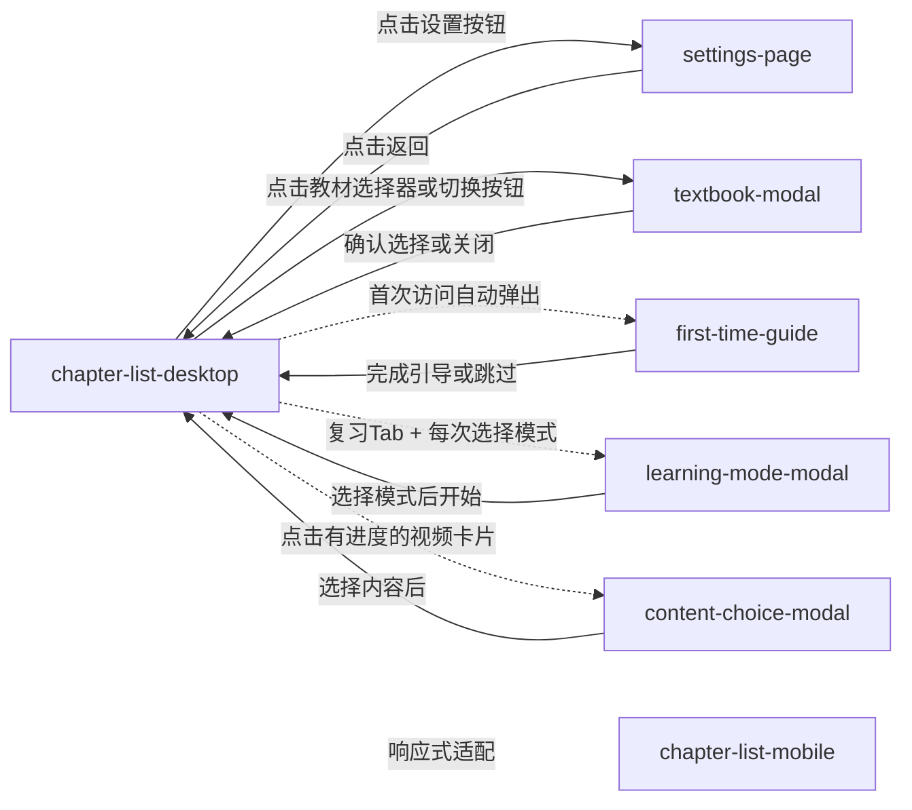

# 评审地图 — 章节列表页迭代 V1.6

> 生成时间：2026-03-12T16:00:00+08:00
> 原型类型：Standard Vue
> 原型路径：`02-prototypes/vue-apps/chapter-list-redesign/`

---

## 页面概览

| # | 页面 | 路由/文件 | 类型 | 状态数 |
|---|------|----------|------|--------|
| 1 | 章节列表（桌面端） | `/` | entry | 8 |
| 2 | 章节列表（移动端） | `/` | entry | 5 |
| 3 | 设置页 | `/settings` | normal | 1 |
| 4 | 教材切换弹窗 | `/` | conditional | 1 |
| 5 | 新手引导 | `/` | conditional | 4 |
| 6 | 学习模式弹窗 | `/` | conditional | 1 |
| 7 | 内容选择弹窗 | `/` | conditional | 1 |

---

## 页面间关系



### 连接详情

| 来源 | 目标 | 类型 | 触发条件 |
|------|------|------|----------|
| chapter-list-desktop | settings-page | navigation | 点击设置按钮 |
| settings-page | chapter-list-desktop | back | 点击返回 |
| chapter-list-desktop | textbook-modal | navigation | 点击教材选择器或切换按钮 |
| textbook-modal | chapter-list-desktop | back | 确认选择或关闭 |
| chapter-list-desktop | first-time-guide | conditional | 首次访问自动弹出 |
| first-time-guide | chapter-list-desktop | back | 完成引导或跳过 |
| chapter-list-desktop | learning-mode-modal | conditional | 复习Tab + 每次选择模式 |
| learning-mode-modal | chapter-list-desktop | back | 选择模式后开始 |
| chapter-list-desktop | content-choice-modal | conditional | 点击有进度的视频卡片 |
| content-choice-modal | chapter-list-desktop | back | 选择内容后 |
| chapter-list-desktop | chapter-list-mobile | data | 响应式适配 (viewport < 768px) |

---

## 各页面详情

### 1. 章节列表（桌面端）

**路由**：`/`

**截图**：`desktop--preview-tab.png`

**摘要**：主页面，采用左右联动双栏布局：左侧章节目录树、右侧场景化资源卡片列表。支持 4 种学科模板的场景 Tab 切换、全量资源模式、滚动联动选中等核心交互。

**功能点**（13 个）：
- 全局头部：返回按钮 + 「教材同步」标题 + 教材版本选择器 + VIP升级入口
- 场景 Tab 栏：4 种学科模板通过 sceneConfig.ts 映射
- 快捷入口栏：思维导图/错题本/收藏/设置
- 章节目录树：递归树形结构，左右联动
- 切换教材按钮
- 学习方法指引：可展开/收起的黄底卡片
- 知识点视频卡片：缩略图 + 标题/标签/难度/进度
- 练习卡片：难度标签 + 完成进度
- 学习指引卡片：PDF学案下载入口
- AI总结笔记卡片：绿色渐变底，含金色星标
- VIP钩子卡片：金色渐变缩略图 + 「去加购」
- 章节底部导航：上一章/下一章
- NEW 新内容标识

**状态列表**：

| 状态 | 截图 | 触发条件 |
|------|------|----------|
| 预习Tab | `desktop--preview-tab.png` | 页面加载默认 |
| 解题指导Tab | `desktop--second-tab.png` | 点击解题指导Tab |
| 刷题Tab | `desktop--third-tab.png` | 点击刷题Tab |
| 全部资源模式 | `desktop--all-resources.png` | 点击「全部」按钮 |
| VIP锁定状态 | `desktop--vip-state.png` | 用户未购买VIP |
| 章节底部 | `desktop--chapter-footer.png` | 内容滚动到底部 |
| 英语预习 | `desktop--english-preview.png` | 切换到英语学科 |

---

### 2. 章节列表（移动端）

**路由**：`/`

**截图**：`mobile--default.png`

**摘要**：移动端自适应布局：侧边栏默认隐藏，通过左侧拉手按钮滑入。单栏显示资源列表。

**功能点**（3 个）：
- 侧边栏拉手：竖条按钮，点击打开抽屉式侧边栏
- 抽屉式侧边栏：从左侧滑入（宽80%，最大300px）
- 移动端更多菜单：快捷入口折叠为下拉菜单

**状态列表**：

| 状态 | 截图 | 触发条件 |
|------|------|----------|
| 默认状态 | `mobile--default.png` | 页面加载默认 |
| 侧边栏展开 | `mobile--sidebar-open.png` | 点击拉手按钮 |
| 向下滚动 | `mobile--preview-scrolled.png` | 用户向下滚动 |
| 解题指导Tab | `mobile--second-tab.png` | 点击解题指导Tab |

---

### 3. 设置页

**路由**：`/settings`

**截图**：`desktop--settings.png`

**摘要**：用户个性化设置：复习学习顺序、默认场景偏好、同步刷题难度筛选。即时生效并持久化到 localStorage。

**功能点**（3 个）：
- 复习学习顺序：先做题后看视频（推荐）/ 先看视频后做题 / 每次选择
- 默认场景选择：全部 / 上次选择
- 同步刷题难度：基础/中等/困难多选，至少保留1个

---

### 4. 教材切换弹窗

**截图**：`desktop--textbook-modal.png`

**摘要**：三列级联选择器：学科→版本→年级册别。支持10个学科、多个出版社版本。

---

### 5. 新手引导

**截图**：`first-time-guide--step-1.png`

**摘要**：首次访问的3步引导：60%半透明遮罩 + 居中引导卡片 + 步骤指示器 + 手势提示动画。

**状态列表**：

| 状态 | 截图 | 触发条件 |
|------|------|----------|
| 第1步：选择教材 | `first-time-guide--step-1.png` | 首次访问 |
| 第2步：浏览章节 | `first-time-guide--step-2.png` | 点击下一步 |
| 第3步：开始学习 | `first-time-guide--step-3.png` | 点击下一步 |

---

### 6. 学习模式弹窗

**截图**：`desktop--preview-tab.png`（弹窗未独立截图）

**摘要**：复习场景下的模式选择器（设置为「每次选择」时触发）：先做题后看视频（推荐）/ 先看视频后做题。

---

### 7. 内容选择弹窗

**截图**：`desktop--preview-tab.png`（弹窗未独立截图）

**摘要**：点击有进度的知识点卡片时弹出3种路径：继续看视频、做补充练习、看课堂笔记（条件显示）。

---

## 用户旅程

### 旅程 1：用户首次学习

> 新用户第一次打开章节列表页，从新手引导开始，到成功学习第一个知识点

**目标**：完成新手引导，理解页面布局，成功点击第一个资源开始学习

| 步骤 | 页面 | 用户操作 |
|------|------|----------|
| 1 | 章节列表（桌面端） | 进入章节列表页 |
| 2 | 新手引导 | 阅读第1步「选择教材」 |
| 3 | 新手引导 | 点击下一步 → 第2步「浏览章节」 |
| 4 | 新手引导 | 点击「开始学习」完成引导 |
| 5 | 章节列表（桌面端） | 浏览预习Tab下的资源（决策：VIP/非VIP） |
| 6 | 章节列表（桌面端） | 点击第一个知识点视频卡片 |

### 旅程 2：用户自主选择场景完成学习

> 用户根据学习需求切换场景Tab和章节，完成个性化学习路径

**目标**：找到适合自己的学习场景，在不同章节间自由导航并完成学习

| 步骤 | 页面 | 用户操作 |
|------|------|----------|
| 1 | 章节列表（桌面端） | 进入页面（预习Tab默认） |
| 2 | 章节列表（桌面端） | 切换场景Tab（决策：预习/解题指导/刷题/全部） |
| 3 | 章节列表（桌面端） | 在目录树中点击其他小节 |
| 4 | 章节列表（桌面端） | 点击知识点视频卡片（决策：有无进度） |
| 5 | 章节列表（桌面端） | 滚动到底部 → 点击「下一章」 |
| 6 | 章节列表（桌面端） | 点击教材选择器 |
| 7 | 教材切换弹窗 | 选择学科→版本→年级 → 确认 |

### 旅程 3：用户调整功能设置

> 用户根据学习习惯调整应用设置

**目标**：个性化配置学习偏好，让应用更符合使用习惯

| 步骤 | 页面 | 用户操作 |
|------|------|----------|
| 1 | 章节列表（桌面端） | 点击「设置」按钮 |
| 2 | 设置页 | 调整复习学习顺序（决策：3种模式） |
| 3 | 设置页 | 设置默认场景偏好 |
| 4 | 设置页 | 勾选刷题难度 |
| 5 | 设置页 | 点击返回 |
| 6 | 章节列表（桌面端） | 验证设置效果 |

---

## 文件清单

```
03-panorama/
├── review-map.html          # 交互式评审地图
├── review-map.md            # 本文件
├── review-map-data.json     # 结构化数据
└── screenshots/
    ├── desktop--preview-tab.png
    ├── desktop--second-tab.png
    ├── desktop--third-tab.png
    ├── desktop--all-resources.png
    ├── desktop--textbook-modal.png
    ├── desktop--settings.png
    ├── desktop--chapter-footer.png
    ├── desktop--vip-state.png
    ├── desktop--english-preview.png
    ├── desktop--vocab-entry.png
    ├── mobile--default.png
    ├── mobile--sidebar-open.png
    ├── mobile--preview-scrolled.png
    ├── mobile--second-tab.png
    ├── first-time-guide--step-1.png
    ├── first-time-guide--step-2.png
    ├── first-time-guide--step-3.png
    └── manifest.json
```

---

> 本文档由 review-map skill 自动生成，配合 `review-map.html` 使用效果更佳。
> 交互式版本请在浏览器中打开 `review-map.html`。
