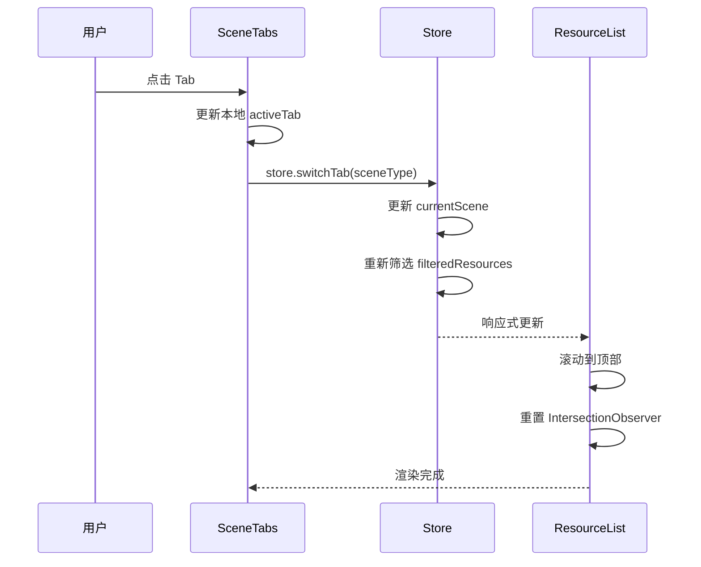

# 功能详细设计：场景系统（Tab + 学习指南 + 学科模板）

| 项目 | 值 |
|------|------|
| 文档版本 | V2.0 |
| 日期 | 2026-03-13 |
| 关联原型 | chapter-list-redesign V1.6 |
| 涉及组件 | `SceneTabs.vue`、`LearningGuide.vue`、`sceneConfig.ts` |
| 状态 | Draft |

---

## 1. 场景模板体系

### 1.1 SceneType 枚举

```typescript
type SceneType =
  | 'preview'          // 预习
  | 'review'           // 复习
  | 'extra'            // 拓展（保留）
  | 'problem_solving'  // 解题指导
  | 'drill'            // 刷题
  | 'accumulation'     // 日常积累
```

### 1.2 四大学科模板

| 模板常量 | 适用学科 | Tab 配置 |
|----------|----------|----------|
| `SCIENCE_PROBLEM_TABS` | 数学、物理、化学 | 预习 → 解题指导 → 刷题 |
| `LANGUAGE_TABS` | 语文、英语 | 预习 → 复习 → 日常积累 |
| `SCIENCE_BASIC_TABS` | 生物、地理 | 预习 → 复习 |
| `HISTORY_TABS` | 历史、政治 | 预习 → 复习 |

```typescript
// sceneConfig.ts

interface SceneTab {
  key: SceneType
  label: string
  icon?: string
}

const SCIENCE_PROBLEM_TABS: SceneTab[] = [
  { key: 'preview', label: '预习' },
  { key: 'problem_solving', label: '解题指导' },
  { key: 'drill', label: '刷题' },
]

const LANGUAGE_TABS: SceneTab[] = [
  { key: 'preview', label: '预习' },
  { key: 'review', label: '复习' },
  { key: 'accumulation', label: '日常积累' },
]

const SCIENCE_BASIC_TABS: SceneTab[] = [
  { key: 'preview', label: '预习' },
  { key: 'review', label: '复习' },
]

const HISTORY_TABS: SceneTab[] = [
  { key: 'preview', label: '预习' },
  { key: 'review', label: '复习' },
]
```

### 1.3 学科 → 模板映射

```typescript
const SUBJECT_SCENE_MAP: Record<string, SceneTab[]> = {
  math:      SCIENCE_PROBLEM_TABS,
  physics:   SCIENCE_PROBLEM_TABS,
  chemistry: SCIENCE_PROBLEM_TABS,
  chinese:   LANGUAGE_TABS,
  english:   LANGUAGE_TABS,
  biology:   SCIENCE_BASIC_TABS,
  geography: SCIENCE_BASIC_TABS,
  history:   HISTORY_TABS,
  politics:  HISTORY_TABS,
}
```

---

## 2. SceneTabs 组件

### 2.1 两种显示模式

#### 默认模式（Default Mode）

用于 content-area 顶部独立行展示。

| 属性 | 值 |
|------|------|
| 布局 | 全宽横向排列，等分宽度 |
| 选中指示器 | 底部横线，高度 3px，颜色 `#FEA345` |
| 文字大小 | 14px（默认）/ 13px（tiny-mobile） |
| 选中文字色 | `#FEA345` |
| 未选中文字色 | `#848096` |
| 切换动画 | 指示器 `transition: left 0.3s ease, width 0.3s ease` |

```scss
.scene-tabs--default {
  display: flex;
  width: 100%;
  border-bottom: 1px solid #D4D2DC;
  position: relative;

  .tab-item {
    flex: 1;
    text-align: center;
    padding: 10px 0;
    font-size: 14px;
    color: #848096;
    cursor: pointer;
    position: relative;
    transition: color 0.2s ease;

    &.is-active {
      color: #FEA345;
      font-weight: 600;
    }
  }

  .tab-indicator {
    position: absolute;
    bottom: 0;
    height: 3px;
    background: #FEA345;
    border-radius: 999px;
    transition: left 0.3s ease, width 0.3s ease;
  }
}
```

#### 嵌入模式（Embedded Mode）

用于 sidebar-header 或 compact 布局场景。

| 属性 | 值 |
|------|------|
| 布局 | 横向排列，间距 8px |
| 胶囊样式 | 圆角 999px，内边距 4px 12px |
| 选中态 | 背景 `#FFF1E3`，文字 `#FEA345` |
| 未选中态 | 背景透明，文字 `#848096` |
| "全部" Tab | 边框 `1px solid #D4D2DC`，无填充背景 |
| 文字大小 | 13px |

```scss
.scene-tabs--embedded {
  display: flex;
  gap: 8px;
  padding: 8px 0;

  .tab-capsule {
    padding: 4px 12px;
    border-radius: 999px;
    font-size: 13px;
    color: #848096;
    cursor: pointer;
    transition: all 0.2s ease;
    white-space: nowrap;

    &.is-active {
      background: #FFF1E3;
      color: #FEA345;
      font-weight: 600;
    }

    &.tab-all {
      border: 1px solid #D4D2DC;
      background: transparent;

      &.is-active {
        border-color: #FEA345;
        background: #FFF1E3;
        color: #FEA345;
      }
    }
  }
}
```

### 2.2 Tab 切换流程



```typescript
// store action
const switchTab = (scene: SceneType) => {
  currentScene.value = scene
  // filteredResources 由 computed 自动更新
}

// SceneTabs.vue
const handleTabClick = (tab: SceneTab) => {
  store.switchTab(tab.key)
  // 通知 content-area 滚动到顶部
  emit('tab-changed', tab.key)
}
```

---

## 3. LearningGuide 组件

### 3.1 视觉规格

| 属性 | 值 |
|------|------|
| 背景色 | `#FFF1E3` |
| 圆角 | 10px (`$radius-lg`) |
| 内边距 | 12px 16px |
| 图标 | `Lightbulb`，颜色 `#FEA345`，尺寸 18px |
| 标题 | "学习指南"，14px semibold，颜色 `#2E2E3A` |
| 内容文字 | 13px regular，颜色 `#848096`，行高 1.6 |
| 折叠动画 | `max-height` 过渡 0.3s ease |

```scss
.learning-guide {
  background: #FFF1E3;
  border-radius: 10px;
  padding: 12px 16px;
  margin-bottom: 12px;

  .guide-header {
    display: flex;
    align-items: center;
    gap: 8px;
    cursor: pointer;

    .guide-icon {
      width: 18px;
      height: 18px;
      color: #FEA345;
    }

    .guide-title {
      font-size: 14px;
      font-weight: 600;
      color: #2E2E3A;
      flex: 1;
    }

    .guide-toggle {
      width: 16px;
      height: 16px;
      color: #848096;
      transition: transform 0.3s ease;

      &.is-collapsed {
        transform: rotate(-90deg);
      }
    }
  }

  .guide-content {
    font-size: 13px;
    color: #848096;
    line-height: 1.6;
    overflow: hidden;
    transition: max-height 0.3s ease, opacity 0.3s ease;

    &.is-collapsed {
      max-height: 0;
      opacity: 0;
    }

    &.is-expanded {
      max-height: 200px;
      opacity: 1;
      margin-top: 8px;
    }
  }
}
```

### 3.2 数据来源

```typescript
// 内容由 store 根据当前学科 + 场景动态提供
const currentGuide = computed(() => {
  const subject = currentSubject.value
  const scene = currentScene.value
  return guideContent[subject]?.[scene] ?? null
})
```

当 `currentGuide` 为 `null` 时，整个 LearningGuide 组件不渲染（`v-if`）。

---

## 4. 响应式适配

| 断点 | SceneTabs 变化 | LearningGuide 变化 |
|------|----------------|---------------------|
| `≥768px` (desktop) | 默认模式，嵌入 content-area 顶部 | 正常显示 |
| `<768px` (mobile) | 独立行，全宽 | 正常显示 |
| `<380px` (tiny) | 字号降至 13px | 内容字号降至 12px |
| `<360px` (micro) | 胶囊间距收窄至 6px | 内边距收窄至 8px 12px |

```scss
@media (max-width: 379px) {
  .scene-tabs--default .tab-item {
    font-size: 13px;
  }

  .learning-guide .guide-content {
    font-size: 12px;
  }
}

@media (max-width: 359px) {
  .scene-tabs--embedded {
    gap: 6px;

    .tab-capsule {
      padding: 3px 10px;
      font-size: 12px;
    }
  }

  .learning-guide {
    padding: 8px 12px;
  }
}
```

---

## 5. V5.x 自检表

| # | 检查项 | 状态 | 备注 |
|---|--------|------|------|
| 1 | 4 种学科模板是否全部定义 | ✅ | SCIENCE_PROBLEM / LANGUAGE / SCIENCE_BASIC / HISTORY |
| 2 | SceneType 枚举是否覆盖所有场景 | ✅ | 6 种场景类型 |
| 3 | 两种 Tab 显示模式样式是否完整 | ✅ | default + embedded |
| 4 | "全部" Tab 特殊边框样式是否标注 | ✅ | 1px solid #D4D2DC |
| 5 | Tab 切换 → 数据更新 → UI 刷新流程是否闭环 | ✅ | Mermaid 时序图 |
| 6 | LearningGuide 折叠/展开动画是否定义 | ✅ | max-height 过渡 |
| 7 | 数据来源 (store.currentGuide) 是否说明 | ✅ | computed by subject + scene |
| 8 | 响应式 tiny/micro 适配是否覆盖 | ✅ | 字号 / 间距 / 内边距 |
