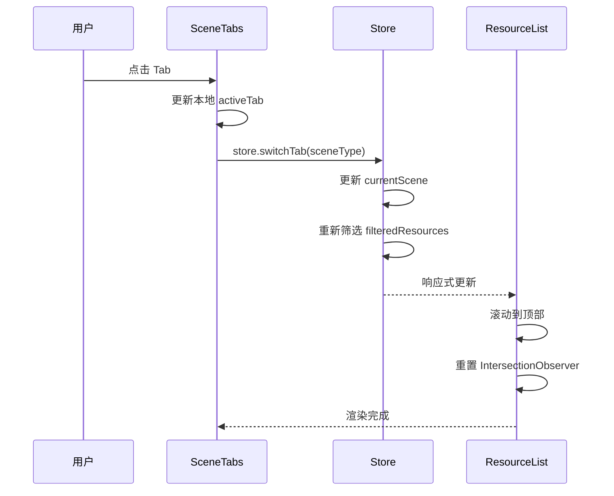

# 功能详细设计：场景系统（Tab + 学习指南 + 标签筛选引擎 + 学科模板）

| 项目 | 值 |
|------|------|
| 文档版本 | V3.0 |
| 日期 | 2026-03-17 |
| 关联原型 | chapter-list-redesign V1.6 |
| 涉及组件 | `SceneTabs.vue`、`LearningGuide.vue`、`sceneConfig.ts` |
| 状态 | Draft |

---

## 1. 场景模板体系

### 1.1 SceneType 枚举

```typescript
type SceneType =
  | 'preview'          // 预习
  | 'review'           // 复习
  | 'extra'            // 加餐
  | 'problem_solving'  // 解题指导
  | 'drill'            // 刷题
  | 'accumulation'     // 日常积累
```

### 1.2 四大学科模板（UPDATED）

| 模板常量 | 适用学科 | Tab 配置 |
|----------|----------|----------|
| `SCIENCE_PROBLEM_TABS` | 初中数理化、高中数理化生 | 预习 → 解题指导 → 刷题 |
| `LANGUAGE_TABS` | 初/高中语英、小学语英 | 预习 → 复习 → 日常积累 |
| `SCIENCE_BASIC_TABS` | 初/高中生物地理历史政治道法 | 预习 → 复习 |
| `ELEMENTARY_SCIENCE_TABS` | 小学数学 | 预习 → 复习 |

> **注意**："加餐"场景在理科解题型和小学理科型中以独立入口存在，不作为 Tab 展示。

```typescript
interface SceneTab {
  key: SceneType
  label: string
  icon?: string
}

const SCIENCE_PROBLEM_TABS: SceneTab[] = [
  { key: 'preview', label: '预习' },
  { key: 'problem_solving', label: '解题指导' },
  { key: 'drill', label: '刷题' },
]

const LANGUAGE_TABS: SceneTab[] = [
  { key: 'preview', label: '预习' },
  { key: 'review', label: '复习' },
  { key: 'accumulation', label: '日常积累' },
]

const SCIENCE_BASIC_TABS: SceneTab[] = [
  { key: 'preview', label: '预习' },
  { key: 'review', label: '复习' },
]

const ELEMENTARY_SCIENCE_TABS: SceneTab[] = [
  { key: 'preview', label: '预习' },
  { key: 'review', label: '复习' },
]
```

### 1.3 学段+学科 → 模板映射（StageSubjectKey）

```typescript
type StageType = 'elementary' | 'middle' | 'high'
type StageSubjectKey = `${StageType}_${string}`

const STAGE_SUBJECT_SCENE_MAP: Record<StageSubjectKey, SceneTab[]> = {
  // 小学
  elementary_math:      ELEMENTARY_SCIENCE_TABS,
  elementary_chinese:   LANGUAGE_TABS,
  elementary_english:   LANGUAGE_TABS,

  // 初中
  middle_math:      SCIENCE_PROBLEM_TABS,
  middle_physics:   SCIENCE_PROBLEM_TABS,
  middle_chemistry: SCIENCE_PROBLEM_TABS,
  middle_chinese:   LANGUAGE_TABS,
  middle_english:   LANGUAGE_TABS,
  middle_biology:   SCIENCE_BASIC_TABS,
  middle_geography: SCIENCE_BASIC_TABS,
  middle_history:   SCIENCE_BASIC_TABS,  // ⚠️ 暂不上线
  middle_politics:  SCIENCE_BASIC_TABS,  // ⚠️ 暂不上线

  // 高中
  high_math:      SCIENCE_PROBLEM_TABS,
  high_physics:   SCIENCE_PROBLEM_TABS,
  high_chemistry: SCIENCE_PROBLEM_TABS,
  high_biology:   SCIENCE_PROBLEM_TABS,
  high_chinese:   LANGUAGE_TABS,
  high_english:   LANGUAGE_TABS,
  high_geography: SCIENCE_BASIC_TABS,  // ⚠️ 暂不上线
  high_history:   SCIENCE_BASIC_TABS,  // ⚠️ 暂不上线
  high_politics:  SCIENCE_BASIC_TABS,  // ⚠️ 暂不上线
}
```

### 1.4 暂不上线学科清单

以下学科已完成模板映射但标记为暂不上线（⚠️），在前端配置中需做 `enabled: false` 处理：

| 学段 | 学科 | 模板 | 原因 |
|------|------|------|------|
| 初中 | 历史 | SCIENCE_BASIC_TABS | 内容标注未完成 |
| 初中 | 道法 | SCIENCE_BASIC_TABS | 内容标注未完成 |
| 高中 | 地理 | SCIENCE_BASIC_TABS | 内容标注未完成 |
| 高中 | 历史 | SCIENCE_BASIC_TABS | 内容标注未完成 |
| 高中 | 政治 | SCIENCE_BASIC_TABS | 内容标注未完成 |

---

## 2. 标签筛选引擎（核心变更）

### 2.1 标签类型定义

```typescript
interface ResourceTag {
  id: string
  name: string
  type: 'content' | 'scene'
}

// 内容标签 examples: 概念课、解题课、课文精讲、进阶理解、实验操作...
// 场景标签 examples: 课前预习、课后巩固、单元复习、作业精讲、期中期末重点、新题型、日常积累
```

| 标签类型 | 字段名 | 用途 | 示例 |
|---------|--------|------|------|
| 内容标签 | `contentTags` | 区分视频课程的教学类型 | 概念课、解题课、课文精讲、进阶理解、实验操作 |
| 场景标签 | `sceneTags` | 标记课程适用的学习场景 | 课前预习、课后巩固、单元复习、作业精讲、期中期末重点、新题型、日常积累 |

### 2.2 筛选规则模型

```typescript
interface SceneFilterRule {
  contentTags?: string[]   // 内容标签组 (组内 OR)
  sceneTags?: string[]     // 场景标签组 (组内 OR)
}

interface SceneDefinition {
  key: SceneType
  label: string
  description: string
  cardTypes: ResourceType[]
  filterRules: SceneFilterRule[]  // 多个规则组之间 OR
  hiddenTags: string[]
  useTagFilter: boolean          // false for "加餐" scene
}
```

### 2.3 筛选逻辑规则

**四条核心规则**：

| # | 规则 | 关系 | 说明 |
|---|------|------|------|
| 1 | 组内关系 | OR | 同一标签类型内多个标签，满足任一即可 |
| 2 | 组间关系 | AND | 内容标签 与 场景标签 须同时满足 |
| 3 | 多条件组合 | OR | 多个 `filterRule` 之间，满足任一组即可 |
| 4 | 隐藏标签 | — | 参与后端筛选，前台不展示 |

**逻辑示意图**：

```
Resource Tags
  ├── contentTags: [A, B]     ─┐
  │     match ANY of rule.contentTags?  ──→ contentOk
  │                                        │
  └── sceneTags: [X, Y]      ─┐            │  AND
        match ANY of rule.sceneTags?  ──→ sceneOk ──→ ruleMatched
                                                         │
                                                    (多个 rule)
                                                         │ OR
                                                    finalResult
```

**筛选伪代码**：

```typescript
function matchesScene(resource: Resource, scene: SceneDefinition): boolean {
  // "加餐"等不走标签筛选的场景
  if (!scene.useTagFilter) {
    return scene.cardTypes.includes(resource.type)
  }

  // 先校验资源类型
  if (!scene.cardTypes.includes(resource.type)) return false

  // 多条件组 OR：任一 filterRule 匹配即通过
  return scene.filterRules.some(rule => {
    // 组内 OR：contentTags 中任一匹配
    const contentOk = !rule.contentTags?.length ||
      rule.contentTags.some(t => resource.contentTags?.includes(t))
    // 组内 OR：sceneTags 中任一匹配
    const sceneOk = !rule.sceneTags?.length ||
      rule.sceneTags.some(t => resource.sceneTags?.includes(t))
    // 组间 AND：content 和 scene 须同时满足
    return contentOk && sceneOk
  })
}
```

### 2.4 标签显示过滤

```typescript
function getVisibleTags(resource: Resource, scene: SceneDefinition): string[] {
  const allTags = [
    ...(resource.contentTags ?? []),
    ...(resource.sceneTags ?? [])
  ]
  return allTags.filter(t => !scene.hiddenTags.includes(t))
}
```

### 2.5 "加餐"场景特殊处理

- `useTagFilter = false`
- 按 `cardTypes` 直接聚合（同步刷题、培优课钩子）
- 不参与标签筛选
- 不作为独立 Tab，以独立入口形式存在于理科解题型和小学理科型模板

---

## 3. 分学段分学科筛选配置（完整参考表）

### 3.1 小学

#### 小学数学（小学理科型）

| 场景 | 定位说明 | 包含卡片类型 | 筛选规则 | 隐藏标签 |
|------|---------|-------------|---------|---------|
| 预习 | 同步视频全覆盖，课前抢先看 | 视频、同步刷题 | contentTags=【概念课/进阶理解/解题课】AND sceneTags=【课前预习/课后巩固/单元复习/作业精讲/期中期末重点/新题型】 | 课前预习、课后巩固、单元复习、作业精讲、期中期末重点 |
| 复习 | 温故知新，查漏补缺 | 同步刷题、培优课钩子、视频(少量) | sceneTags=【课后巩固/单元复习/作业精讲/期中期末重点】 | 无 |
| ~~加餐~~ | 学有余力，更进一程 | 同步刷题、培优课钩子 | 不走标签筛选，按资源类型聚合 | — |

#### 小学语文（文科语言型）

| 场景 | 定位说明 | 包含卡片类型 | 筛选规则 | 隐藏标签 |
|------|---------|-------------|---------|---------|
| 预习 | 同步视频全覆盖，课前抢先看 | 视频、学案 | contentTags=【基础知识/课文阅读/必备古诗/趣味拓展】AND sceneTags=【课前预习】 | 课前预习 |
| 复习 | 温故知新，查漏补缺 | 视频、学案、同步刷题 | contentTags=【必备古诗/课文阅读/名著阅读/习作表达】AND sceneTags=【课后巩固】 | 无 |
| 日常积累 | 每日一小步，成长一大步 | 视频 | contentTags=【文言积累/必备古诗】 | 所有场景标签 |
| ~~加餐~~ | 学有余力，更进一程 | 同步刷题 | 不走标签筛选 | — |

#### 小学英语（文科语言型）

| 场景 | 定位说明 | 包含卡片类型 | 筛选规则 | 隐藏标签 |
|------|---------|-------------|---------|---------|
| 预习 | 同步视频全覆盖，课前抢先看 | 视频 | contentTags=【概念课/进阶理解】AND sceneTags=【课前预习/课后巩固】 | 课前预习 |
| 复习 | 温故知新，查漏补缺 | 视频、学案、同步刷题 | contentTags=【解题课】AND sceneTags=【课后巩固/单元复习】 | 无 |
| 日常积累 | 每日一小步，成长一大步 | 视频、背单词 | contentTags=【概念课】AND sceneTags=【课前预习】 | 所有场景标签 |
| ~~加餐~~ | 学有余力，更进一程 | 同步刷题 | 不走标签筛选 | — |

### 3.2 初中

#### 初中数学（理科解题型）

| 场景 | 定位说明 | 包含卡片类型 | 筛选规则 | 隐藏标签 |
|------|---------|-------------|---------|---------|
| 预习 | 课前勤预习，心中有底气 | 视频 | sceneTags=【课前预习】OR【课后巩固】 | 课前预习、课后巩固 |
| 解题指导 | 作业没思路？解题有妙招 | 视频 | sceneTags=【作业精讲】 | 无 |
| ~~加餐~~ | 想要更出色？来这儿多刷题 | 同步刷题、培优课钩子 | 不走标签筛选 | — |

#### 初中物理（理科解题型）

| 场景 | 定位说明 | 包含卡片类型 | 筛选规则 | 隐藏标签 |
|------|---------|-------------|---------|---------|
| 预习 | 课前勤预习，心中有底气 | 视频 | contentTags=【概念课】AND sceneTags=【课前预习】 | 课前预习 |
| 解题指导 | 作业没思路？解题有妙招 | 视频 | contentTags=【解题课】OR【实验操作】 | 无 |
| ~~加餐~~ | 想要更出色？来这儿多刷题 | 同步刷题、培优课钩子 | 不走标签筛选 | — |

#### 初中化学（理科解题型）

| 场景 | 定位说明 | 包含卡片类型 | 筛选规则 | 隐藏标签 |
|------|---------|-------------|---------|---------|
| 预习 | 课前勤预习，心中有底气 | 视频 | 规则组1: contentTags=【概念课/进阶理解】AND sceneTags=【课前预习/课后巩固/作业精讲】; 规则组2: contentTags=【实验操作】(仅此标签) | 课前预习 |
| 解题指导 | 作业没思路？解题有妙招 | 视频 | contentTags=【解题课】AND sceneTags=【单元复习/期中期末重点】 | 无 |
| ~~加餐~~ | 想要更出色？来这儿多刷题 | 同步刷题、培优课钩子 | 不走标签筛选 | — |

#### 初中语文（文科语言型）

| 场景 | 定位说明 | 包含卡片类型 | 筛选规则 | 隐藏标签 |
|------|---------|-------------|---------|---------|
| 预习 | 拆解经典文章，内化核心素养 | 视频、学案、笔记卡 | contentTags=【课文朗读/课文精讲/文言文翻译】AND sceneTags=【课前预习】 | 课前预习 |
| 复习 | 针对性训练综合语言能力 | 视频、学案、同步刷题、培优课钩子 | contentTags=【阅读方法/写作】AND sceneTags=【课后巩固】 | 课后巩固 |
| 日常积累 | 扫清基础漏洞，字词语法全掌握 | 视频 | contentTags=【文学文化常识/艺术手法/语法知识/名著导读】AND sceneTags=【课前预习】 | 课前预习 |
| ~~加餐~~ | 学有余力，更进一程 | 同步刷题、培优课钩子 | 不走标签筛选 | — |

#### 初中英语（文科语言型）

| 场景 | 定位说明 | 包含卡片类型 | 筛选规则 | 隐藏标签 |
|------|---------|-------------|---------|---------|
| 预习 | 拆解经典文章，内化核心素养 | 视频、学案 | contentTags=【课文精读】AND sceneTags=【课前预习】 | 课前预习 |
| 复习 | 针对性训练综合语言能力 | 视频、同步刷题、培优课钩子 | 规则组1: contentTags=【情景交际】AND sceneTags=【课后巩固】; 规则组2: contentTags=【语法概念】AND sceneTags=【期中期末重点/课后巩固】 | 无 |
| 日常积累 | 扫清基础漏洞，字词语法全掌握 | 视频、背单词 | contentTags=【词汇精讲/词汇串讲/趣味词汇/音标教学/语法概念】AND sceneTags=【课前预习】 | 课前预习 |
| ~~加餐~~ | 学有余力，更进一程 | 同步刷题、培优课钩子 | 不走标签筛选 | — |

#### 初中生物（小四门基础型）

| 场景 | 定位说明 | 包含卡片类型 | 筛选规则 | 隐藏标签 |
|------|---------|-------------|---------|---------|
| 预习 | 知识图谱全扫描，同步学透不费力 | 视频、同步刷题(简单) | 规则组1: contentTags=【基础概念课/实验操作/进阶理解课】; 规则组2: contentTags=【解题课】AND sceneTags=【作业精讲】 | 所有场景标签 |
| 复习 | 备考冲刺加速器，突破提分瓶颈 | 视频、同步刷题(中等+较难)、培优课钩子 | 规则组1: contentTags=【解题课】AND sceneTags NOT含【作业精讲】; 规则组2: contentTags=【基础概念课/实验操作/进阶理解课】AND sceneTags=【期中期末重点】 | 基础概念课、实验操作、进阶理解课 |

#### 初中地理（小四门基础型）

| 场景 | 定位说明 | 包含卡片类型 | 筛选规则 | 隐藏标签 |
|------|---------|-------------|---------|---------|
| 预习 | 知识图谱全扫描，同步学透不费力 | 视频、同步刷题 | 规则组1: contentTags=【基础概念课】; 规则组2: contentTags=【进阶理解课】AND sceneTags=【期中期末重点/课前预习/课后巩固】 | 解题课、日常积累 |
| 复习 | 备考冲刺加速器，突破提分瓶颈 | 视频、同步刷题、培优课钩子 | 规则组1: contentTags=【解题课】; 规则组2: contentTags=【进阶理解课】AND sceneTags=【日常积累】 | 基础概念课、期中期末重点、课前预习、课后巩固 |

#### 初中历史 ⚠️ 暂不上线

| 场景 | 定位说明 | 包含卡片类型 | 筛选规则 | 隐藏标签 |
|------|---------|-------------|---------|---------|
| 预习 | 知识图谱全扫描，同步学透不费力 | 视频 | contentTags=【基础史实/进阶理解】AND sceneTags=【课前预习/课后巩固/期中期末重点】 | 课前预习 |
| 复习 | 备考冲刺加速器，突破提分瓶颈 | 视频、同步刷题 | （待补充） | （待补充） |

#### 道法（初中） ⚠️ 暂不上线

| 场景 | 定位说明 | 包含卡片类型 | 筛选规则 | 隐藏标签 |
|------|---------|-------------|---------|---------|
| 预习 | 知识图谱全扫描，同步学透不费力 | 视频 | contentTags=【基础概念/进阶理解】AND sceneTags=【课前预习/课后巩固/期中期末重点】 | 课前预习 |
| 复习 | 备考冲刺加速器，突破提分瓶颈 | 视频、同步刷题 | （待补充） | （待补充） |

### 3.3 高中

#### 高中数学（理科解题型）

| 场景 | 定位说明 | 包含卡片类型 | 筛选规则 | 隐藏标签 |
|------|---------|-------------|---------|---------|
| 预习 | 基础内容全梳理，快速构建知识体系 | 视频 | sceneTags=【课前预习】 | 课前预习 |
| 解题指导 | 精讲做题套路，攻克重难点 | 视频、培优课钩子 | sceneTags=【作业精讲/期中期末重点】 | 课前预习 |
| 刷题 | 实战见真章，海量题库随时练 | 同步刷题 | 不走标签筛选 | — |

#### 高中物理（理科解题型）

| 场景 | 定位说明 | 包含卡片类型 | 筛选规则 | 隐藏标签 |
|------|---------|-------------|---------|---------|
| 预习 | 基础内容全梳理，快速构建知识体系 | 视频 | contentTags=【概念课】AND sceneTags=【课前预习】 | 课前预习 |
| 解题指导 | 精讲做题套路，攻克重难点 | 视频、培优课钩子 | sceneTags=【课后巩固/作业精讲/单元复习/期中期末重点】 | 概念课 |
| 刷题 | 实战见真章，海量题库随时练 | 同步刷题 | 不走标签筛选 | — |

#### 高中化学（理科解题型）

| 场景 | 定位说明 | 包含卡片类型 | 筛选规则 | 隐藏标签 |
|------|---------|-------------|---------|---------|
| 预习 | 基础内容全梳理，快速构建知识体系 | 视频 | sceneTags=【课前预习】 | 课前预习 |
| 解题指导 | 精讲做题套路，攻克重难点 | 视频、培优课钩子 | sceneTags=【作业精讲】 | 无 |
| 刷题 | 实战见真章，海量题库随时练 | 同步刷题 | 不走标签筛选 | — |

#### 高中生物（理科解题型）

| 场景 | 定位说明 | 包含卡片类型 | 筛选规则 | 隐藏标签 |
|------|---------|-------------|---------|---------|
| 预习 | 基础内容全梳理，快速构建知识体系 | 视频 | contentTags=【概念课】 | 课前预习 |
| 解题指导 | 精讲做题套路，攻克重难点 | 视频、培优课钩子 | contentTags=【解题课】 | 无 |
| 刷题 | 实战见真章，海量题库随时练 | 同步刷题 | 不走标签筛选 | — |

#### 高中语文（文科语言型）

| 场景 | 定位说明 | 包含卡片类型 | 筛选规则 | 隐藏标签 |
|------|---------|-------------|---------|---------|
| 预习 | 拆解经典文章，内化核心素养 | 视频、学案、笔记卡 | contentTags=【课文理解】AND sceneTags=【课前预习】 | 课前预习 |
| 复习 | 针对性训练综合语言能力 | 视频、学案、同步刷题 | contentTags=【能力提升】AND sceneTags=【课后巩固】 | 课后巩固 |
| 日常积累 | 扫清基础漏洞，字词语法全掌握 | 视频 | contentTags=【知识梳理】AND sceneTags=【课后巩固】 | 无 |
| ~~加餐~~ | 学有余力，更进一程 | 同步刷题 | 不走标签筛选 | — |

#### 高中英语（文科语言型）

| 场景 | 定位说明 | 包含卡片类型 | 筛选规则 | 隐藏标签 |
|------|---------|-------------|---------|---------|
| 预习 | 拆解经典文章，内化核心素养 | 视频、学案 | contentTags=【语法概念】AND sceneTags=【课前预习】 | 课前预习 |
| 复习 | 针对性训练综合语言能力 | 视频、同步刷题 | 规则组1: contentTags=【语法应用/语法习题】AND sceneTags=【课后巩固】; 规则组2: contentTags=【语法复习】AND sceneTags=【期中期末重点】; 规则组3: contentTags=【思路拓展/内容和表达/英文表达】AND sceneTags=【期中期末重点】 | 无 |
| 日常积累 | 扫清基础漏洞，字词语法全掌握 | 视频、背单词 | contentTags=【词汇精讲/词汇串讲】AND sceneTags=【课前预习】 | 课前预习 |
| ~~加餐~~ | 学有余力，更进一程 | 同步刷题 | 不走标签筛选 | — |

#### 高中地理 ⚠️ 暂不上线

| 场景 | 定位说明 | 包含卡片类型 | 筛选规则 | 隐藏标签 |
|------|---------|-------------|---------|---------|
| 预习 | 知识图谱全扫描，同步学透不费力 | 视频 | contentTags=【基础概念/进阶理解】AND sceneTags=【课前预习/课后巩固/期中期末重点】 | 课前预习 |
| 复习 | 备考冲刺加速器，突破提分瓶颈 | 视频、同步刷题 | （待补充） | （待补充） |

#### 高中历史 ⚠️ 暂不上线

| 场景 | 定位说明 | 包含卡片类型 | 筛选规则 | 隐藏标签 |
|------|---------|-------------|---------|---------|
| 预习 | 知识图谱全扫描，同步学透不费力 | 视频 | contentTags=【基础概念/进阶理解】AND sceneTags=【课前预习/课后巩固/期中期末重点】 | 课前预习 |
| 复习 | 备考冲刺加速器，突破提分瓶颈 | 视频、同步刷题 | （待补充） | （待补充） |

#### 高中政治 ⚠️ 暂不上线

| 场景 | 定位说明 | 包含卡片类型 | 筛选规则 | 隐藏标签 |
|------|---------|-------------|---------|---------|
| 预习 | 知识图谱全扫描，同步学透不费力 | 视频 | contentTags=【基础概念/进阶理解】AND sceneTags=【课前预习/课后巩固/期中期末重点】 | 课前预习 |
| 复习 | 备考冲刺加速器，突破提分瓶颈 | 视频、同步刷题 | （待补充） | （待补充） |

---

## 4. SceneTabs 组件

### 4.1 两种显示模式

#### 默认模式（Default Mode）

用于 content-area 顶部独立行展示。

| 属性 | 值 |
|------|------|
| 布局 | 全宽横向排列，等分宽度 |
| 选中指示器 | 底部横线，高度 3px，颜色 `#FEA345` |
| 文字大小 | 14px（默认）/ 13px（tiny-mobile） |
| 选中文字色 | `#FEA345` |
| 未选中文字色 | `#848096` |
| 切换动画 | 指示器 `transition: left 0.3s ease, width 0.3s ease` |

```scss
.scene-tabs--default {
  display: flex;
  width: 100%;
  border-bottom: 1px solid #D4D2DC;
  position: relative;

  .tab-item {
    flex: 1;
    text-align: center;
    padding: 10px 0;
    font-size: 14px;
    color: #848096;
    cursor: pointer;
    position: relative;
    transition: color 0.2s ease;

    &.is-active {
      color: #FEA345;
      font-weight: 600;
    }
  }

  .tab-indicator {
    position: absolute;
    bottom: 0;
    height: 3px;
    background: #FEA345;
    border-radius: 999px;
    transition: left 0.3s ease, width 0.3s ease;
  }
}
```

#### 嵌入模式（Embedded Mode）

用于 sidebar-header 或 compact 布局场景。

| 属性 | 值 |
|------|------|
| 布局 | 横向排列，间距 8px |
| 胶囊样式 | 圆角 999px，内边距 4px 12px |
| 选中态 | 背景 `#FFF1E3`，文字 `#FEA345` |
| 未选中态 | 背景透明，文字 `#848096` |
| "全部" Tab | 边框 `1px solid #D4D2DC`，无填充背景 |
| 文字大小 | 13px |

```scss
.scene-tabs--embedded {
  display: flex;
  gap: 8px;
  padding: 8px 0;

  .tab-capsule {
    padding: 4px 12px;
    border-radius: 999px;
    font-size: 13px;
    color: #848096;
    cursor: pointer;
    transition: all 0.2s ease;
    white-space: nowrap;

    &.is-active {
      background: #FFF1E3;
      color: #FEA345;
      font-weight: 600;
    }

    &.tab-all {
      border: 1px solid #D4D2DC;
      background: transparent;

      &.is-active {
        border-color: #FEA345;
        background: #FFF1E3;
        color: #FEA345;
      }
    }
  }
}
```

### 4.2 Tab 切换流程



```typescript
// store action
const switchTab = (scene: SceneType) => {
  currentScene.value = scene
  // filteredResources 由 computed 自动更新
}

// SceneTabs.vue
const handleTabClick = (tab: SceneTab) => {
  store.switchTab(tab.key)
  // 通知 content-area 滚动到顶部
  emit('tab-changed', tab.key)
}
```

---

## 5. LearningGuide 组件

### 5.1 视觉规格

| 属性 | 值 |
|------|------|
| 背景色 | `#FFF1E3` |
| 圆角 | 10px (`$radius-lg`) |
| 内边距 | 12px 16px |
| 图标 | `Lightbulb`，颜色 `#FEA345`，尺寸 18px |
| 标题 | "学习指南"，14px semibold，颜色 `#2E2E3A` |
| 内容文字 | 13px regular，颜色 `#848096`，行高 1.6 |
| 折叠动画 | `max-height` 过渡 0.3s ease |

```scss
.learning-guide {
  background: #FFF1E3;
  border-radius: 10px;
  padding: 12px 16px;
  margin-bottom: 12px;

  .guide-header {
    display: flex;
    align-items: center;
    gap: 8px;
    cursor: pointer;

    .guide-icon {
      width: 18px;
      height: 18px;
      color: #FEA345;
    }

    .guide-title {
      font-size: 14px;
      font-weight: 600;
      color: #2E2E3A;
      flex: 1;
    }

    .guide-toggle {
      width: 16px;
      height: 16px;
      color: #848096;
      transition: transform 0.3s ease;

      &.is-collapsed {
        transform: rotate(-90deg);
      }
    }
  }

  .guide-content {
    font-size: 13px;
    color: #848096;
    line-height: 1.6;
    overflow: hidden;
    transition: max-height 0.3s ease, opacity 0.3s ease;

    &.is-collapsed {
      max-height: 0;
      opacity: 0;
    }

    &.is-expanded {
      max-height: 200px;
      opacity: 1;
      margin-top: 8px;
    }
  }
}
```

### 5.2 数据来源

```typescript
// 内容由 store 根据当前学科 + 场景动态提供
const currentGuide = computed(() => {
  const subject = currentSubject.value
  const scene = currentScene.value
  return guideContent[subject]?.[scene] ?? null
})
```

当 `currentGuide` 为 `null` 时，整个 LearningGuide 组件不渲染（`v-if`）。

---

## 6. 响应式适配

| 断点 | SceneTabs 变化 | LearningGuide 变化 |
|------|----------------|---------------------|
| `>=768px` (desktop) | 默认模式，嵌入 content-area 顶部 | 正常显示 |
| `<768px` (mobile) | 独立行，全宽 | 正常显示 |
| `<380px` (tiny) | 字号降至 13px | 内容字号降至 12px |
| `<360px` (micro) | 胶囊间距收窄至 6px | 内边距收窄至 8px 12px |

```scss
@media (max-width: 379px) {
  .scene-tabs--default .tab-item {
    font-size: 13px;
  }

  .learning-guide .guide-content {
    font-size: 12px;
  }
}

@media (max-width: 359px) {
  .scene-tabs--embedded {
    gap: 6px;

    .tab-capsule {
      padding: 3px 10px;
      font-size: 12px;
    }
  }

  .learning-guide {
    padding: 8px 12px;
  }
}
```

---

## 7. V5.x 自检表

| # | 检查项 | 状态 | 备注 |
|---|--------|------|------|
| 1 | 4 种场景模板是否全部定义 | ✅ | SCIENCE_PROBLEM / LANGUAGE / SCIENCE_BASIC / ELEMENTARY_SCIENCE |
| 2 | StageSubjectKey 映射是否覆盖全部 20+ 学科 | ✅ | 3 学段 x 多学科，含暂不上线标记 |
| 3 | 标签筛选引擎伪代码是否提供 | ✅ | matchesScene() 含完整逻辑 |
| 4 | 隐藏标签逻辑是否文档化 | ✅ | getVisibleTags() + 每科隐藏标签列 |
| 5 | "加餐"场景特殊处理是否文档化 | ✅ | useTagFilter=false，按资源类型聚合 |
| 6 | 分学科分场景筛选规则是否完整 | ✅ | 小学 3 + 初中 9 + 高中 9，含暂不上线 |
| 7 | 暂不上线学科是否标记 | ✅ | 5 科标记 ⚠️ |
| 8 | 两种 Tab 显示模式样式是否完整 | ✅ | default + embedded |
| 9 | Tab 切换流程是否文档化 | ✅ | Mermaid 时序图 |
| 10 | LearningGuide 折叠/展开动画是否定义 | ✅ | max-height 过渡 |
| 11 | 响应式 tiny/micro 适配是否覆盖 | ✅ | 字号 / 间距 / 内边距 |
