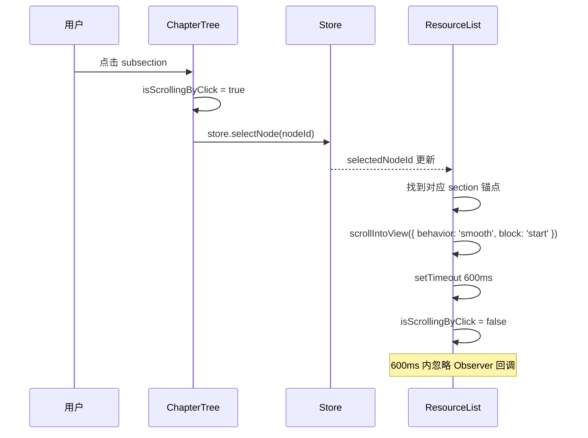
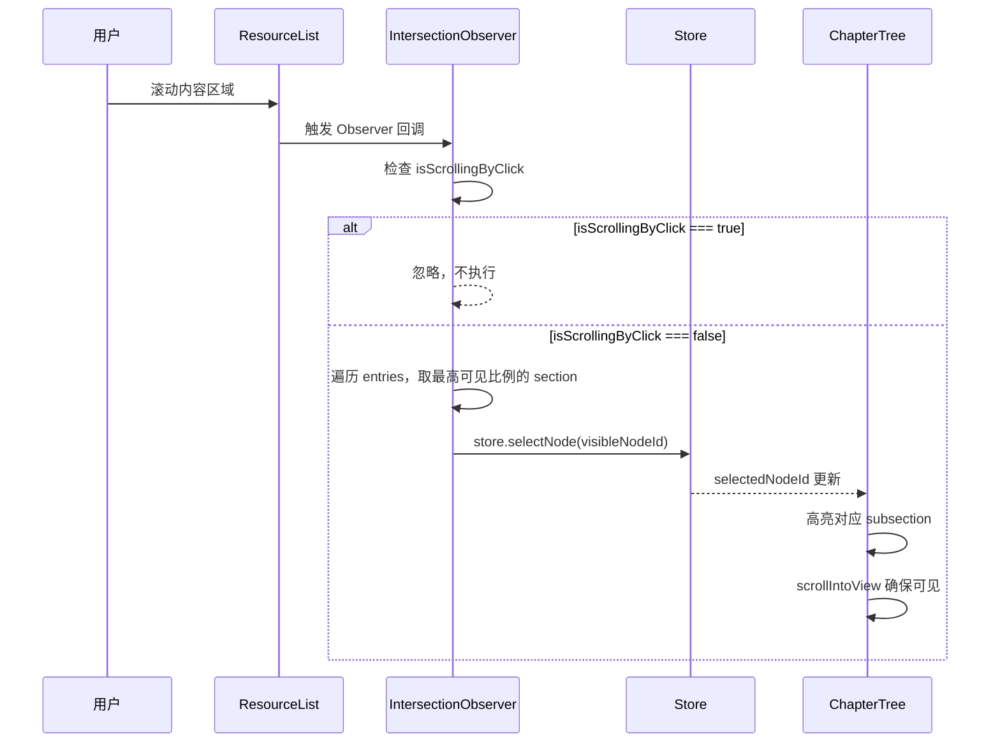

# 功能详细设计：章节目录树与滚动联动

| 项目 | 值 |
|------|------|
| 文档版本 | V2.0 |
| 日期 | 2026-03-13 |
| 关联原型 | chapter-list-redesign V1.6 |
| 涉及组件 | `ChapterTree.vue`、`ResourceList.vue`（滚动联动部分） |
| 状态 | Draft |

---

## 1. 目录树层级结构

章节目录采用递归组件渲染，支持 3 个层级。

```
ChapterTree
├── chapter (第 1 级 - 册/大章节)      ← 仅作为包裹容器，不单独渲染行
│   ├── section (第 2 级 - 节)          ← 标题行 + 展开/折叠
│   │   ├── subsection (第 3 级 - 小节) ← 可点击叶节点
│   │   ├── subsection
│   │   └── ...
│   ├── section
│   │   └── ...
│   └── ...
└── ...
```

---

## 2. 各层级视觉规格

### 2.1 第 1 级 - chapter（容器）

不单独渲染 UI 行，仅作为子节点的包裹 `<div>`。

### 2.2 第 2 级 - section（节标题）

| 属性 | 值 |
|------|------|
| 字号 | 14px |
| 字重 | 600 (semibold) |
| 颜色 | `#2E2E3A` |
| 左内边距 | 12px |
| 是否可点击 | 否（仅展开/折叠） |
| 展开图标 | `ChevronDown` / `ChevronRight`，12px，颜色 `#848096` |
| 行高度 | 40px |

```scss
.tree-section {
  display: flex;
  align-items: center;
  padding: 0 12px;
  height: 40px;
  gap: 8px;
  cursor: pointer; // 点击展开/折叠
  user-select: none;

  .section-icon {
    width: 12px;
    height: 12px;
    color: #848096;
    transition: transform 0.2s ease;
    flex-shrink: 0;

    &.is-expanded {
      transform: rotate(90deg);
    }
  }

  .section-title {
    font-size: 14px;
    font-weight: 600;
    color: #2E2E3A;
    flex: 1;
    overflow: hidden;
    text-overflow: ellipsis;
    white-space: nowrap;
  }
}
```

### 2.3 第 3 级 - subsection（小节 / 叶节点）

| 属性 | 值 |
|------|------|
| 字号 | 13px |
| 字重 | 500 (medium) |
| 颜色 | `#2E2E3A`（默认）/ `#FEA345`（选中） |
| 左内边距 | 24px |
| 是否可点击 | 是 |
| hover 背景 | `#F5F4F8` |
| 选中背景 | `#FFF1E3` |
| 选中文字色 | `#FEA345` |
| 行高度 | 36px |
| 圆角 | 6px |

```scss
.tree-subsection {
  display: flex;
  align-items: center;
  padding: 0 12px 0 24px;
  height: 36px;
  gap: 8px;
  cursor: pointer;
  border-radius: 6px;
  margin: 0 8px;
  transition: background 0.15s ease;

  &:hover {
    background: #F5F4F8;
  }

  &.is-selected {
    background: #FFF1E3;

    .subsection-title {
      color: #FEA345;
      font-weight: 600;
    }
  }

  .subsection-title {
    font-size: 13px;
    font-weight: 500;
    color: #2E2E3A;
    flex: 1;
    overflow: hidden;
    text-overflow: ellipsis;
    white-space: nowrap;
  }
}
```

---

## 3. 进度与标记

### 3.1 进度显示

每个 subsection 行右侧显示学习进度。

| 状态 | 圆点颜色 | 百分比文字 |
|------|----------|------------|
| 未开始 (`progress === 0`) | `#B0ADBA`（灰色） | 不显示 |
| 学习中 (`0 < progress < 100`) | `#FEA345`（橙色） | `${progress}%`，11px，`#848096` |
| 已完成 (`progress === 100`) | `#92E066`（绿色） | `100%`，11px，`#92E066` |

```scss
.progress-indicator {
  display: flex;
  align-items: center;
  gap: 4px;
  flex-shrink: 0;

  .progress-dot {
    width: 6px;
    height: 6px;
    border-radius: 50%;

    &.not-started { background: #B0ADBA; }
    &.in-progress { background: #FEA345; }
    &.completed   { background: #92E066; }
  }

  .progress-text {
    font-size: 11px;
    color: #848096;

    &.completed {
      color: #92E066;
    }
  }
}
```

### 3.2 NEW 红点标记

当章节 `firstPublishAt` 在 7 天以内时，显示红点。

```typescript
// 使用 NewBadge 组件，size="dot"
<NewBadge v-if="store.isNewContent(node.firstPublishAt)" size="dot" />
```

| 属性 | 值 |
|------|------|
| 组件 | `NewBadge` |
| size | `"dot"` |
| 尺寸 | 8px × 8px 红色圆点 |
| 颜色 | `#FA5A65` |
| 位置 | subsection 标题右侧、进度指示器左侧 |

---

## 4. Sidebar Header

| 元素 | 规格 |
|------|------|
| 章节标题 | 16px semibold，`#2E2E3A`，最多 2 行，overflow ellipsis |
| 切换按钮 | `RefreshCw` 图标 16px，背景 `#845EFF`，文字 `#FFFFFF`，圆角 8px，内边距 6px 12px |
| 容器 | padding 16px，border-bottom 1px solid `#D4D2DC` |

```scss
.sidebar-header {
  padding: 16px;
  border-bottom: 1px solid #D4D2DC;
  display: flex;
  align-items: flex-start;
  justify-content: space-between;
  gap: 12px;

  .chapter-title {
    font-size: 16px;
    font-weight: 600;
    color: #2E2E3A;
    flex: 1;
    display: -webkit-box;
    -webkit-line-clamp: 2;
    -webkit-box-orient: vertical;
    overflow: hidden;
  }

  .switch-button {
    display: flex;
    align-items: center;
    gap: 4px;
    padding: 6px 12px;
    background: #845EFF;
    color: #FFFFFF;
    border-radius: 8px;
    font-size: 12px;
    cursor: pointer;
    white-space: nowrap;
    flex-shrink: 0;
    transition: opacity 0.2s ease;

    &:hover {
      opacity: 0.9;
    }

    .switch-icon {
      width: 16px;
      height: 16px;
    }
  }
}
```

---

## 5. 滚动联动机制

### 5.1 点击目录 → 滚动到内容（Click-to-Scroll）



```typescript
// ChapterTree.vue
const isScrollingByClick = ref(false)

const handleSubsectionClick = (nodeId: string) => {
  isScrollingByClick.value = true
  store.selectNode(nodeId)

  const target = document.getElementById(`section-${nodeId}`)
  target?.scrollIntoView({ behavior: 'smooth', block: 'start' })

  setTimeout(() => {
    isScrollingByClick.value = false
  }, 600)
}
```

### 5.2 滚动内容 → 高亮目录（Scroll-to-Highlight）



```typescript
// ResourceList.vue
const setupObserver = () => {
  const observer = new IntersectionObserver(
    (entries) => {
      if (isScrollingByClick.value) return

      const visible = entries
        .filter((e) => e.isIntersecting)
        .sort((a, b) => b.intersectionRatio - a.intersectionRatio)

      if (visible.length > 0) {
        const nodeId = visible[0].target.getAttribute('data-node-id')
        if (nodeId) {
          store.selectNode(nodeId)
        }
      }
    },
    {
      root: contentContainer.value,
      threshold: [0, 0.1, 0.2],
      rootMargin: '-10% 0px -85% 0px',
    }
  )

  return observer
}
```

### 5.3 目录自动跟随

当 `selectedNodeId` 变化时，sidebar 中对应节点自动滚入视口。

```typescript
// ChapterTree.vue
watch(
  () => store.selectedNodeId,
  (nodeId) => {
    if (!nodeId) return
    nextTick(() => {
      const el = document.querySelector(
        `.tree-subsection[data-id="${nodeId}"]`
      )
      el?.scrollIntoView({ behavior: 'smooth', block: 'nearest' })
    })
  }
)
```

---

## 6. 移动端行为

| 行为 | 说明 |
|------|------|
| 点击 subsection | 选中节点 + 自动关闭 sidebar 抽屉 |
| 关闭方式 | 点击 overlay / 点击 subsection / 点击 toggle 按钮 |

```typescript
// ChapterTree.vue (移动端)
const handleSubsectionClick = (nodeId: string) => {
  // ... 同桌面端逻辑 ...

  // 移动端额外：关闭抽屉
  if (isMobile.value) {
    emit('close-sidebar')
  }
}
```

---

## 7. V5.x 自检表

| # | 检查项 | 状态 | 备注 |
|---|--------|------|------|
| 1 | 3 层递归结构是否清晰定义 | ✅ | chapter(容器) / section(标题) / subsection(叶节点) |
| 2 | 各层级视觉规格（字号/字重/颜色/间距）是否完整 | ✅ | 含 SCSS 代码 |
| 3 | 进度显示 3 种状态是否区分 | ✅ | 未开始/学习中/已完成，颜色+文字 |
| 4 | NEW 红点触发条件与组件是否明确 | ✅ | firstPublishAt 7 天内，NewBadge size="dot" |
| 5 | sidebar-header 切换按钮样式是否完整 | ✅ | RefreshCw 图标，紫色背景 |
| 6 | Click-to-Scroll 时序图与代码是否闭环 | ✅ | 含 600ms 锁定机制 |
| 7 | Scroll-to-Highlight Observer 参数是否精确 | ✅ | threshold / rootMargin 均标注 |
| 8 | 目录自动跟随 watch 是否定义 | ✅ | watch selectedNodeId → scrollIntoView |
| 9 | 移动端点击自动关闭抽屉是否说明 | ✅ | emit('close-sidebar') |
| 10 | 双向联动冲突防护 (isScrollingByClick) 是否完善 | ✅ | 600ms 锁定 + Observer 内判断 |
