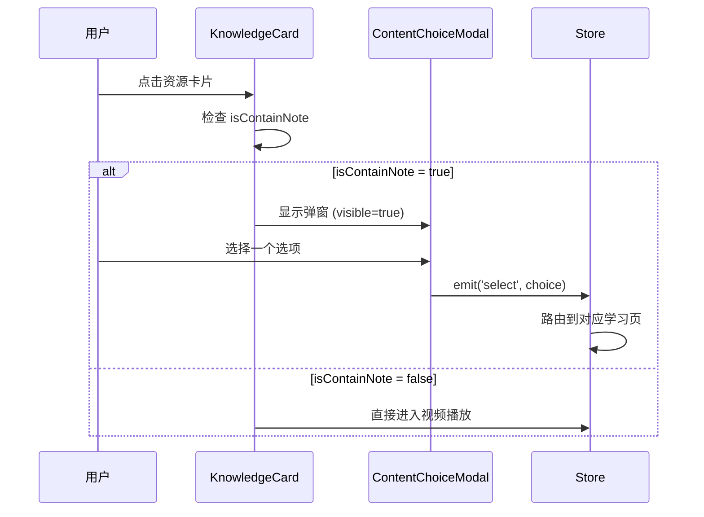
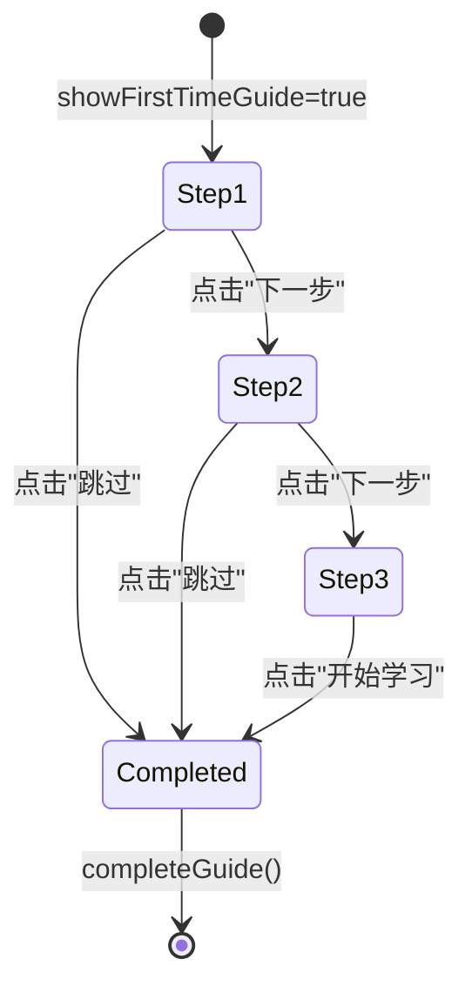

# 功能详细设计：弹窗与引导系统

| 项目 | 值 |
|------|------|
| 文档版本 | V2.0 |
| 日期 | 2026-03-13 |
| 关联原型 | chapter-list-redesign V1.6 |
| 涉及组件 | `ContentChoiceModal.vue`、`LearningModeModal.vue`、`FirstTimeGuide.vue` |
| 状态 | Draft |

---

## 1. 组件总览

```
弹窗与引导系统
├── ContentChoiceModal    ← 选择学习内容（视频/练习/笔记）
├── LearningModeModal     ← 选择学习方式（先做题/先看视频）
└── FirstTimeGuide        ← 首次使用三步引导
```

| 组件 | 触发条件 | 渲染方式 | 层级 |
|------|----------|----------|------|
| `ContentChoiceModal` | 用户点击 `isContainNote=true` 的 KnowledgeCard | `Teleport to body` | z-index: 1000 |
| `LearningModeModal` | 复习场景且 `reviewLearningMode === 'ask-every-time'` | `Teleport to body` | z-index: 1000 |
| `FirstTimeGuide` | `store.showFirstTimeGuide === true`（首次访问） | `Teleport to body` | z-index: 2000 |

---

## 2. ContentChoiceModal（选择学习内容）

### 2.1 Props & Events

```typescript
interface ContentChoiceModalProps {
  visible: boolean
  resourceTitle: string
  hasNote: boolean
}

interface ContentChoiceModalEmits {
  (e: 'close'): void
  (e: 'select', choice: 'video' | 'practice' | 'note'): void
}
```

### 2.2 选项卡片配置

| 选项 | 图标 | 图标背景色 | 标题 | 描述 | 条件 |
|------|------|-----------|------|------|------|
| `video` | PlayCircle | `#E8F0FE`（蓝底） | 继续看视频 | 从上次位置继续播放 | 始终显示 |
| `practice` | FileText | `#E6F4EA`（绿底） | 做补充练习 | 巩固本节知识点 | 始终显示 |
| `note` | BookOpen | `#F3EEFF`（紫底 `#845EFF` 相关） | 看课堂笔记 | 查看本节知识要点 | `v-if="hasNote"` |

### 2.3 卡片结构

```
option-card (flex: row, align-center, gap: 12px, padding: 16px)
├── icon-wrapper (48x48, border-radius: 12px, 居中图标 24px)
├── text-group (flex: 1, flex-column)
│   ├── title (14px, font-weight: 600, #2E2E3A)
│   └── desc (12px, #848096)
└── ChevronRight (16px, #B0ADBA)
```

```scss
.option-card {
  display: flex;
  align-items: center;
  gap: 12px;
  padding: 16px;
  border: 1px solid #D4D2DC;
  border-radius: 12px;
  cursor: pointer;
  transition: all 0.2s;

  &:hover {
    border-color: #FEA345;
    background: #FFF1E3;
  }

  &:active {
    transform: scale(0.98);
  }
}

.icon-wrapper {
  width: 48px;
  height: 48px;
  border-radius: 12px;
  display: flex;
  align-items: center;
  justify-content: center;
  flex-shrink: 0;
}
```

### 2.4 布局与动画

#### 移动端：底部弹出（Bottom Sheet）

```scss
@media (max-width: 767px) {
  .modal-content {
    position: fixed;
    bottom: 0;
    left: 0;
    right: 0;
    border-radius: 16px 16px 0 0;
    padding: 20px 16px calc(env(safe-area-inset-bottom) + 16px);
    max-height: 80vh;
  }

  .modal-enter-active,
  .modal-leave-active {
    transition: transform 0.3s ease, opacity 0.3s ease;
  }

  .modal-enter-from,
  .modal-leave-to {
    transform: translateY(100%);
    opacity: 0;
  }
}
```

#### 桌面端：居中弹窗

```scss
@media (min-width: 768px) {
  .modal-content {
    position: fixed;
    top: 50%;
    left: 50%;
    transform: translate(-50%, -50%);
    border-radius: 16px;
    padding: 24px;
    width: 400px;
    max-width: 90vw;
  }

  .modal-enter-active,
  .modal-leave-active {
    transition: transform 0.2s ease, opacity 0.2s ease;
  }

  .modal-enter-from,
  .modal-leave-to {
    transform: translate(-50%, -50%) scale(0.95);
    opacity: 0;
  }
}
```

### 2.5 关闭方式

| 方式 | 说明 |
|------|------|
| X 按钮 | 弹窗右上角，24px，`#848096`，hover 变 `#2E2E3A` |
| 点击遮罩 | `@click.self="$emit('close')"` |
| ESC 键 | `@keydown.esc` 监听（桌面端） |

### 2.6 交互流程



---

## 3. LearningModeModal（选择学习方式）

### 3.1 Props & Events

```typescript
interface LearningModeModalProps {
  visible: boolean
  resourceTitle?: string
}

interface LearningModeModalEmits {
  (e: 'close'): void
  (e: 'confirm', mode: 'quiz-first' | 'video-first'): void
}
```

### 3.2 内部状态

```typescript
const selectedMode = ref<'quiz-first' | 'video-first'>('quiz-first')
```

### 3.3 选项卡片配置

| 选项 | 图标 | 标题 | 徽标 | 默认选中 |
|------|------|------|------|----------|
| `quiz-first` | ClipboardCheck | 先做题后看视频 | "推荐"（橙色徽标） | 是 |
| `video-first` | PlayCircle | 先看视频后做题 | 无 | 否 |

### 3.4 选中与未选中样式

```scss
.mode-option {
  display: flex;
  align-items: center;
  gap: 12px;
  padding: 16px;
  border: 2px solid #D4D2DC;
  border-radius: 12px;
  cursor: pointer;
  transition: all 0.2s;

  &.is-selected {
    border-color: #FEA345;
    background: #FFF1E3;

    .mode-icon-wrapper {
      background: #FEA345;
      color: #FFFFFF;
    }
  }

  &:not(.is-selected) {
    .mode-icon-wrapper {
      background: #F5F4F8;
      color: #848096;
    }
  }
}

.recommend-badge {
  display: inline-flex;
  align-items: center;
  padding: 2px 8px;
  font-size: 10px;
  font-weight: 600;
  color: #FEA345;
  background: #FFF1E3;
  border-radius: 999px;
}
```

### 3.5 弹窗结构

```
modal-overlay (rgba(0,0,0,0.5))
└── modal-content (max-width: 360px, border-radius: 16px, padding: 24px)
    ├── modal-header
    │   ├── title ("选择学习方式", 16px, 600)
    │   └── close-btn (X icon, top-right)
    ├── modal-body (flex-column, gap: 12px, margin-top: 16px)
    │   ├── mode-option[quiz-first]
    │   └── mode-option[video-first]
    ├── modal-hint (margin-top: 12px)
    │   └── "可在「设置」中修改默认学习方式" (12px, #B0ADBA)
    └── modal-footer (margin-top: 20px)
        └── confirm-btn ("开始学习", 全宽, 44px高)
```

### 3.6 确认按钮状态

| 状态 | 背景色 | 文字色 | cursor |
|------|--------|--------|--------|
| 可用（已选择） | `#FEA345` | `#FFFFFF` | pointer |
| 禁用（未选择） | `#D4D2DC` | `#FFFFFF` | not-allowed |

### 3.7 动画

```scss
.modal-enter-active,
.modal-leave-active {
  transition: transform 0.2s ease, opacity 0.2s ease;
}

.modal-enter-from,
.modal-leave-to {
  transform: translate(-50%, -50%) scale(0.95);
  opacity: 0;
}
```

---

## 4. FirstTimeGuide（首次引导）

### 4.1 触发条件与生命周期

```typescript
// 触发：store 中检测
const showFirstTimeGuide = computed(() => {
  return !localStorage.getItem('chapter-list-guide-completed')
})

// 完成：持久化
const completeGuide = () => {
  localStorage.setItem('chapter-list-guide-completed', 'true')
  showFirstTimeGuide.value = false
}
```

### 4.2 三步引导内容

| 步骤 | 图标 | 标题 | 描述 |
|------|------|------|------|
| 1 | BookOpen | 选择你的教材 | 先选择你的教材版本，系统会自动加载对应内容 |
| 2 | ListTree | 选择要学习的章节 | 在左侧目录中找到你要学习的章节 |
| 3 | PlayCircle | 点击小节开始学习 | 点击资源卡片即可开始学习，支持视频、刷题等多种形式 |

### 4.3 步骤指示器

```scss
.step-indicators {
  display: flex;
  gap: 6px;
  justify-content: center;
  margin-bottom: 24px;
}

.step-dot {
  width: 8px;
  height: 8px;
  border-radius: 999px;
  background: #D4D2DC;
  transition: all 0.3s ease;

  &.is-active {
    width: 24px;
    background: #FEA345;
  }
}
```

### 4.4 引导卡片结构

```
guide-overlay (fixed inset 0, rgba(0,0,0,0.6), z-index: 2000)
└── guide-card (max-width: 340px, border-radius: 16px, padding: 32px 24px, white bg)
    ├── step-indicators (3 dots)
    ├── icon-area (64x64, border-radius: 16px, bg: #FFF1E3, icon: #FEA345 32px)
    ├── title (18px, font-weight: 700, #2E2E3A, margin-top: 20px)
    ├── description (14px, #848096, line-height: 1.6, margin-top: 8px, text-align: center)
    ├── gesture-hint (条件渲染，6秒后出现)
    │   ├── MousePointerClick icon (20px, #FEA345)
    │   └── "点击此处试试" (12px, #FEA345)
    └── actions (flex, gap: 12px, margin-top: 24px)
        ├── skip-btn ("跳过", flex: 1)
        └── next-btn ("下一步" / "开始学习", flex: 2)
```

### 4.5 手势提示动画

```typescript
// 6 秒空闲后显示手势提示
const showGestureHint = ref(false)
let gestureTimer: ReturnType<typeof setTimeout> | null = null

const resetGestureTimer = () => {
  if (gestureTimer) clearTimeout(gestureTimer)
  showGestureHint.value = false
  gestureTimer = setTimeout(() => {
    showGestureHint.value = true
  }, 6000)
}

onMounted(() => resetGestureTimer())
onUnmounted(() => {
  if (gestureTimer) clearTimeout(gestureTimer)
})
```

```scss
.gesture-hint {
  display: flex;
  align-items: center;
  gap: 4px;
  margin-top: 16px;
  animation: bounce 1.5s ease-in-out infinite;
}

@keyframes bounce {
  0%, 100% { transform: translateY(0); }
  50% { transform: translateY(-6px); }
}
```

### 4.6 按钮样式

| 按钮 | 样式 | flex | 高度 |
|------|------|------|------|
| 跳过 | bg: `#F5F4F8`, color: `#848096`, radius: 12px | 1 | 44px |
| 下一步 | bg: `#FEA345`, color: `#FFFFFF`, radius: 12px | 2 | 44px |
| 开始学习（最后一步） | 同"下一步" | 2 | 44px |

### 4.7 状态机



### 4.8 内部状态

```typescript
const currentStep = ref(0) // 0 | 1 | 2

const handleNext = () => {
  if (currentStep.value < 2) {
    currentStep.value += 1
    resetGestureTimer()
  } else {
    completeGuide()
  }
}

const handleSkip = () => {
  completeGuide()
}
```

---

## 5. 通用遮罩层样式

```scss
.modal-overlay {
  position: fixed;
  inset: 0;
  background: rgba(0, 0, 0, 0.5);
  display: flex;
  align-items: center;
  justify-content: center;
  z-index: 1000;

  &.guide-overlay {
    background: rgba(0, 0, 0, 0.6);
    z-index: 2000;
  }
}

.modal-content {
  background: #FFFFFF;
  border-radius: 16px;
  box-shadow: 0 8px 32px rgba(0, 0, 0, 0.12);
}
```

---

## 6. 无障碍 (Accessibility)

| 要求 | 实现 |
|------|------|
| 焦点管理 | 弹窗打开后自动 focus 第一个可操作元素 |
| 焦点陷阱 | Tab 键在弹窗内循环，不逃逸到背景 |
| `role` | 弹窗容器 `role="dialog"`, `aria-modal="true"` |
| `aria-label` | 每个选项卡片标注 `aria-label` 描述完整操作 |
| 键盘操作 | ESC 关闭、Enter 确认、方向键切换选项 |

---

## 7. V5.x 自检表

| # | 检查项 | 状态 | 备注 |
|---|--------|------|------|
| 1 | ContentChoiceModal 三个选项卡片是否全部定义 | ✅ | video/practice/note，note 条件渲染 |
| 2 | ContentChoiceModal 移动端 bottom-sheet 样式是否完整 | ✅ | translateY 动画 + safe-area |
| 3 | ContentChoiceModal 桌面端居中 + scale 动画是否定义 | ✅ | translate(-50%,-50%) + scale(0.95) |
| 4 | LearningModeModal 选中/未选中状态是否明确 | ✅ | border/bg/icon 三重状态切换 |
| 5 | LearningModeModal "推荐"徽标样式是否标注 | ✅ | 橙色 pill badge |
| 6 | LearningModeModal 确认按钮禁用态是否定义 | ✅ | 灰色背景 + not-allowed |
| 7 | FirstTimeGuide 三步内容是否完整 | ✅ | 图标/标题/描述全部列出 |
| 8 | FirstTimeGuide 步骤指示器胶囊样式是否标注 | ✅ | 活跃态 width:24px + #FEA345 |
| 9 | FirstTimeGuide 手势提示 6 秒延迟是否实现 | ✅ | setTimeout + bounce animation |
| 10 | FirstTimeGuide 完成后 localStorage 持久化是否定义 | ✅ | completeGuide() 写入 |
| 11 | 所有弹窗关闭方式是否全覆盖（X/遮罩/ESC） | ✅ | 三种关闭方式 |
| 12 | Design Tokens 颜色值是否与全局一致 | ✅ | #FEA345/#845EFF/#D4D2DC 等 |
