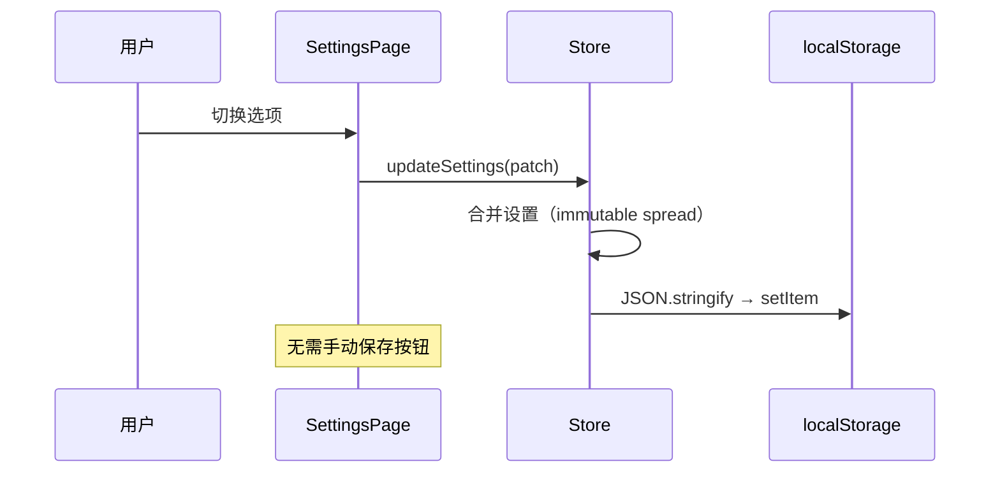

# 功能详细设计：设置模块

| 项目 | 值 |
|------|------|
| 文档版本 | V2.0 |
| 日期 | 2026-03-13 |
| 关联原型 | chapter-list-redesign V1.6 |
| 涉及组件 | `SettingsPage.vue`、`AppSettings`（Store） |
| 状态 | Draft |

---

## 1. 页面定位

设置页为**全页覆盖视图**，非弹窗模式。通过 `currentView === 'settings'` 切换显示。

```typescript
// ChapterList.vue 中的视图切换
const currentView = ref<'main' | 'settings'>('main')

const openSettings = () => {
  currentView.value = 'settings'
}

const closeSettings = () => {
  currentView.value = 'main'
}
```

---

## 2. 数据结构

### 2.1 AppSettings 接口

```typescript
interface AppSettings {
  /** 复习学习顺序 */
  reviewLearningMode: 'quiz-first' | 'video-first' | 'ask-every-time'
  /** 默认场景选择 */
  defaultSceneTab: 'all' | 'last-selected'
  /** 同步刷题默认难度（至少选 1 项） */
  practiceDifficulties: ('basic' | 'medium' | 'hard')[]
  /** 上次选中的 Tab（仅 defaultSceneTab='last-selected' 时生效） */
  lastSelectedTab: SceneType | 'all'
}
```

### 2.2 默认值

```typescript
const DEFAULT_SETTINGS: AppSettings = {
  reviewLearningMode: 'ask-every-time',
  defaultSceneTab: 'all',
  practiceDifficulties: ['basic', 'medium', 'hard'],
  lastSelectedTab: 'preview',
}
```

### 2.3 Store 集成

```typescript
// store/useAppStore.ts
const settings = ref<AppSettings>(loadSettingsFromStorage())

const updateSettings = (patch: Partial<AppSettings>) => {
  settings.value = { ...settings.value, ...patch }
  localStorage.setItem('app-settings', JSON.stringify(settings.value))
}

function loadSettingsFromStorage(): AppSettings {
  try {
    const raw = localStorage.getItem('app-settings')
    if (!raw) return { ...DEFAULT_SETTINGS }
    return { ...DEFAULT_SETTINGS, ...JSON.parse(raw) }
  } catch {
    return { ...DEFAULT_SETTINGS }
  }
}
```

---

## 3. 页面结构

```
settings-page (full-screen overlay, bg: #F5F4F8)
├── settings-header (height: 56px, bg: #FFFFFF, border-bottom)
│   ├── back-btn (ArrowLeft 24px, #2E2E3A)
│   ├── title ("设置", 16px, font-weight: 600, center)
│   └── placeholder (保持三列平衡)
├── settings-body (overflow-y: auto, padding: 16px)
│   ├── section[复习学习顺序]
│   │   ├── section-title
│   │   └── section-card
│   │       ├── radio-option[quiz-first]    ← "推荐" 标签
│   │       ├── radio-option[video-first]
│   │       └── radio-option[ask-every-time]
│   ├── section[默认场景选择]
│   │   ├── section-title
│   │   └── section-card
│   │       ├── radio-option[all]
│   │       └── radio-option[last-selected]
│   ├── section[同步刷题默认难度]
│   │   ├── section-title
│   │   └── section-card
│   │       ├── checkbox-option[basic]
│   │       ├── checkbox-option[medium]
│   │       └── checkbox-option[hard]
│   ├── section[原型演示]       ← 仅原型阶段保留
│   │   ├── section-title
│   │   └── section-card
│   │       └── vip-toggle (isVip 开关)
│   └── settings-hint ("设置自动保存", 12px, #B0ADBA, text-align: center)
└── (no footer — auto-save)
```

---

## 4. 组件样式

### 4.1 页头

```scss
.settings-header {
  display: flex;
  align-items: center;
  height: 56px;
  padding: 0 16px;
  background: #FFFFFF;
  border-bottom: 1px solid #D4D2DC;

  .back-btn {
    width: 40px;
    height: 40px;
    display: flex;
    align-items: center;
    justify-content: center;
    cursor: pointer;
    color: #2E2E3A;
    border-radius: 8px;
    transition: background 0.2s;

    &:hover {
      background: #F5F4F8;
    }
  }

  .title {
    flex: 1;
    text-align: center;
    font-size: 16px;
    font-weight: 600;
    color: #2E2E3A;
  }

  .placeholder {
    width: 40px;
  }
}
```

### 4.2 Section 样式

```scss
.settings-section {
  margin-bottom: 24px;

  .section-title {
    font-size: 12px;
    font-weight: 600;
    color: #B0ADBA;
    text-transform: uppercase;
    letter-spacing: 0.5px;
    padding: 0 4px;
    margin-bottom: 8px;
  }

  .section-card {
    background: #FFFFFF;
    border-radius: 12px;
    overflow: hidden;
  }
}
```

### 4.3 Radio 选项

```scss
.radio-option {
  display: flex;
  align-items: center;
  padding: 14px 16px;
  cursor: pointer;
  transition: background 0.2s;

  & + .radio-option {
    border-top: 1px solid #F5F4F8;
  }

  &:hover {
    background: #FAFAFA;
  }
}

.radio-indicator {
  width: 20px;
  height: 20px;
  border-radius: 50%;
  border: 2px solid #D4D2DC;
  margin-right: 12px;
  display: flex;
  align-items: center;
  justify-content: center;
  flex-shrink: 0;
  transition: all 0.2s;

  &.is-selected {
    border-color: #FEA345;
    background: #FEA345;

    &::after {
      content: '';
      width: 8px;
      height: 8px;
      border-radius: 50%;
      background: #FFFFFF;
    }
  }
}

.radio-label {
  flex: 1;
  font-size: 14px;
  color: #2E2E3A;

  .is-selected & {
    font-weight: 600;
  }
}

.recommend-tag {
  display: inline-flex;
  align-items: center;
  padding: 2px 8px;
  margin-left: 8px;
  font-size: 10px;
  font-weight: 600;
  color: #FEA345;
  background: #FFF1E3;
  border-radius: 999px;
}
```

### 4.4 Checkbox 选项

```scss
.checkbox-option {
  display: flex;
  align-items: center;
  padding: 14px 16px;
  cursor: pointer;
  transition: background 0.2s;

  & + .checkbox-option {
    border-top: 1px solid #F5F4F8;
  }

  &:hover {
    background: #FAFAFA;
  }

  // 最后一项被选中时，禁止取消
  &.is-last-selected {
    cursor: not-allowed;
    opacity: 0.6;
  }
}

.checkbox-indicator {
  width: 20px;
  height: 20px;
  border-radius: 4px;
  border: 2px solid #D4D2DC;
  margin-right: 12px;
  display: flex;
  align-items: center;
  justify-content: center;
  flex-shrink: 0;
  transition: all 0.2s;

  &.is-checked {
    border-color: #FEA345;
    background: #FEA345;

    // 白色对勾 (Check icon 12px)
    .check-icon {
      color: #FFFFFF;
      width: 12px;
      height: 12px;
    }
  }
}
```

### 4.5 VIP 开关（原型演示用）

```scss
.vip-toggle {
  display: flex;
  align-items: center;
  justify-content: space-between;
  padding: 14px 16px;

  .toggle-label {
    font-size: 14px;
    color: #2E2E3A;
  }

  .toggle-switch {
    width: 44px;
    height: 24px;
    border-radius: 12px;
    background: #D4D2DC;
    position: relative;
    cursor: pointer;
    transition: background 0.2s;

    &.is-on {
      background: #FEA345;
    }

    &::after {
      content: '';
      position: absolute;
      top: 2px;
      left: 2px;
      width: 20px;
      height: 20px;
      border-radius: 50%;
      background: #FFFFFF;
      transition: transform 0.2s;
    }

    &.is-on::after {
      transform: translateX(20px);
    }
  }
}
```

---

## 5. 交互逻辑

### 5.1 Radio 切换

```typescript
const handleRadioChange = (
  key: keyof Pick<AppSettings, 'reviewLearningMode' | 'defaultSceneTab'>,
  value: string
) => {
  updateSettings({ [key]: value })
}
```

### 5.2 Checkbox 切换（至少保留一项）

```typescript
const handleDifficultyToggle = (difficulty: 'basic' | 'medium' | 'hard') => {
  const current = settings.value.practiceDifficulties
  const isSelected = current.includes(difficulty)

  if (isSelected && current.length <= 1) {
    // 最后一项，禁止取消
    return
  }

  const updated = isSelected
    ? current.filter((d) => d !== difficulty)
    : [...current, difficulty]

  updateSettings({ practiceDifficulties: updated })
}
```

### 5.3 自动保存流程



---

## 6. 页面进入/退出动画

```scss
.settings-enter-active,
.settings-leave-active {
  transition: transform 0.3s ease, opacity 0.3s ease;
}

.settings-enter-from {
  transform: translateX(100%);
  opacity: 0;
}

.settings-leave-to {
  transform: translateX(100%);
  opacity: 0;
}
```

---

## 7. 设置项 ↔ 功能映射

| 设置项 | 影响的功能模块 | 作用 |
|--------|---------------|------|
| `reviewLearningMode` | `LearningModeModal` | 控制复习场景是否弹出选择弹窗 |
| `defaultSceneTab` | `SceneTabs` 初始化 | 决定页面加载时默认展示哪个 Tab |
| `practiceDifficulties` | 资源列表过滤 | 过滤同步刷题资源的难度 |
| `lastSelectedTab` | `SceneTabs`（配合 `last-selected`） | 记忆上次退出时的 Tab |
| `isVip` | 全局 VIP 状态 | 控制 VIP 内容可见性（原型演示） |

---

## 8. 响应式适配

| 断点 | 调整项 |
|------|--------|
| `>=768px` | section-card max-width: 560px，居中对齐 |
| `<768px` | 全宽布局，padding 收窄至 12px |
| `<380px` | section-title 与 option 字号各减 1px |

```scss
@media (min-width: 768px) {
  .settings-body {
    max-width: 560px;
    margin: 0 auto;
    padding: 24px 16px;
  }
}
```

---

## 9. V5.x 自检表

| # | 检查项 | 状态 | 备注 |
|---|--------|------|------|
| 1 | AppSettings 接口是否完整覆盖 4 个设置项 | ✅ | reviewLearningMode/defaultSceneTab/practiceDifficulties/lastSelectedTab |
| 2 | 默认值是否与需求一致 | ✅ | ask-every-time / all / 三个难度全选 / preview |
| 3 | Radio 选中态样式（橙色圆填充 + 加粗）是否定义 | ✅ | #FEA345 bg + 白色内圆 + 600 weight |
| 4 | Checkbox 选中态样式（橙色填充 + 白色勾）是否定义 | ✅ | #FEA345 bg + Check icon 12px |
| 5 | Checkbox 至少保留 1 项的约束是否实现 | ✅ | length <= 1 时禁止取消 |
| 6 | 自动保存机制是否明确（每次变更写 localStorage） | ✅ | updateSettings 内 setItem |
| 7 | "设置自动保存" hint 是否标注 | ✅ | 12px, #B0ADBA, 底部居中 |
| 8 | 页面进入/退出动画是否定义 | ✅ | translateX(100%) 滑入滑出 |
| 9 | 设置页为全页覆盖（非弹窗）是否明确 | ✅ | currentView === 'settings' |
| 10 | VIP 开关仅作原型演示是否注明 | ✅ | 单独 section + 注释 |
| 11 | Design Tokens 颜色值是否与全局一致 | ✅ | #FEA345/#D4D2DC/#F5F4F8 等 |
