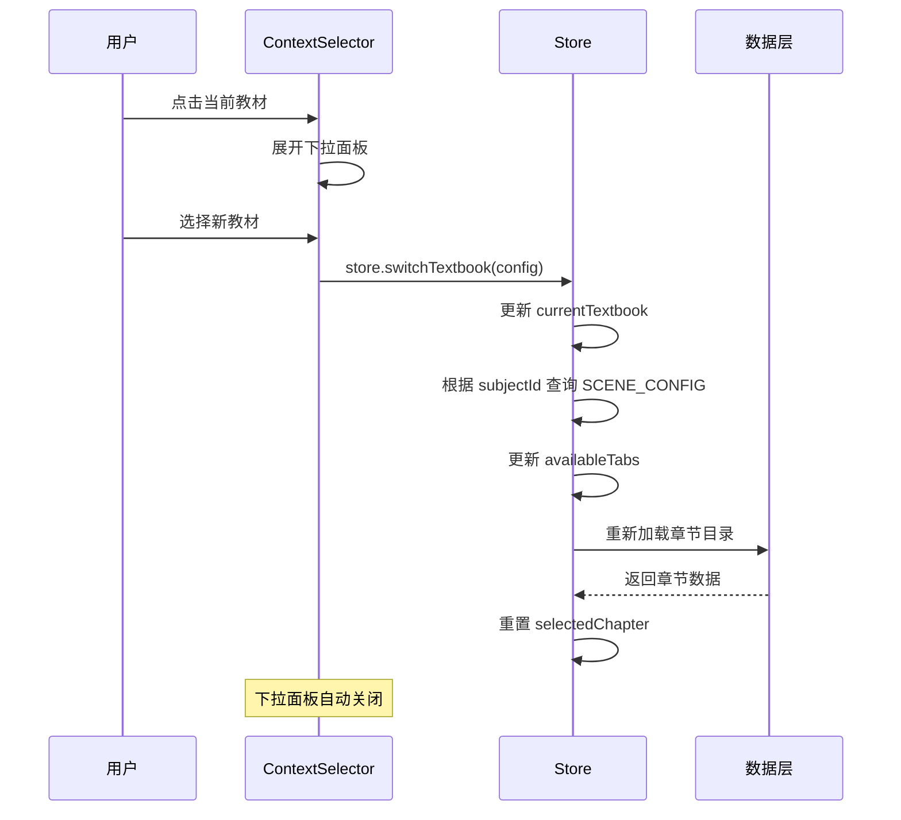
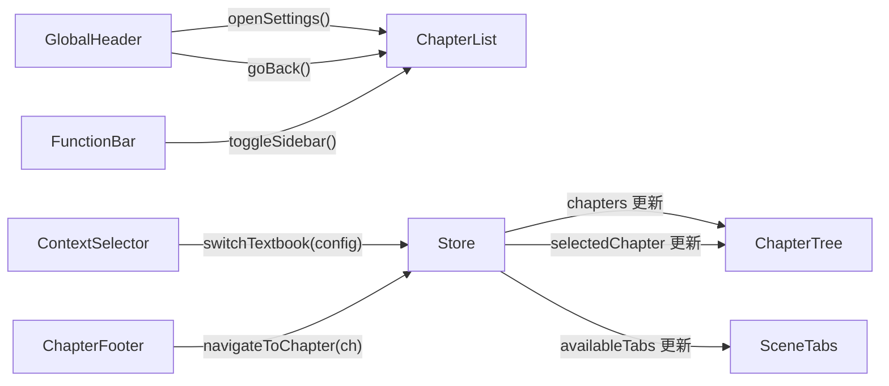

# 功能详细设计：全局导航与教材切换

| 项目 | 值 |
|------|------|
| 文档版本 | V2.0 |
| 日期 | 2026-03-13 |
| 关联原型 | chapter-list-redesign V1.6 |
| 涉及组件 | `GlobalHeader.vue`、`FunctionBar.vue`、`ContextSelector.vue`、`ChapterFooter.vue` |
| 状态 | Draft |

---

## 1. 组件关系总览

```
top-area (sticky, z-index: 100)
├── GlobalHeader (40px)
│   ├── back-btn
│   ├── center-slot (SceneTabs 嵌入)
│   └── vip-entry
└── FunctionBar (44px)
    ├── left-group
    │   ├── ContextSelector (教材切换)
    │   └── SceneTabs (桌面端复用位)
    └── right-group
        ├── quick-entries (>=600px)
        └── collapsed-menu (<600px)

content-area (底部)
└── ChapterFooter (上下章导航)
```

---

## 2. GlobalHeader（全局导航栏）

### 2.1 规格

| 属性 | 值 |
|------|------|
| 高度 | 40px |
| 背景 | `#FFFFFF` |
| 底部边框 | 无（与 FunctionBar 紧密连接） |
| 布局 | 三列 flex (`space-between`) |
| 内边距 | `0 12px` |

### 2.2 结构

```
global-header (height: 40px, flex, align-center, justify: space-between)
├── left-area
│   └── back-btn (ChevronLeft 24px, #2E2E3A)
├── center-area (flex: 1, overflow: hidden)
│   └── SceneTabs (桌面端嵌入，移动端隐藏)
└── right-area
    └── vip-entry (Crown icon + text)
```

### 2.3 返回按钮

```scss
.back-btn {
  display: flex;
  align-items: center;
  justify-content: center;
  width: 32px;
  height: 32px;
  border-radius: 8px;
  color: #2E2E3A;
  cursor: pointer;
  transition: background 0.2s;

  &:hover {
    background: #F5F4F8;
  }

  .icon {
    width: 24px;
    height: 24px;
  }
}
```

### 2.4 VIP 入口

| 状态 | 图标 | 文字 | 背景 | 圆角 |
|------|------|------|------|------|
| 非 VIP | Crown 14px | "开通VIP" | `linear-gradient(135deg, #FFD700, #FFA500)` | 999px (pill) |
| 已 VIP | Crown 14px | "VIP" | `linear-gradient(135deg, #FFD700, #FFA500)` | 999px (pill) |
| micro (<360px) | Crown 14px | 隐藏 | 同上 | 999px |

```scss
.vip-entry {
  display: inline-flex;
  align-items: center;
  gap: 4px;
  padding: 4px 10px;
  background: linear-gradient(135deg, #FFD700, #FFA500);
  border-radius: 999px;
  cursor: pointer;
  transition: all 0.2s;

  &:hover {
    filter: brightness(1.05);
    transform: scale(1.02);
  }

  .vip-icon {
    width: 14px;
    height: 14px;
    color: #FFFFFF;
    flex-shrink: 0;
  }

  .vip-text {
    font-size: 11px;
    font-weight: 600;
    color: #FFFFFF;
    white-space: nowrap;

    @media (max-width: 359px) {
      display: none;
    }
  }
}
```

---

## 3. FunctionBar（功能操作栏）

### 3.1 规格

| 属性 | 值 |
|------|------|
| 高度 | 44px |
| 背景 | `#FFFFFF` |
| 底部边框 | `1px solid #D4D2DC` |
| 布局 | 两列 flex (`space-between`) |
| 内边距 | `0 12px` |

### 3.2 结构

```
function-bar (height: 44px, flex, align-center, justify: space-between)
├── left-group (flex, align-center, gap: 8px)
│   ├── ContextSelector
│   └── SceneTabs (桌面端可选嵌入位)
└── right-group (flex, align-center, gap: 4px)
    ├── quick-entries (>=600px, 展开显示)
    │   ├── entry[思维导图] (BrainCircuit)
    │   ├── entry[错题本] (BookX)
    │   ├── entry[收藏] (Bookmark)
    │   └── entry[设置] (Settings2)
    └── collapsed-menu (<600px, 折叠菜单)
        └── hamburger-btn ("三" icon)
```

### 3.3 快捷入口（展开态）

| 入口 | 图标 | 标签 |
|------|------|------|
| 思维导图 | BrainCircuit | 导图 |
| 错题本 | BookX | 错题 |
| 收藏 | Bookmark | 收藏 |
| 设置 | Settings2 | 设置 |

```scss
.quick-entry {
  display: flex;
  flex-direction: column;
  align-items: center;
  gap: 2px;
  padding: 4px 8px;
  border-radius: 8px;
  cursor: pointer;
  transition: background 0.2s;

  &:hover {
    background: #F5F4F8;
  }

  .entry-icon {
    width: 16px;
    height: 16px;
    color: #848096;
  }

  .entry-label {
    font-size: 11px;
    color: #848096;
    white-space: nowrap;
  }
}

@media (max-width: 599px) {
  .quick-entries {
    display: none;
  }
}
```

### 3.4 折叠菜单（收起态）

```scss
.hamburger-btn {
  width: 36px;
  height: 36px;
  display: flex;
  align-items: center;
  justify-content: center;
  background: #2E2E3A;
  color: #FFFFFF;
  border-radius: 8px;
  cursor: pointer;
  font-size: 14px;
  transition: background 0.2s;

  &:hover {
    background: #3E3E4A;
  }

  @media (min-width: 600px) {
    display: none;
  }
}

.dropdown-menu {
  position: absolute;
  top: 100%;
  right: 12px;
  min-width: 140px;
  background: #FFFFFF;
  border: 1px solid #D4D2DC;
  border-radius: 12px;
  box-shadow: 0 4px 16px rgba(0, 0, 0, 0.1);
  padding: 4px;
  z-index: 300;

  .dropdown-item {
    display: flex;
    align-items: center;
    gap: 8px;
    padding: 10px 12px;
    border-radius: 8px;
    font-size: 14px;
    color: #2E2E3A;
    cursor: pointer;
    transition: background 0.2s;

    &:hover {
      background: #F5F4F8;
    }

    .item-icon {
      width: 16px;
      height: 16px;
      color: #848096;
    }
  }
}
```

---

## 4. ContextSelector（教材切换）

### 4.1 数据结构

```typescript
interface TextbookConfig {
  stageId: string     // e.g. 'junior'
  subjectId: string   // e.g. 'math'
  publisherId: string // e.g. 'renjiaoban'
  semesterId: string  // e.g. 'grade7-up'
  displayName: string // e.g. '七年级·数学'
}
```

### 4.2 显示态

```
context-selector (flex, align-center, gap: 4px, cursor: pointer)
├── subject-badge (padding: 4px 10px, bg: #F5F4F8, radius: 999px)
│   └── displayName ("七年级·数学", 12px, 600, #2E2E3A)
└── ChevronDown (14px, #848096)
```

```scss
.context-selector {
  display: inline-flex;
  align-items: center;
  gap: 4px;
  cursor: pointer;
  transition: opacity 0.2s;

  &:hover {
    opacity: 0.8;
  }

  .subject-badge {
    padding: 4px 10px;
    background: #F5F4F8;
    border-radius: 999px;
    font-size: 12px;
    font-weight: 600;
    color: #2E2E3A;
    white-space: nowrap;
  }

  .chevron-icon {
    width: 14px;
    height: 14px;
    color: #848096;
    transition: transform 0.2s;

    &.is-open {
      transform: rotate(180deg);
    }
  }
}
```

### 4.3 下拉选择面板

```
selector-dropdown (absolute, bg: #FFFFFF, radius: 12px, shadow, z-index: 400)
├── dropdown-header ("选择教材", 14px, 600, padding: 12px 16px)
├── dropdown-list (max-height: 280px, overflow-y: auto)
│   └── textbook-item * N
│       ├── subject-icon (24px, colored)
│       ├── textbook-name (14px, #2E2E3A)
│       └── check-icon (v-if selected, 16px, #FEA345)
└── dropdown-footer (可选，"管理教材" 链接)
```

### 4.4 教材切换流程



### 4.5 学科 → 场景 Tab 映射

```typescript
// 教材切换后触发场景 Tab 更新
const switchTextbook = (config: TextbookConfig) => {
  currentTextbook.value = config
  const sceneConfig = SCENE_CONFIG[config.subjectId]
  availableTabs.value = sceneConfig?.tabs ?? ['preview']
  loadChapters(config)
}
```

---

## 5. ChapterFooter（上下章导航）

### 5.1 显示条件

```typescript
const adjacentChapters = computed(() => {
  const chapters = chapterTree.value
  const currentIdx = chapters.findIndex(
    (ch) => ch.id === selectedChapter.value?.id
  )

  return {
    prev: currentIdx > 0 ? chapters[currentIdx - 1] : null,
    next: currentIdx < chapters.length - 1 ? chapters[currentIdx + 1] : null,
  }
})

const hasFooter = computed(() => {
  return adjacentChapters.value.prev !== null
    || adjacentChapters.value.next !== null
})
```

### 5.2 结构

```
chapter-footer (v-if="hasFooter", flex, gap: 12px, padding: 16px 0, margin-top: 24px)
├── prev-btn (v-if="adjacentChapters.prev", flex: 1)
│   ├── ChevronLeft (16px)
│   ├── text-group
│   │   ├── hint ("上一章", 11px, #B0ADBA)
│   │   └── title (14px, #2E2E3A, ellipsis 1 line)
└── next-btn (v-if="adjacentChapters.next", flex: 1, ml-auto)
    ├── text-group (text-align: right)
    │   ├── hint ("下一章", 11px, #B0ADBA)
    │   └── title (14px, #2E2E3A, ellipsis 1 line)
    └── ChevronRight (16px)
```

### 5.3 样式

```scss
.chapter-footer {
  display: flex;
  gap: 12px;
  padding: 16px 0;
  margin-top: 24px;
  border-top: 1px solid #F5F4F8;
}

.footer-btn {
  flex: 1;
  display: flex;
  align-items: center;
  gap: 8px;
  padding: 12px 16px;
  background: #FFFFFF;
  border: 1px solid #D4D2DC;
  border-radius: 12px;
  cursor: pointer;
  transition: all 0.2s;
  max-width: 50%;

  &:hover {
    border-color: #FEA345;
    background: #FFF1E3;
  }

  &:active {
    transform: scale(0.98);
  }

  &.prev-btn {
    // 靠左
  }

  &.next-btn {
    margin-left: auto;
    justify-content: flex-end;
  }

  .btn-icon {
    width: 16px;
    height: 16px;
    color: #848096;
    flex-shrink: 0;
  }

  .text-group {
    min-width: 0; // 启用 ellipsis
  }

  .btn-hint {
    font-size: 11px;
    color: #B0ADBA;
  }

  .btn-title {
    font-size: 14px;
    color: #2E2E3A;
    white-space: nowrap;
    overflow: hidden;
    text-overflow: ellipsis;
  }
}
```

### 5.4 导航逻辑

```typescript
const navigateToChapter = (chapter: Chapter) => {
  // 选中目标章节
  selectedChapter.value = chapter
  // 自动定位到第一个小节
  if (chapter.subsections?.length) {
    selectedSubsection.value = chapter.subsections[0]
  }
  // 滚动内容区到顶部
  contentAreaRef.value?.scrollTo({ top: 0, behavior: 'smooth' })
  // 在移动端关闭 sidebar
  isSidebarOpen.value = false
}
```

---

## 6. 响应式行为汇总

| 断点 | GlobalHeader | FunctionBar | ContextSelector | ChapterFooter |
|------|-------------|-------------|-----------------|---------------|
| `>=768px` | SceneTabs 嵌入 center | 快捷入口展开 | 正常显示 | 双按钮并排 |
| `600-767px` | SceneTabs 移至 content 区 | 快捷入口展开 | 正常显示 | 双按钮并排 |
| `<600px` | SceneTabs 移至 content 区 | 折叠菜单 | 正常显示 | 双按钮并排，字号减小 |
| `<360px` | VIP 仅图标 | 折叠菜单 | badge 截断 | 按钮堆叠或缩窄 |

---

## 7. 组件间通信



---

## 8. V5.x 自检表

| # | 检查项 | 状态 | 备注 |
|---|--------|------|------|
| 1 | GlobalHeader 三列布局（back / center / VIP）是否完整 | ✅ | flex space-between |
| 2 | VIP 入口金色渐变 + pill 圆角是否定义 | ✅ | gradient #FFD700→#FFA500, radius 999px |
| 3 | VIP micro(<360px) 仅图标是否标注 | ✅ | .vip-text display:none |
| 4 | FunctionBar 快捷入口 4 项是否全部列出 | ✅ | 导图/错题/收藏/设置 |
| 5 | FunctionBar 折叠菜单触发断点 <600px 是否定义 | ✅ | hamburger-btn 显隐逻辑 |
| 6 | ContextSelector 数据结构 TextbookConfig 是否完整 | ✅ | stageId/subjectId/publisherId/semesterId |
| 7 | 教材切换 → 场景 Tab 更新联动是否说明 | ✅ | SCENE_CONFIG 映射 + availableTabs 更新 |
| 8 | ChapterFooter 显示条件 hasPrev/hasNext 是否定义 | ✅ | adjacentChapters computed |
| 9 | ChapterFooter hover 态（橙色边框 + 浅橙背景）是否标注 | ✅ | #FEA345 border + #FFF1E3 bg |
| 10 | ChapterFooter 导航逻辑（定位第一小节 + 滚动）是否完整 | ✅ | navigateToChapter 函数 |
| 11 | 4 个组件间通信关系图是否清晰 | ✅ | Mermaid graph LR |
| 12 | Design Tokens 颜色值是否与全局一致 | ✅ | #FEA345/#2E2E3A/#D4D2DC 等 |
