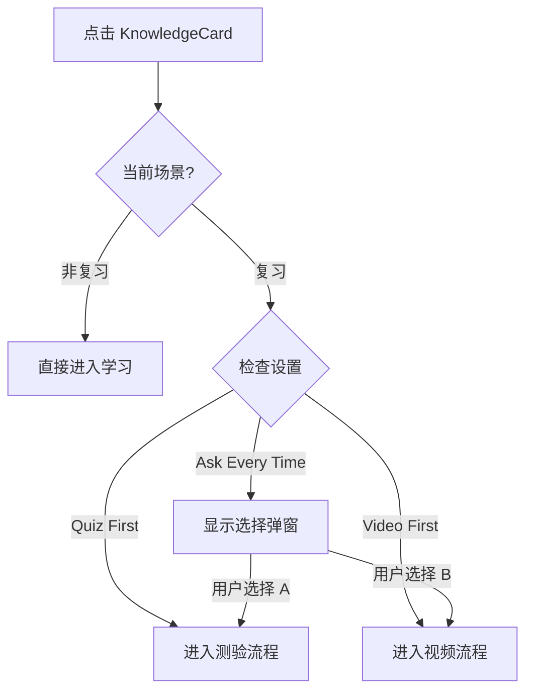

# 功能详设：复习模式 (Review Mode)

> **版本**：V1.0
> **更新时间**：2026-01-12

## 1. 功能概述

在复习场景下，系统引导用户采用更科学的学习顺序，同时尊重用户的个性化习惯。

## 2. 交互逻辑

## 3. 弹窗设计 (LearningModeModal)

### 3.1 触发条件
- `currentTab === 'review'`
- `appSettings.reviewLearningMode === 'ask-every-time'`

### 3.2 界面元素
- **标题**："选择学习方式"
- **副标题**："复习时建议先做题检测掌握程度..."
- **选项卡片**：
  - A: 先做题后看视频 (Tag: 推荐, Style: 橙色高亮)
  - B: 先看视频后做题 (Style: 默认灰色)
- **提示文案**：底部显示"可在设置中修改默认学习方式"，引导用户去设置页。

## 4. 状态记忆

- 不再在弹窗内提供"记住选择"复选框，避免与全局设置冲突。
- 引导用户通过设置页面进行全局配置。
