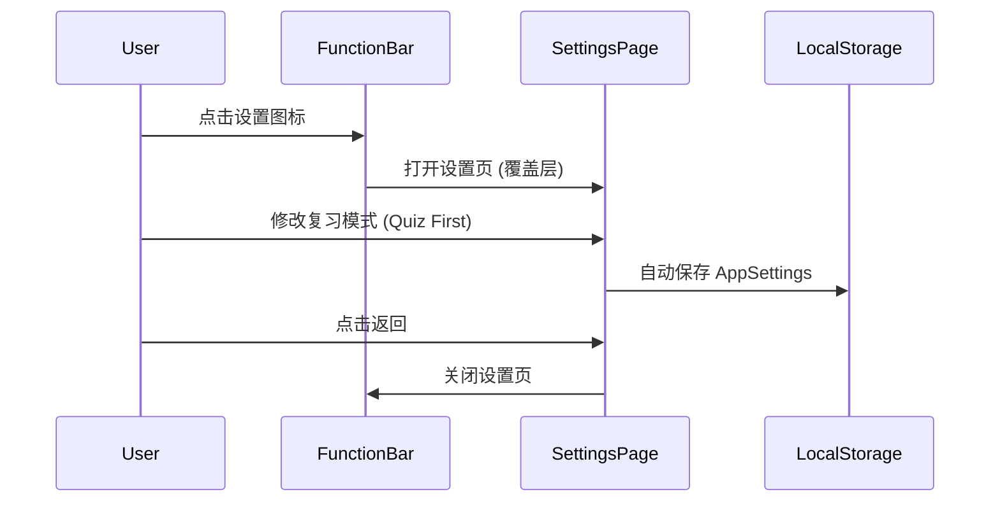

# 功能详设：设置模块 (Settings Module)

> **版本**：V1.0
> **更新时间**：2026-01-12

## 1. 功能概述

提供一个集中的配置入口，允许用户个性化定制学习体验，包括复习模式、默认视图和难度偏好。

## 2. 页面流程

## 3. 设置项规格

### 3.1 复习学习顺序 (Review Learning Mode)
- **键名**：`reviewLearningMode`
- **选项**：
  - `quiz-first`: 先做题后看视频（推荐，高亮）
  - `video-first`: 先看视频后做题
  - `ask-every-time`: 每次选择（默认值）
- **影响**：控制 `KnowledgeCard` 在 review 场景下的点击行为。

### 3.2 默认场景选择 (Default Scene Tab)
- **键名**：`defaultSceneTab`
- **选项**：
  - `all`: 每次进入默认选"全部"（默认值）
  - `last-selected`: 记住上次退出的 Tab
- **逻辑**：Store 初始化时，根据此配置决定 `currentTab` 的初始值。

### 3.3 同步刷题难度 (Practice Difficulties)
- **键名**：`practiceDifficulties`
- **类型**：多选数组 `Array<'basic' | 'medium' | 'hard'>`
- **默认值**：全选
- **交互**：至少保留一个选项，不可全部取消。

## 4. UI 规范

- **页面模式**：覆盖式页面，背景浅灰 (`$bg-secondary`)。
- **导航栏**：固定顶部，包含返回按钮和标题。
- **保存反馈**：底部显示"设置自动保存"提示，增强用户信心。
- **推荐标记**：推荐选项（如"先做题后看视频"）需有醒目的 Tag。
