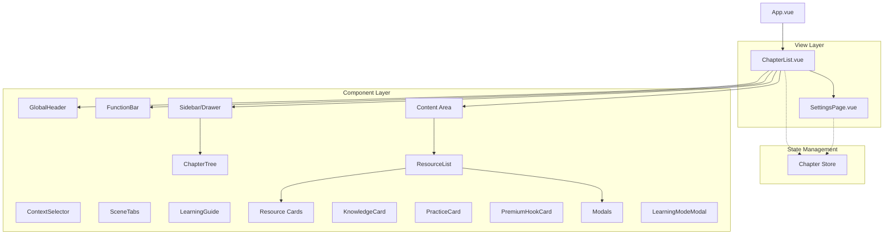

# 技术架构说明 (System Architecture)

> **版本**：V1.0
> **更新时间**：2026-01-12

## 1. 系统架构概览

本项目采用 **Vue 3 + TypeScript + Pinia + SCSS** 技术栈，基于组件化和响应式设计原则构建。



## 2. 目录结构

```
src/
├── components/          # UI 组件
│   ├── GlobalHeader.vue # 顶部全局导航
│   ├── FunctionBar.vue  # 功能操作栏
│   ├── SceneTabs.vue    # 场景切换 Tab
│   ├── ResourceList.vue # 资源列表容器
│   ├── ChapterTree.vue  # 章节目录树
│   └── ... (各种卡片组件)
├── views/               # 页面视图
│   ├── ChapterList.vue  # 主页面
│   └── SettingsPage.vue # 设置页面
├── stores/              # 状态管理
│   └── chapter.ts       # 核心业务逻辑 Store
├── mocks/               # 模拟数据
│   └── data.ts          # 章节、资源、进度数据
├── types/               # TypeScript 类型定义
│   └── index.ts
└── styles/              # 全局样式
    └── _variables.scss  # Design Tokens
```

## 3. 核心依赖

| 依赖项 | 版本 | 用途 |
|--------|------|------|
| **Vue** | ^3.x | 核心框架 (Composition API) |
| **Pinia** | ^2.x | 状态管理 (Store) |
| **Sass** | ^1.x | CSS 预处理器 (变量、Mixins) |
| **Lucide Vue Next** | latest | 图标库 |
| **TypeScript** | ^5.x | 类型安全 |

## 4. 响应式策略

采用 **Mobile-First** 的断点设计，结合 SCSS Mixins 实现多端适配。

| 断点 (Mixin) | 阈值 | 布局行为 |
|--------------|------|----------|
| `mobile` | < 768px | 启用抽屉式侧边栏，折叠 FunctionBar |
| `desktop` | >= 768px | 双栏布局，展开所有操作入口 |
| `small-mobile` | < 600px | 压缩间距，精简文本显示 |

## 5. 关键技术实现

### 5.1 状态持久化
- 使用 `localStorage` 存储用户偏好 (`appSettings`) 和 VIP 状态。
- Store 初始化时自动从 Storage 恢复状态。

### 5.2 滚动联动
- 使用 `IntersectionObserver` 监听资源列表滚动，自动高亮目录树。
- 点击目录树时，使用 `scrollIntoView` 平滑滚动，并暂时禁用 Observer 防止冲突。

### 5.3 动态组件
- 使用 `<component :is="...">` 动态渲染不同类型的资源卡片。
- 利用 `markRaw` 优化性能，避免组件实例被代理。
