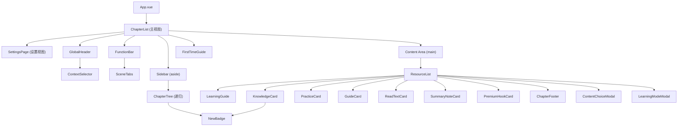
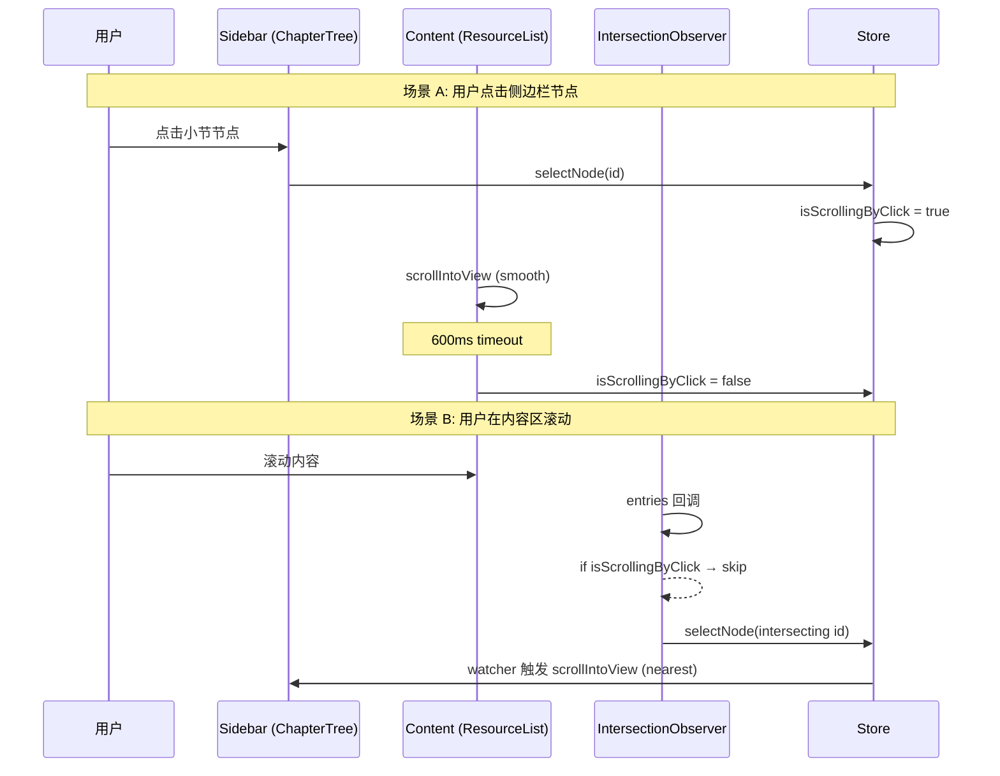

# 章节列表页迭代 V1.6 -- 软件设计文档 (SDD)

---

## 1. 元数据

| 字段 | 值 |
|---|---|
| 文档版本 | 3.0.0 |
| 项目代号 | chapter-list-redesign |
| 原型版本 | V1.6 |
| 提取来源 | `02-prototypes/vue-apps/chapter-list-redesign/src/` |
| 提取时间 | 2026-03-17 |
| 产品 | 洋葱学园 (Onion Academy) -- 教材同步模块 |

---

## 2. 技术栈

| 层 | 技术 | 版本 |
|---|---|---|
| 框架 | Vue 3 (Composition API, `<script setup>`) | 3.x |
| 语言 | TypeScript | 5.x |
| 状态管理 | Pinia | 2.x |
| 构建 | Vite | 5.x |
| 样式 | SCSS + Design Tokens (`_variables.scss`) | -- |
| 图标 | Lucide Vue Next | -- |
| 字体 | Alibaba PuHuiTi 2.0 | -- |

---

## 3. 设计令牌 (Design Tokens)

所有令牌定义于 `src/styles/_variables.scss`。

### 3.1 颜色系统

| 变量 | 值 | 语义 |
|---|---|---|
| `$primary` | `#FEA345` | 主色 / 提示橙 |
| `$primary-light` | `#FFF1E3` | 主色浅底 |
| `$secondary` | `#845EFF` | 次要色 / 品牌紫 |
| `$secondary-light` | `#F0ECFF` | 次要色浅底 |
| `$brand-yellow` | `#FFD633` | 品牌黄 |
| `$brand-yellow-light` | `#FFF9E0` | 品牌黄浅底 |
| `$success` | `#92E066` | 成功 / 正确绿 |
| `$success-light` | `#EFFAE8` | 成功浅底 |
| `$warning` | `#FFD633` | 警告 (同品牌黄) |
| `$warning-light` | `#FFF9E0` | 警告浅底 |
| `$error` | `#FA5A65` | 错误红 |
| `$error-light` | `#FEE6E8` | 错误浅底 |
| `$blue` | `#518AFF` | 链接蓝 |
| `$blue-light` | `#EAF2FF` | 链接蓝浅底 |
| `$text-primary` | `#2E2E3A` | 主文字色 |
| `$text-secondary` | `#848096` | 次文字色 |
| `$text-tertiary` | `#B0ADBA` | 三级文字色 |
| `$border-color` | `#D4D2DC` | 边框色 |
| `$bg-white` | `#FFFFFF` | 白色背景 |
| `$bg-secondary` | `#F5F4F8` | 次级背景 |
| `$overlay` | `rgba(0, 0, 0, 0.4)` | 遮罩层 |

### 3.2 渐变

| 变量 | 值 |
|---|---|
| `$vip-gradient` | `linear-gradient(135deg, #FFD633 0%, #FEA345 100%)` |
| `$gold-gradient` | `linear-gradient(135deg, #FFD633 0%, #FEA345 100%)` |

### 3.3 字体规格

| 变量 | 值 |
|---|---|
| `$font-family` | `"Alibaba PuHuiTi 2.0", -apple-system, BlinkMacSystemFont, "Segoe UI", Roboto, Helvetica, Arial, sans-serif` |
| `$font-size-xl` | `18px` |
| `$font-size-lg` | `16px` |
| `$font-size-md` | `14px` |
| `$font-size-sm` | `13px` |
| `$font-size-xs` | `12px` |
| `$font-size-xxs` | `11px` |
| `$font-size-xxxs` | `10px` |
| `$font-weight-normal` | `400` |
| `$font-weight-medium` | `500` |
| `$font-weight-semibold` | `600` |
| `$font-weight-bold` | `800` |

### 3.4 间距系统

| 变量 | 值 |
|---|---|
| `$spacing-xxs` | `2px` |
| `$spacing-xs` | `4px` |
| `$spacing-sm` | `6px` |
| `$spacing-md` | `8px` |
| `$spacing-lg` | `10px` |
| `$spacing-xl` | `12px` |
| `$spacing-xxl` | `16px` |
| `$spacing-xxxl` | `24px` |

### 3.5 圆角

| 变量 | 值 |
|---|---|
| `$radius-sm` | `6px` |
| `$radius-md` | `8px` |
| `$radius-lg` | `10px` |
| `$radius-xl` | `12px` |
| `$radius-pill` | `999px` |
| `$radius-circle` | `50%` |

### 3.6 阴影

| 变量 | 值 |
|---|---|
| `$shadow-card` | `0 1px 1px rgba(18, 22, 38, 0.05), 0 3px 8px -1px rgba(18, 22, 38, 0.05)` |
| `$shadow-dropdown` | `0 4px 12px rgba(0, 0, 0, 0.15)` |
| `$shadow-badge` | `-1px 1px 4px rgba(0, 0, 0, 0.1)` |

### 3.7 过渡

| 变量 | 值 |
|---|---|
| `$transition-fast` | `0.2s` |
| `$transition-normal` | `0.3s` |
| `$transition-slow` | `0.6s` |

### 3.8 断点

| 变量 | 值 | 说明 |
|---|---|---|
| `$breakpoint-mobile` | `768px` | 移动端/桌面端分界 |
| `$breakpoint-small-mobile` | `600px` | 小屏手机 |
| `$breakpoint-tiny-mobile` | `380px` | 超窄屏 |
| `$breakpoint-micro-mobile` | `360px` | 极窄屏 |

### 3.9 布局尺寸

| 变量 | 值 |
|---|---|
| `$sidebar-width` | `260px` |
| `$header-height` | `40px` |
| `$function-bar-height` | `44px` |

### 3.10 响应式 Mixins

| Mixin | 条件 |
|---|---|
| `@include desktop` | `min-width: 768px` |
| `@include mobile` | `max-width: 767px` |
| `@include small-mobile` | `max-width: 599px` |
| `@include tiny-mobile` | `max-width: 379px` |
| `@include micro-mobile` | `max-width: 359px` |
| `@include tablet-portrait` | `min-width: 640px and min-height: 640px` |
| `@include phone-landscape` | `max-height: 639px` |
| `@include tablet-landscape` | `min-width: 1024px` |

---

## 4. 数据模型

### 4.1 TextbookConfig

教材配置，标识当前用户所选教材的完整上下文。

```typescript
interface TextbookConfig {
  id: string             // 唯一标识 (如 'math_rj_7b')
  stageId: number        // 学段 ID (2=初中, 3=高中)
  subjectId: number      // 学科 ID (2=数学, 3=英语, 4=语文)
  publisherId: number    // 出版社 ID (2=人教版)
  semesterId: number     // 册别 ID (上册/下册)
  subject: SubjectType   // 学科枚举值
  version: string        // 版本名称 (如 '人教版')
  grade: string          // 年级 (如 '七年级')
  semester: string       // 学期 (如 '下册')
  displayName: string    // 显示名称
}
```

### 4.2 Resource

资源实体，表示一个可学习的内容单元。

```typescript
interface Resource {
  // --- 必填字段 ---
  id: string
  type: ResourceType
  title: string
  tags: string[]
  isFree: boolean

  // --- 场景与学科 ---
  scenes?: SceneType[]          // 适用场景
  subject?: SubjectType         // 所属学科

  // --- VIP 相关 ---
  isTrial?: boolean             // 是否可试看

  // --- 视频相关 ---
  duration?: number             // 时长 (分钟)
  questionCount?: number        // 随堂检测题目数
  category?: CourseCategory     // 课程分类
  valueTag?: ValueTag           // 价值标签
  difficulty?: 1 | 2 | 3       // 难度等级
  coverUrl?: string             // 封面图 URL

  // --- 刷题相关 ---
  completedCount?: number       // 已完成题数
  totalCount?: number           // 总题数
  difficultyLevels?: string[]   // ['基础', '中等', '困难']
  subsectionTitle?: string      // 小节标题

  // --- 学案相关 ---
  pageCount?: number            // 页数
  downloadUrl?: string          // 下载链接

  // --- 读课文相关 ---
  paragraphCount?: number       // 段落数
  estimatedTime?: number        // 预计用时 (分钟)

  // --- 笔记相关 ---
  noteCount?: number            // 笔记条数

  // --- 培优课钩子 ---
  hookType?: '重难点' | '拔高' | '竞赛'
  targetCourse?: string         // 目标课程名称

  // --- V1.5 线上对齐字段 ---
  firstPublishAt?: string       // 首次发布时间 (ISO8601)
  videoTimepoint?: number       // 视频播放进度 (秒)
  isContainNote?: boolean       // 是否含课堂笔记
  isPremium?: boolean           // 是否为付费内容

  // --- V3.0 标签筛选字段 ---
  contentTags?: string[]        // 内容标签
  sceneTags?: string[]          // 场景标签
}
```

### 4.3 Chapter

章节节点，支持三级递归结构 (chapter > section > subsection)。

```typescript
interface Chapter {
  id: string
  title: string
  level: ChapterLevel
  children?: Chapter[]
  resources?: Resource[]
  progress?: {
    completed: number
    total: number
  }
  isExpanded?: boolean
  isHaveNew?: boolean          // 是否含 NEW 内容 (冒泡标记)
  scene?: string               // 场景标记
  firstPublishAt?: string      // 首次发布时间 (侧边栏 NEW 红点)
}
```

### 4.4 UserProgress

用户学习进度。

```typescript
interface UserProgress {
  nodeId: string
  status: ProgressStatus       // 'not_started' | 'in_progress' | 'completed'
  percentage: number           // 0-100
  lastUpdateTime: string       // ISO8601
}
```

### 4.5 TabConfig

Tab 配置项。

```typescript
interface TabConfig {
  key: SceneType
  label: string
}
```

### 4.6 GuideContent

学习方法指南内容，按场景键索引。

```typescript
type GuideContent = Partial<Record<SceneType | 'all', string>>
```

### 4.7 ChapterLevelEntry

章节级资源入口 (思维导图、错题本、背单词)。

```typescript
interface ChapterLevelEntry {
  type: 'mind_map' | 'error_book' | 'recite'
  title: string
  icon: string
  count?: number
  isAvailable: boolean
}
```

### 4.8 AppSettings

应用设置持久化结构。

```typescript
interface AppSettings {
  reviewLearningMode: ReviewLearningMode   // 'quiz-first' | 'video-first' | 'ask-every-time'
  defaultSceneTab: DefaultSceneTab         // 'all' | 'last-selected'
  practiceDifficulties: DifficultyLevel[]  // ('basic' | 'medium' | 'hard')[]
  lastSelectedTab: SceneType | 'all'
}
```

### 4.9 ResourceTag

资源标签，区分内容标签与场景标签。

```typescript
interface ResourceTag {
  id: string
  name: string
  type: 'content' | 'scene'  // 内容标签 | 场景标签
}
```

### 4.10 SceneFilterRule

场景筛选规则，支持双维度过滤。

```typescript
interface SceneFilterRule {
  contentTags?: string[]    // 内容标签组 (组内 OR)
  sceneTags?: string[]      // 场景标签组 (组内 OR)
  operator: 'AND' | 'OR'    // 组间关系 (默认 AND)
}
```

### 4.11 SubjectSceneConfig

学段×学科维度的场景配置。

```typescript
interface SubjectSceneConfig {
  stage: 'elementary' | 'middle' | 'high'  // 学段
  subject: SubjectType
  templateType: 'science_problem' | 'language' | 'science_basic' | 'elementary_science'
  scenes: SceneDefinition[]
  isLaunched: boolean  // 是否上线
}
```

### 4.12 SceneDefinition

场景定义，描述单个 Tab 的完整配置。

```typescript
interface SceneDefinition {
  key: SceneType
  label: string
  description: string           // 定位说明
  cardTypes: ResourceType[]     // 包含卡片类型
  filterRules: SceneFilterRule[]  // 筛选条件组 (组间 OR)
  hiddenTags: string[]          // 前台隐藏标签
  useTagFilter: boolean         // false = 按资源类型聚合（如"加餐"场景）
}
```

---

## 5. 枚举定义

### 5.1 SceneType

```typescript
type SceneType = 'preview' | 'review' | 'extra' | 'problem_solving' | 'drill' | 'accumulation'
```

| 值 | 含义 | 适用学科 |
|---|---|---|
| `preview` | 预习 | 全部 |
| `review` | 复习 | 语文/英语/生物/地理/历史/政治 |
| `extra` | 加餐 (旧版保留) | 部分学段 |
| `problem_solving` | 解题指导 | 数学/物理/化学 |
| `drill` | 刷题 | 数学/物理/化学 |
| `accumulation` | 日常积累 | 语文/英语 |

### 5.2 SubjectType

```typescript
type SubjectType = '数学' | '英语' | '语文' | '历史' | '地理' | '政治' | '物理' | '化学' | '生物'
```

文科学科常量: `liberalArtsSubjects = ['语文', '历史', '地理', '政治']`

### 5.2b StageType

```typescript
type StageType = 'elementary' | 'middle' | 'high'  // 小学 | 初中 | 高中
```

### 5.2c TemplateType

```typescript
type TemplateType = 'science_problem' | 'language' | 'science_basic' | 'elementary_science'
```

### 5.2d StageSubjectKey

学段×学科的复合键，用于精确匹配场景配置。

```typescript
type StageSubjectKey = `${StageType}_${SubjectType}`
```

### 5.3 ResourceType

```typescript
type ResourceType =
  | 'video'           // 知识点视频 + 课后题 (小节级)
  | 'practice'        // 同步刷题 (小节级)
  | 'guide'           // 学案 (小节级)
  | 'read_text'       // 读课文 (小节级, 仅文科)
  | 'summary_note'    // 总结类笔记 (小节级)
  | 'premium_hook'    // 培优课钩子 (小节级, 仅加餐场景)
  | 'recite'          // 背单词 (章节级, 仅英语)
  | 'mind_map'        // 思维导图 (章节级)
  | 'error_book'      // 错题本 (章节级)
```

### 5.4 ChapterLevel

```typescript
type ChapterLevel = 'chapter' | 'section' | 'subsection'
```

### 5.5 ProgressStatus

```typescript
type ProgressStatus = 'not_started' | 'in_progress' | 'completed'
```

### 5.6 CourseCategory / ValueTag

```typescript
type CourseCategory = '概念课' | '解题课' | '实验课' | '总结课'
type ValueTag = '新中考' | '重难点' | '易错点' | '考点' | '必看'
```

### 5.7 LearningMode / ContentChoice (Modal 导出类型)

```typescript
type LearningMode = 'quiz-first' | 'video-first'
type ContentChoice = 'video' | 'practice' | 'note'
```

---

## 6. 状态管理 (Pinia Store)

Store 定义于 `src/stores/chapter.ts`，使用 Composition API 风格 (`defineStore('chapter', () => {...})`)。

### 6.1 State

| 名称 | 类型 | 默认值 | 说明 |
|---|---|---|---|
| `loading` | `Ref<boolean>` | `false` | 数据加载状态 |
| `currentTab` | `Ref<SceneType>` | `'preview'` | 当前场景 Tab |
| `chapters` | `Ref<Chapter[]>` | `[]` | 章节树数据 |
| `selectedNodeId` | `Ref<string>` | `''` | 当前选中小节 ID |
| `isScrollingByClick` | `Ref<boolean>` | `false` | 点击触发滚动锁 |
| `progressMap` | `Ref<Record<string, UserProgress>>` | `{}` | 资源进度映射 |
| `isVip` | `Ref<boolean>` | `false` | VIP 状态 |
| `currentTextbook` | `Ref<TextbookConfig>` | 首个配置 | 当前教材 |
| `availableTextbooks` | `Ref<TextbookConfig[]>` | 全部配置 | 可用教材列表 |
| `isAllResourcesOpen` | `Ref<boolean>` | `false` | "全部资源"模式开关 |
| `reviewLearningMode` | `Ref<LearningMode \| null>` | `null` | 复习学习模式 (旧版兼容) |
| `rememberReviewMode` | `Ref<boolean>` | `false` | 是否记住模式 (旧版兼容) |
| `appSettings` | `Reactive<AppSettings>` | DEFAULT_SETTINGS | 应用设置 |
| `isFirstVisit` | `Ref<boolean>` | `!localStorage['guide_completed']` | 首次访问标记 |
| `readResources` | `Ref<Set<string>>` | localStorage 恢复 | 已读资源 ID 集合 |

**DEFAULT_SETTINGS:**

```typescript
{
  reviewLearningMode: 'ask-every-time',
  defaultSceneTab: 'all',
  practiceDifficulties: ['basic', 'medium', 'hard'],
  lastSelectedTab: 'preview'
}
```

### 6.2 Getters (Computed)

| 名称 | 返回类型 | 说明 |
|---|---|---|
| `currentSubject` | `SubjectType` | 从 `currentTextbook.subject` 派生 |
| `sceneTabs` | `TabConfig[]` | 基于当前学科查 `SCENE_CONFIG`，fallback 为 `DEFAULT_SCENE_TABS` |
| `isEnglish` | `boolean` | 当前学科是否为英语 |
| `isLiberalArts` | `boolean` | 当前学科是否为文科 (语/历/地/政) |
| `currentGuide` | `string` | 当前场景学习方法指南文案；"全部资源"模式下返回 `all` 键内容 |
| `allSubsections` | `Chapter[]` | 递归收集所有 `level === 'subsection'` 的节点 |
| `currentChapterTitle` | `string` | 首个章节标题，兜底值 `'加载中...'` |
| `chapterStats` | `object` | 章节级统计 (mindMapCount, errorBookCount, vocabWordCount) |
| `adjacentChapters` | `{ prev, next }` | 当前选中小节所属章节的上/下一章 |

### 6.3 Actions

| 名称 | 签名 | 说明 |
|---|---|---|
| `fetchChapters` | `() => Promise<void>` | 根据当前学科加载章节数据，500ms 模拟延迟，自动选中首个小节 |
| `switchTextbook` | `(textbookId: string) => Promise<void>` | 切换教材，验证 Tab 有效性，自动回退到新学科首 Tab |
| `selectNode` | `(id: string) => void` | 设置选中节点 |
| `toggleExpand` | `(chapterId: string) => void` | 递归切换章节展开状态 |
| `switchTab` | `(tab: SceneType) => Promise<void>` | 切换场景 Tab，自动关闭全部资源抽屉 |
| `unlockVip` | `() => void` | 设置 VIP 状态为 true |
| `getProgress` | `(resourceId: string) => UserProgress \| undefined` | 查询资源进度 |
| `updateProgress` | `(resourceId: string, percentage: number) => void` | 更新进度，自动推断 status |
| `setScrollingByClick` | `(value: boolean) => void` | 设置滚动锁 |
| `toggleAllResources` | `(isOpen: boolean) => void` | 切换全部资源模式 |
| `shouldShowLearningModeModal` | `() => boolean` | 判断是否弹出学习模式选择 (依据 `appSettings.reviewLearningMode`) |
| `updateAppSettings` | `(updates: Partial<AppSettings>) => void` | 合并更新设置并持久化 |
| `recordLastSelectedTab` | `(tab: SceneType \| 'all') => void` | 记录上次 Tab 选择 |
| `restorePosition` | `(urlParams?) => Promise<void>` | 定位优先级链: URL > 服务端 > localStorage > 默认首章 |
| `markAsRead` | `(nodeId: string) => void` | 标记资源已读 (NEW 徽标判断) |
| `completeGuide` | `() => void` | 完成新手引导，写 localStorage |
| `isNewContent` | `(item: {id, firstPublishAt?}) => boolean` | 判断是否为新内容 (7 天窗口 + 未读) |

### 6.4 持久化策略

| 存储键 | 说明 | 读取时机 |
|---|---|---|
| `appSettings` | 应用设置 JSON | Store 初始化时 `loadAppSettings()` |
| `guide_completed` | 新手引导完成标记 | `isFirstVisit` 初始化 |
| `read_resources` | 已读资源 ID 数组 JSON | Store 初始化时 `loadReadResources()` |
| `reviewLearningMode` | 旧版学习模式偏好 (兼容) | Store 初始化时 `loadReviewModePreference()` |
| `last_position_{textbookId}` | 教材维度学习位置 | `restorePosition()` 调用时 |

---

## 7. 组件规格

### 7.1 组件树



### 7.2 各组件规格

#### App.vue

- 入口组件，仅渲染 `<ChapterList />`
- 适配断点声明: 375px / 640px / 768px / 1024px

#### ChapterList.vue (主视图)

- **State**: `currentView: 'list' | 'settings'`, `isSidebarOpen: boolean`
- **Props**: 无
- **Events**: 无 (顶层视图)
- **职责**: 页面布局调度 (加载态 / 主列表 / 设置页)；侧边栏开关；目录节点点击转发；watcher 监听 `selectedNodeId` 自动滚动侧边栏

#### SettingsPage.vue

- **Props**: 无
- **Events**: `@back`
- **职责**: 三个设置组 -- 复习学习顺序 (radio)、默认场景选择 (radio)、同步刷题难度 (checkbox 多选)

#### GlobalHeader.vue

- **子组件**: ContextSelector
- **职责**: 返回按钮、品牌标题 ("教材同步")、教材选择器、VIP 升级入口
- **VIP 按钮**: 未升级 → 金色渐变 "去升级"；已升级 → 灰色渐变 "已升级"
- **响应式**: `@include micro-mobile` 隐藏升级按钮文字

#### ContextSelector.vue

- **Props**: `compact?: boolean`
- **职责**: 教材选择触发器 + Teleport 弹窗 (三列选择器: 学科/版本/册别)
- **弹窗交互**: 选择后调用 `store.switchTextbook(textbookId)`

#### FunctionBar.vue

- **子组件**: SceneTabs (embedded 模式)
- **Events**: `@open-settings`
- **布局**: `justify-content: space-between`，左侧 SceneTabs + 右侧快捷入口
- **快捷入口**: 思维导图 (带 badge)、错题本 (带 badge)、收藏、设置
- **响应式**: `>=600px` 展示全部按钮; `<600px` 折叠为更多菜单 (Menu 图标)
- **更多菜单**: absolute 定位 dropdown + overlay 关闭

#### SceneTabs.vue

- **Props**: `embedded?: boolean`
- **布局**: "全部" 固定按钮 + 竖分隔线 + 可滚动场景 Tab 列表
- **Tab 来源**: `store.sceneTabs` (由当前学科从 SCENE_CONFIG 查表)
- **激活态**: embedded 模式 -- 橙色文字 + bold; standalone 模式 -- 底部 indicator 线
- **"全部" Tab**: 激活时显示 outline pill (border: $text-primary)
- **响应式**: `@include small-mobile` 压缩 padding/gap; `@include tiny-mobile` 进一步缩减

#### ChapterTree.vue (递归)

- **Props**: `chapters: Chapter[]`
- **Events**: `@node-click(nodeId: string)`
- **递归机制**: `v-if="item.children && item.children.length"` 渲染自身
- **选中态**: `store.selectedNodeId === item.id`
- **NEW 红点**: subsection/section 级别显示 `<NewBadge size="dot">`
- **进度显示**: section 级别显示 `completed/total`

#### ResourceList.vue

- **Props**: `mode?: 'scene' | 'all'` (默认 `'scene'`)
- **Events**: `@scroll-to-node(nodeId: string)`
- **子组件**: LearningGuide, KnowledgeCard, PracticeCard, GuideCard, ReadTextCard, SummaryNoteCard, PremiumHookCard, ChapterFooter, LearningModeModal, ContentChoiceModal
- **过滤逻辑** (filteredSubsections computed):
  1. 场景过滤: `res.scenes.includes(currentTab)`; 无 scenes 标记默认显示在 preview/review
  2. 学科过滤: `read_text` 仅文科
- **布局行** (LayoutRow): 相邻 `practice + guide` 合并为并排行 (各 50%)，其余为单卡片行
- **并排模式**: 使用 CSS `container-type: inline-size` + `@container pair-row` 查询:
  - 默认 (>350px): grid 双列布局 40px 图标
  - Tier 1 (<=350px): 24px 图标，缩小字体
  - Tier 2 (<=300px): 20px 图标，隐藏类型标题，副标题提升为主标题

#### KnowledgeCard.vue

- **Props**: `resource: Resource`
- **Events**: `@request-learning-mode(resource)`, `@request-content-choice(resource)`
- **VIP 角标优先级**: badge-lock > NEW > badge-unlocked
- **信息展示**: 封面图 + 时长标签 (pill + clock icon) + 标题行 (含 NewBadge) + 标签行 (分类/价值/难度星) + 双进度行

#### PracticeCard.vue

- **Props**: `resource: Resource`
- **展示**: 图标区 + 类型标签 ("同步刷题") + 小节标题 + 难度条 + 进度 (completed/total)

#### GuideCard.vue

- **Props**: `resource: Resource`
- **展示**: 蓝色图标 + 类型标签 ("学案") + 标题 + 元信息标签 (页数)

#### ReadTextCard.vue

- **Props**: `resource: Resource`
- **限制**: 仅文科学科显示 (`store.isLiberalArts`)

#### SummaryNoteCard.vue

- **Props**: `resource: Resource`
- **展示**: AI 总结笔记

#### PremiumHookCard.vue

- **Props**: `resource: Resource`
- **展示**: 培优课钩子 (hookType + targetCourse)

#### NewBadge.vue

- **Props**: `id: string`, `firstPublishAt?: string`, `size?: 'resource' | 'dot'` (默认 `'resource'`)
- **逻辑**: `store.isNewContent({ id, firstPublishAt })` 判断是否显示
- **渲染**: `resource` 尺寸 → 红底白字 "NEW"; `dot` 尺寸 → 红点无文字

#### LearningGuide.vue

- **Props**: 无 (直接访问 store)
- **展示**: 可折叠的学习方法指南，默认展开 (`isExpanded: true`)
- **内容来源**: `store.currentGuide`

#### ChapterFooter.vue

- **Props**: 无 (直接访问 store)
- **展示**: 上一章/下一章导航按钮
- **数据源**: `store.adjacentChapters`

#### LearningModeModal.vue

- **Props**: `visible: boolean`, `resourceTitle?: string`
- **Events**: `@close`, `@confirm(mode: LearningMode)`
- **导出类型**: `LearningMode = 'quiz-first' | 'video-first'`
- **选项**: "先做题后看视频" (推荐) / "先看视频后做题"
- **底部提示**: 可在设置中修改默认学习方式

#### ContentChoiceModal.vue

- **Props**: `visible: boolean`, `resourceTitle: string`, `hasNote: boolean`
- **Events**: `@close`, `@select(choice: ContentChoice)`
- **导出类型**: `ContentChoice = 'video' | 'practice' | 'note'`
- **选项**: 继续看视频 / 做补充练习 / 看课堂笔记 (仅 `hasNote` 时显示)
- **触发条件**: 用户点击已有观看进度的视频资源

#### FirstTimeGuide.vue

- **Props**: `visible: boolean`
- **Events**: `@complete`
- **渲染**: Teleport to body，3 步新手引导
- **步骤**:
  1. BookOpen -- "选择你的教材"
  2. ListTree -- "选择要学习的章节"
  3. PlayCircle -- "点击小节开始学习"
- **交互**: 步骤指示器 (dots) + 跳过按钮 + 下一步/开始学习按钮 + Lottie 手势动画占位
- **手势提示**: 进入步骤 1.5s 后显示点击手势 (MousePointerClick)

---

## 8. 场景配置系统

定义于 `src/constants/sceneConfig.ts`。

### 8.1 四种 Tab 模板

| 模板名称 | 常量名 | 适用学科 | Tab 组合 |
|---|---|---|---|
| 理科解题型 | `SCIENCE_PROBLEM_TABS` | 初中数理化、高中数理化生 | 预习 → 解题指导 / 复习 → 刷题 / 加餐 |
| 文科语言型 | `LANGUAGE_TABS` | 初/高中语英、小学语英 | 预习 → 复习 → 日常积累 → 加餐 |
| 小四门基础型 | `SCIENCE_BASIC_TABS` | 初/高中生物地理历史政治道法 | 预习 → 复习 |
| 小学理科型 | `ELEMENTARY_SCIENCE_TABS` | 小学数学 | 预习 → 复习 → 加餐 |

### 8.2 学科映射表 (学段×学科维度)

```typescript
SCENE_CONFIG: Record<StageSubjectKey, SubjectSceneConfig> = {
  // --- 初中 ---
  'middle_数学': { templateType: 'science_problem', isLaunched: true },
  'middle_物理': { templateType: 'science_problem', isLaunched: true },
  'middle_化学': { templateType: 'science_problem', isLaunched: true },
  'middle_语文': { templateType: 'language', isLaunched: true },
  'middle_英语': { templateType: 'language', isLaunched: true },
  'middle_生物': { templateType: 'science_basic', isLaunched: true },
  'middle_地理': { templateType: 'science_basic', isLaunched: true },
  'middle_历史': { templateType: 'science_basic', isLaunched: false },  // 暂不上线
  'middle_政治': { templateType: 'science_basic', isLaunched: false },  // 暂不上线 (道法)
  // --- 高中 ---
  'high_数学': { templateType: 'science_problem', isLaunched: true },
  'high_物理': { templateType: 'science_problem', isLaunched: true },
  'high_化学': { templateType: 'science_problem', isLaunched: true },
  'high_生物': { templateType: 'science_problem', isLaunched: true },
  'high_语文': { templateType: 'language', isLaunched: true },
  'high_英语': { templateType: 'language', isLaunched: true },
  'high_地理': { templateType: 'science_basic', isLaunched: false },  // 暂不上线
  'high_历史': { templateType: 'science_basic', isLaunched: false },  // 暂不上线
  'high_政治': { templateType: 'science_basic', isLaunched: false },  // 暂不上线
  // --- 小学 ---
  'elementary_数学': { templateType: 'elementary_science', isLaunched: true },
  'elementary_语文': { templateType: 'language', isLaunched: true },
  'elementary_英语': { templateType: 'language', isLaunched: true },
}
```

### 8.3 默认回退

```typescript
DEFAULT_SCENE_TABS = SCIENCE_PROBLEM_TABS
```

当 `SCENE_CONFIG[stageSubjectKey]` 未命中时使用此默认值。

### 8.4 Tab 切换时的数据联动

- `switchTextbook()` 执行后检查当前 Tab 是否在新学科的 `SCENE_CONFIG` 中有效
- 若无效，自动回退到新学科的第一个 Tab
- 切换 Tab 后自动关闭全部资源抽屉 (`isAllResourcesOpen = false`)

### 8.5 标签筛选引擎

场景资源过滤采用双维度标签筛选机制，数据来源为团队确认的《场景划分与标签筛选逻辑汇总》。

**筛选维度:**

- **内容标签 (contentTags)**: 描述资源的内容属性 (如"概念课"、"解题课")
- **场景标签 (sceneTags)**: 描述资源的使用场景 (如"预习"、"复习")

**筛选逻辑:**

1. **组内 OR**: 同一标签组内的多个标签取并集。例如 `contentTags: ['概念课', '解题课']` 表示匹配"概念课"或"解题课"
2. **组间 AND**: `contentTags` 与 `sceneTags` 两组之间取交集。即资源需同时满足内容标签和场景标签的筛选条件
3. **多条件组 OR**: 一个场景可配置多组 `SceneFilterRule`，组间取并集。满足任意一组规则的资源均展示

**特殊规则:**

- **隐藏标签 (hiddenTags)**: 指定的标签参与后端筛选逻辑，但在前端 UI 不展示给用户
- **"加餐"场景**: 设置 `useTagFilter: false`，不走标签筛选，改为按资源类型 (ResourceType) 聚合展示
- **暂不上线学科**: 初中历史/道法、高中地理/历史/政治，配置中 `isLaunched: false`，前端不展示对应场景 Tab

---

## 9. 联动机制

### 9.1 左右滚动联动



**IntersectionObserver 配置:**

```javascript
{
  root: containerRef.value,
  threshold: [0, 0.1, 0.2],
  rootMargin: '-10% 0px -85% 0px'  // 感应区压缩在顶部 10%-15%
}
```

**防冲突机制:** `isScrollingByClick` 锁在点击触发滚动时设为 true，600ms 后自动释放。期间 IntersectionObserver 回调跳过节点选中逻辑。

### 9.2 Tab 切换联动

- 切换 Tab 后: `containerRef.scrollTop = 0` (滚动到顶)
- 重新调用 `setupObserver()` 重建 IntersectionObserver
- 自动关闭全部资源抽屉

### 9.3 学科切换联动

- `switchTextbook()` → 验证 Tab 有效性 → `fetchChapters()` → 重置 `selectedNodeId` → 选中首个小节
- ResourceList watcher 监听 `currentSubject` 变化，`scrollTop = 0`
- ResourceList watcher 监听 `allSubsections` 变化，`setupObserver()`

### 9.4 位置恢复优先级链

```
URL 参数 (chapterId/topicId)
  → 服务端 API (TODO: V5.x)
    → localStorage (last_position_{textbookId})
      → 默认首章第一个小节
```

---

## 10. VIP 权限逻辑

### 10.1 锁定判定

```
isLocked = !resource.isFree && !store.isVip
```

### 10.2 角标优先级

KnowledgeCard 中 VIP 角标优先级:

```
badge-lock (需付费) > NEW (新内容) > badge-unlocked (已解锁)
```

### 10.3 升级入口

- GlobalHeader 右侧按钮
- 未升级: `$gold-gradient` 背景 + "去升级"
- 已升级: 灰色渐变 + "已升级"
- 点击未升级: `confirm()` 确认后 `store.unlockVip()`

### 10.4 试看标记

`resource.isTrial === true` 时标记为可试看，角标显示 Crown 图标。

---

## 11. NEW 标识逻辑

### 11.1 判定规则

```typescript
function isNewContent(item: { id: string; firstPublishAt?: string }): boolean {
  if (!item.firstPublishAt) return false        // 无发布时间 → 非新
  if (readResources.has(item.id)) return false   // 已读 → 非新
  const diffDays = (now - publishDate) / (1000 * 60 * 60 * 24)
  return diffDays <= 7                           // 7 天窗口内
}
```

### 11.2 展示形态

| 场景 | 组件 | size prop | 渲染 |
|---|---|---|---|
| 资源卡片 (KnowledgeCard) | NewBadge | `resource` | 红底白字 "NEW" pill |
| 侧边栏小节/大节 | NewBadge | `dot` | 红色圆点 (无文字) |

### 11.3 已读标记

- `store.markAsRead(nodeId)` 将 ID 加入 `readResources` Set
- 持久化: `localStorage['read_resources']` (JSON 数组)

---

## 12. 响应式规则

### 12.1 总体布局

| 视口 | 侧边栏 | 内容区 |
|---|---|---|
| `>=768px` (desktop) | 固定左侧 260px | flex: 1 |
| `<768px` (mobile) | 抽屉模式 80% (max 300px) | 全宽 |

### 12.2 移动端侧边栏

- 默认 `transform: translateX(-100%)` 隐藏
- `.is-open` 时 `translateX(0)` 滑入
- 遮罩层: `$overlay` 背景 + fadeIn 0.2s 动画
- 拉手按钮: `top: 61.8%` (黄金分割位置)，宽 16px，高 80px

### 12.3 FunctionBar 响应式

| 断点 | 快捷入口展示 |
|---|---|
| `>=600px` | 全部按钮展开 (思维导图/错题本/收藏/设置) |
| `<600px` | 折叠为更多菜单 (Menu icon dropdown) |

### 12.4 SceneTabs 响应式

| 断点 | 调整 |
|---|---|
| `<600px` | padding 4px 8px, font 13px, gap 4px |
| `<380px` | padding 进一步压缩 |

### 12.5 ResourceList 并排卡片 Container Query

| 容器宽度 | 策略 |
|---|---|
| `>350px` | 默认 grid 布局，40px 图标 |
| `<=350px` (Tier 1) | 24px 图标，缩小字体 |
| `<=300px` (Tier 2) | 20px 图标，隐藏类型标题，副标题提升为主标题 |

### 12.6 GlobalHeader 响应式

| 断点 | 调整 |
|---|---|
| `<360px` | 隐藏升级按钮文字 (仅保留 Crown 图标) |

---

## 13. 文件结构

```
src/
├── App.vue                          # 入口组件
├── main.ts                          # 应用引导
├── vite-env.d.ts                    # Vite 类型声明
│
├── types/
│   └── index.ts                     # 全局类型定义 (9 个 type + 7 个 interface)
│
├── constants/
│   └── sceneConfig.ts               # 场景 Tab 配置 (4 模板 + SCENE_CONFIG 映射)
│
├── stores/
│   └── chapter.ts                   # Pinia Store (14 state + 9 getters + 17 actions)
│
├── mocks/
│   └── data.ts                      # Mock 数据 (教材/章节/进度/指南/统计)
│
├── views/
│   ├── ChapterList.vue              # 主视图 (布局调度)
│   └── SettingsPage.vue             # 设置页
│
├── components/
│   ├── GlobalHeader.vue             # 全局头部
│   ├── ContextSelector.vue          # 教材选择器
│   ├── FunctionBar.vue              # 功能栏
│   ├── SceneTabs.vue                # 场景 Tabs
│   ├── ChapterTree.vue              # 递归章节树
│   ├── ResourceList.vue             # 资源列表 (核心)
│   ├── LearningGuide.vue            # 学习方法指南
│   ├── KnowledgeCard.vue            # 知识点视频卡片
│   ├── PracticeCard.vue             # 同步刷题卡片
│   ├── GuideCard.vue                # 学案卡片
│   ├── ReadTextCard.vue             # 读课文卡片
│   ├── SummaryNoteCard.vue          # AI 总结笔记卡片
│   ├── PremiumHookCard.vue          # 培优课钩子卡片
│   ├── NewBadge.vue                 # NEW 徽标
│   ├── ChapterFooter.vue            # 章节底部导航
│   ├── ContentChoiceModal.vue       # 学习内容选择弹窗
│   ├── LearningModeModal.vue        # 学习模式选择弹窗
│   └── FirstTimeGuide.vue           # 新手引导 (3 步)
│
└── styles/
    ├── _variables.scss              # Design Tokens + Mixins
    └── global.scss                  # 全局样式
```

---

## 14. 复现检查清单

### 14.1 数据层

- [ ] `TextbookConfig` 字段完整性 (id/stageId/subjectId/publisherId/semesterId/subject/version/grade/semester/displayName)
- [ ] `Resource` 接口 -- 必填字段 4 个 + 可选字段 22 个 (含 contentTags/sceneTags)
- [ ] `Chapter` 三级递归结构 (chapter > section > subsection)
- [ ] 9 个 `SceneType` / 9 个 `SubjectType` / 9 个 `ResourceType` 枚举值
- [ ] `AppSettings` 四项设置: reviewLearningMode / defaultSceneTab / practiceDifficulties / lastSelectedTab

### 14.2 状态管理

- [ ] Pinia Composition API 风格 (`defineStore('chapter', () => {...})`)
- [ ] 14 个 State 字段全部声明
- [ ] 9 个 Computed getters 正确派生
- [ ] 17 个 Actions 签名与逻辑一致
- [ ] localStorage 持久化键 5 个: appSettings / guide_completed / read_resources / reviewLearningMode / last_position_{id}

### 14.3 场景配置

- [ ] 4 个 Tab 模板常量: SCIENCE_PROBLEM_TABS / LANGUAGE_TABS / SCIENCE_BASIC_TABS / ELEMENTARY_SCIENCE_TABS
- [ ] SCENE_CONFIG 映射学段×学科维度 (StageSubjectKey)
- [ ] DEFAULT_SCENE_TABS 指向 SCIENCE_PROBLEM_TABS
- [ ] Tab 切换联动: 验证有效性 + 自动回退
- [ ] 标签筛选引擎: 双维度 (contentTags × sceneTags)，组内 OR、组间 AND、多条件组 OR
- [ ] 隐藏标签规则: hiddenTags 参与筛选但前台不展示
- [ ] "加餐"场景: useTagFilter=false，按资源类型聚合
- [ ] 暂不上线学科标记: isLaunched=false (初中历史/道法、高中地理/历史/政治)

### 14.4 组件

- [ ] 22 个组件 (1 App + 2 Views + 19 Components)
- [ ] ResourceList 场景过滤 + 学科过滤双层逻辑
- [ ] ResourceList 并排布局: practice + guide 配对检测
- [ ] ResourceList Container Query 三级响应 (默认/Tier1/Tier2)
- [ ] IntersectionObserver rootMargin: `-10% 0px -85% 0px`
- [ ] isScrollingByClick 防冲突锁 (600ms 超时)
- [ ] 侧边栏移动端: 抽屉 80% + 拉手 top: 61.8%
- [ ] NewBadge 双模: resource (pill) / dot (圆点)
- [ ] FirstTimeGuide 3 步 (Teleport to body)
- [ ] LearningModeModal 导出 LearningMode 类型
- [ ] ContentChoiceModal 导出 ContentChoice 类型 + hasNote 条件渲染

### 14.5 设计令牌

- [ ] 颜色系统 20+ 变量
- [ ] 字体 7 级 (10px-18px) + 4 级字重 (400-800)
- [ ] 间距 8 级 (2px-24px) + 圆角 6 级
- [ ] 阴影 3 种 (card/dropdown/badge)
- [ ] 过渡 3 档 (0.2s/0.3s/0.6s)
- [ ] 断点 4 级 + 布局尺寸 3 个
- [ ] 响应式 Mixins 8 个

### 14.6 响应式

- [ ] 桌面/移动端分界: 768px
- [ ] FunctionBar 折叠点: 600px
- [ ] 并排卡片 Container Query: 350px / 300px
- [ ] GlobalHeader 文字隐藏: 360px
- [ ] SceneTabs 压缩: 600px / 380px

---

## 15. 更新日志

| 版本 | 日期 | 变更 |
|---|---|---|
| 3.0.0 | 2026-03-17 | 场景模板体系重构 + 标签筛选引擎 (详见下方) |
| 2.0.0 | 2026-03-13 | 从 V1.6 原型完整提取，覆盖全部 22 个组件、状态管理、场景配置、联动机制、响应式规则 |

### v3.0.0 (2026-03-17)
- 场景模板体系重构：新增"小学理科型"模板，模板适用范围调整为学段×学科维度
- 新增标签筛选引擎：双维度（内容标签×场景标签）过滤，支持组内OR、组间AND、多条件组OR
- 新增标签隐藏规则：指定标签参与后端筛选但前台不展示
- 新增"加餐"场景按资源类型聚合逻辑（不走标签筛选）
- Resource 模型新增 contentTags / sceneTags 字段
- 标记暂不上线学科：初中历史/道法、高中地理/历史/政治
- 数据来源：团队确认的《场景划分与标签筛选逻辑汇总》
